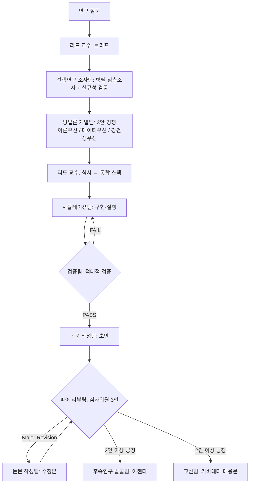

# AIops — 에이전트팀 하네스 모음

하나의 레포에 여러 Claude Code 에이전트팀 하네스가 공존한다.

| 하네스 | 진입점 | 위치 |
|---|---|---|
| **리스크프리미엄 퍼즐 연구실** | `risk-premium-lab` 워크플로우 | `knowledge-base/`, `research/`, `.claude/agents/rp-*` |
| **법무 에이전트팀** | `legal-team` 스킬 | `kb/legal/`, `harness/legal/`, `.claude/agents/legal-*` |
| **번역 에이전트팀** | `translate` 스킬 | `translation/`, `.claude/agents/translator` 등 |
| **적합성검증 팀** | `validation-team-agent/` | `validation-team-agent/` |
| **금융 AI 디자인 팀** | (PR #66) | 디자인 산출물 디렉토리 |

---

# 리스크프리미엄 퍼즐 연구실 (Risk Premium Lab)

리스크프리미엄 퍼즐(equity premium puzzle) 해결을 위한 멀티에이전트 연구 하네스.
성균관대학교 이재준 석사논문 **「개별가계소비자료를 이용한 자산가격결정」**을 국제 저널 수준의 논문으로 디벨롭하는 것을 핵심 목표로 한다.

## 구성

```
knowledge-base/          # 리스크프리미엄 문헌 지식베이스 (00-index.md부터 읽을 것)
.claude/agents/          # 9개 팀 에이전트 정의 (rp-*)
.claude/workflows/       # 연구 사이클 오케스트레이션 워크플로우
research/                # 연구 사이클 산출물 (research/README.md 참조)
```

## 에이전트팀

| 에이전트 | 팀 | 역할 |
|---|---|---|
| `rp-lead-professor` | 리드 교수 | 연구 브리프, 방법론 심사, 품질 관문 |
| `rp-literature-team` | 선행연구 조사팀 | 문헌 심층조사, 신규성 검증, 지식베이스 갱신 |
| `rp-methodology-team` | 방법론 개발팀 | 실증 설계안 개발 (3안 경쟁 방식) |
| `rp-simulation-team` | 시뮬레이션팀 | 파이프라인 구현, 몬테카를로, 보정 실험 |
| `rp-validation-team` | 검증팀 | 적대적 검증: 재현, 코드 감사, 강건성 |
| `rp-future-research-team` | 후속연구 발굴팀 | 후속 연구 아이디어 채굴·어젠다 관리 |
| `rp-paper-writing-team` | 논문 작성팀 | 논문 초안·수정본 집필 |
| `rp-peer-review-team` | 피어 리뷰팀 | 저널 심사위원 3인 패널 시뮬레이션 |
| `rp-correspondence-team` | 교신팀 | 커버레터, 심사위원 대응문, 대외 문서 |

## 연구 사이클 (`risk-premium-lab` 워크플로우)



## 사용법

Claude Code에서:

```
# 기본 실행 (이재준 논문 디벨롭 질문으로)
risk-premium-lab 워크플로우를 실행해줘

# 질문 지정 실행
risk-premium-lab 워크플로우를 실행해줘.
args: { "question": "가계 소비성장 왜도(skewness)는 한국 주식프리미엄을 설명하는가?" }

# 개별 팀 단독 호출 (Agent 도구)
rp-literature-team 에이전트로 'Constantinides-Ghosh (2017) 계열 왜도 연구' 심층조사해줘
```

워크플로우 파라미터: `question`(연구 질문), `max_validation_rounds`(기본 2), `max_review_rounds`(기본 2).

## 지식베이스

`knowledge-base/`는 리스크프리미엄 퍼즐 문헌을 11개 갈래로 정리한 것이다.
`00-index.md`(전체 지도·필독 우선순위)와 `12-thesis-development-roadmap.md`(이재준 논문 디벨롭 로드맵)부터 읽는다.

| 파일 | 갈래 |
|---|---|
| 01 | 퍼즐의 기원과 정식화 (Mehra-Prescott, HJ bounds) |
| 02 | 선호 기반 해법 (Epstein-Zin, 습관형성) |
| 03 | 장기위험 (Bansal-Yaron) |
| 04 | 희귀재해 (Rietz, Barro) |
| 05 | 이질적 주체·불완전시장 (Constantinides-Duffie) |
| 06 | **개별가계소비 실증·제한적 참가 (핵심 갈래: Mankiw-Zeldes, BCG, Vissing-Jørgensen)** |
| 07 | 소비 측정 문제 (Savov, Kroencke, Parker-Julliard) |
| 08 | 행동재무·기타 해법 (Benartzi-Thaler 등) |
| 09 | 계량 방법론 (GMM, 오일러방정식, 약식별) |
| 10 | 한국 주식프리미엄 실증연구 |
| 11 | 한국 가계 미시데이터 + 이재준 논문 서지조사 |
| 13 | **AI: 머신러닝 실증 자산가격결정 (Gu-Kelly-Xiu, IPCA, 딥러닝 SDF)** |
| 14 | **AI: 딥러닝 기반 이질적 주체·불완전시장 모형 풀이 (Deep Equilibrium Nets, DeepHAM)** |
| 15 | **AI: LLM·AI 에이전트 기반 경제·금융 연구 (Homo Silicus, 연구 자동화)** |
| 16 | **이재준 석사논문 원문 요약 (구글 드라이브 확보본 — 집계문제 기반 설계 확정)** |

## 운영 원칙

- 모든 팀은 작업 전 지식베이스를 읽고, 산출물을 `research/` 규약 경로에 남긴다.
- 검증팀·피어 리뷰팀은 산출팀과 독립적으로 (적대적으로) 운용한다.
- 검증 안 된 서지정보·수치는 어떤 산출물에도 싣지 않는다.
- git 커밋은 오케스트레이터(메인 세션)가 담당한다.

---

# 법무 에이전트팀 하네스 (Legal Agent Team Harness)

회사 법무팀 · 변호인 · 법무컨설팅 업무를 지원하는 Claude Code 기반 법무
에이전트팀. 대한민국 법률을 기본 준거로 하고, 외국적 요소가 있는 사안에서
미국·EU·아시아 법제와 국제규범을 병행 검토한다.

> ⚠️ 본 하네스의 산출물은 내부 참고자료이며 변호사의 법률자문을 대체하지
> 않는다. 대외적 법률 판단과 소송 수행은 변호사 검토를 거친다.

## 구성

```
.claude/
  agents/legal-*.md          에이전트 12종 (팀장, 리서처 2, 영역 전문가 6, 작성자, 반대검증관)
  workflows/*.js             재사용 워크플로 5종 (자문/계약/분쟁/컴플라이언스/KB갱신)
  skills/legal-team/         하네스 진입점 스킬 (요청 라우팅 규칙)
harness/legal/
  team.yaml                  팀 정의, 인용 정책, 품질 게이트
  runbook.md                 시나리오별 운영 절차 (A 자문 / B 계약 / C 분쟁 / D 컴플라이언스 / E 국제)
kb/legal/
  00-index.md                KB 인덱스와 사용 규칙
  kr/01~10-*.md              국내법 10개 분야 (법체계/민사/회사/형사/노동/공정거래/개인정보·AI/금융/IP/조세·행정)
  global/11~13-*.md          글로벌 3개 분야 (미국/EU·아시아/국제거래·중재)
templates/legal/             산출물 템플릿 6종 (의견서/계약검토/전략메모/점검표/규제브리핑/내용증명)
reports/legal/               최종 산출물 저장 위치
```

## 에이전트팀

| 에이전트 | 역할 |
|---|---|
| `legal-lead` | 법무팀장 — 쟁점 정리, 작업계획, 종합 |
| `legal-statute-researcher` | 법령 리서처 — 조문·개정이력·시행일 |
| `legal-case-researcher` | 판례 리서처 — 국내외 판례, 인용 검증 |
| `legal-contract-reviewer` | 계약 검토 — 독소조항, 수정안, 협상 |
| `legal-corporate-advisor` | 회사법·지배구조·M&A |
| `legal-compliance-officer` | 공정거래·개인정보·금융·부패방지 |
| `legal-labor-advisor` | 인사노무·중대재해 |
| `legal-ip-tech-advisor` | 지재권·오픈소스·AI·데이터 |
| `legal-litigation-strategist` | 송무·수사 대응·분쟁 전략 |
| `legal-international-counsel` | 국제계약·역외규제·중재 |
| `legal-writer` | 법률문서 작성 (`reports/legal/`) |
| `legal-red-team` | 반대검증 — 품질 게이트 (PASS/FAIL) |

## 사용법

법무 요청을 그냥 말하면 `legal-team` 스킬이 라우팅한다. 직접 실행하려면:

```
# 법률자문 (쟁점 분해 → 병렬 조사 → 반대검증 → 의견서)
Workflow legal-consult      args: { "question": "...", "context": "..." }

# 계약 검토 (조항 분석 → 전문 심화 → 반대검증 → 보고서)
Workflow contract-review    args: { "contract_path": "...", "party": "을/수급인/..." }

# 분쟁 대응 (전략 → 판례조사 → 상대방 시뮬레이션 → 전략메모)
Workflow litigation-prep    args: { "case_summary": "...", "our_role": "피고" }

# 컴플라이언스 점검 (영역별 병렬 점검 → 통합 보고서)
Workflow compliance-audit   args: { "domains": ["privacy","labor"], "scope": "..." }

# KB 갱신 (분기 1회 권장)
Workflow legal-kb-update    args: { "date": "YYYY-MM-DD", "topics": ["kr-corporate"] }
```

가벼운 단일 질문은 워크플로 없이 해당 전문가 에이전트 하나만 투입한다.

## 품질 원칙

1. **국내법 우선** — 한국법 기준 검토 후 외국적 요소가 있을 때만 외국법 병행
2. **인용 무결성** — 사건번호·조문은 웹 검증된 것만 기재, 미확인은 `[사건번호 미확인]` 표기
3. **반대검증 게이트** — 의견서·전략메모·대외문서는 `legal-red-team` PASS 후 전달
4. **KB 우선, 웹 보강** — `kb/legal/`을 먼저 읽고 기준일 이후 변경만 웹 확인
5. **고지** — 모든 산출물에 검토 기준일과 "변호사 자문 대체 아님" 명시

## KB 유지보수

KB 기준일은 `kb/legal/00-index.md` 참조. 분기 1회 또는 큰 입법·판례
이벤트(정기국회, 대형 전원합의체 판결) 후 `legal-kb-update` 워크플로로
갱신한다. KB 구축·검증 이력은 각 문서 헤더의 갱신일로 추적한다.
