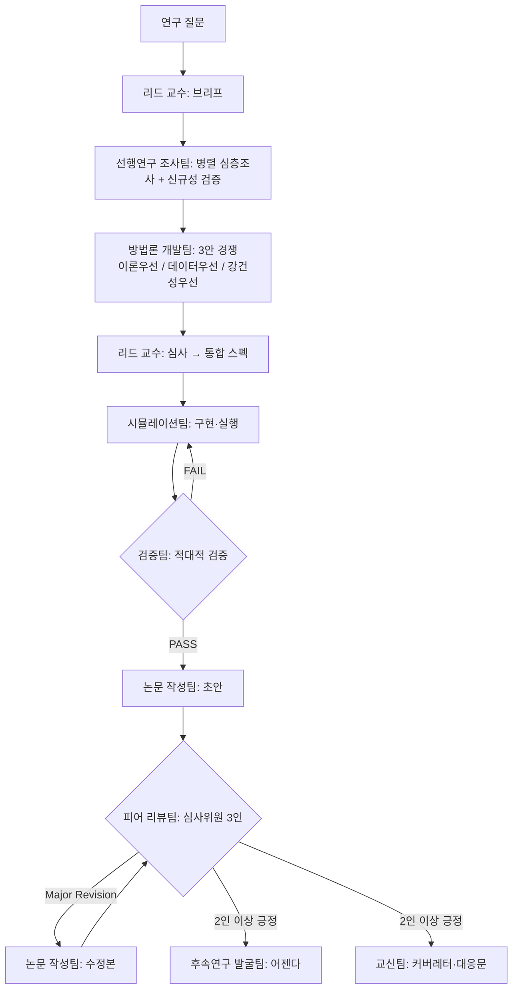

# AIops — 팀 에이전트 하네스 모음

Claude Code 기반 팀 에이전트 하네스 모노레포.

| 팀 | 위치 | 설명 |
|---|---|---|
| 리스크프리미엄 연구실 | `knowledge-base/`, `research/`, `.claude/agents/rp-*` | 아래 [리스크프리미엄 퍼즐 연구실](#리스크프리미엄-퍼즐-연구실-risk-premium-lab) |
| 법무팀 | `.claude/agents/legal-*`, `harness/legal/`, `kb/legal/`, `templates/legal/` | 아래 [법무 에이전트팀 하네스](#법무-에이전트팀-하네스-legal-agent-team-harness) |
| 데이터 엔지니어링팀 | `.claude/agents/`, `harness/`, `templates/`, `deliverables/` | 아래 [Data Engineering Team Agent Harness](#data-engineering-team-agent-harness) |
| 디자인팀 | `design-team/` | `design-team/README.md` |
| 번역팀 | `translation/` | `translation/README.md` |
| 리스크관리팀 | `risk_lib/`, `.claude/agents/risk-*`, `teams/risk-management/` | 아래 [리스크관리 에이전트 하네스](#리스크관리-에이전트-하네스-basel-iii--fss) |
| 적합성검증팀 연동 | `validation-team-agent/` | `validation-team-agent/README-INTEGRATION.md` |

---

# 법무 에이전트팀 하네스 (Legal Agent Team Harness)

회사 법무팀 · 변호인 · 법무컨설팅 업무를 지원하는 Claude Code 기반 법무
에이전트팀. 대한민국 법률을 기본 준거로 하고, 외국적 요소가 있는 사안에서
미국·EU·아시아 법제와 국제규범을 병행 검토한다.

> ⚠️ 본 하네스의 산출물은 내부 참고자료이며 변호사의 법률자문을 대체하지
> 않는다. 대외적 법률 판단과 소송 수행은 변호사 검토를 거친다.

## 구성

```
.claude/
  agents/legal-*.md          에이전트 12종 (팀장, 리서처 2, 영역 전문가 6, 작성자, 반대검증관)
  workflows/*.js             재사용 워크플로 5종 (자문/계약/분쟁/컴플라이언스/KB갱신)
  skills/legal-team/         하네스 진입점 스킬 (요청 라우팅 규칙)
harness/legal/
  team.yaml                  팀 정의, 인용 정책, 품질 게이트
  runbook.md                 시나리오별 운영 절차 (A 자문 / B 계약 / C 분쟁 / D 컴플라이언스 / E 국제)
kb/legal/
  00-index.md                KB 인덱스와 사용 규칙
  kr/01~10-*.md              국내법 10개 분야 (법체계/민사/회사/형사/노동/공정거래/개인정보·AI/금융/IP/조세·행정)
  global/11~13-*.md          글로벌 3개 분야 (미국/EU·아시아/국제거래·중재)
templates/legal/             산출물 템플릿 6종 (의견서/계약검토/전략메모/점검표/규제브리핑/내용증명)
reports/legal/               최종 산출물 저장 위치
```

## 에이전트팀

| 에이전트 | 역할 |
|---|---|
| `legal-lead` | 법무팀장 — 쟁점 정리, 작업계획, 종합 |
| `legal-statute-researcher` | 법령 리서처 — 조문·개정이력·시행일 |
| `legal-case-researcher` | 판례 리서처 — 국내외 판례, 인용 검증 |
| `legal-contract-reviewer` | 계약 검토 — 독소조항, 수정안, 협상 |
| `legal-corporate-advisor` | 회사법·지배구조·M&A |
| `legal-compliance-officer` | 공정거래·개인정보·금융·부패방지 |
| `legal-labor-advisor` | 인사노무·중대재해 |
| `legal-ip-tech-advisor` | 지재권·오픈소스·AI·데이터 |
| `legal-litigation-strategist` | 송무·수사 대응·분쟁 전략 |
| `legal-international-counsel` | 국제계약·역외규제·중재 |
| `legal-writer` | 법률문서 작성 (`reports/legal/`) |
| `legal-red-team` | 반대검증 — 품질 게이트 (PASS/FAIL) |

## 사용법

법무 요청을 그냥 말하면 `legal-team` 스킬이 라우팅한다. 직접 실행하려면:

```
# 법률자문 (쟁점 분해 → 병렬 조사 → 반대검증 → 의견서)
Workflow legal-consult      args: { "question": "...", "context": "..." }

# 계약 검토 (조항 분석 → 전문 심화 → 반대검증 → 보고서)
Workflow contract-review    args: { "contract_path": "...", "party": "을/수급인/..." }

# 분쟁 대응 (전략 → 판례조사 → 상대방 시뮬레이션 → 전략메모)
Workflow litigation-prep    args: { "case_summary": "...", "our_role": "피고" }

# 컴플라이언스 점검 (영역별 병렬 점검 → 통합 보고서)
Workflow compliance-audit   args: { "domains": ["privacy","labor"], "scope": "..." }

# KB 갱신 (분기 1회 권장)
Workflow legal-kb-update    args: { "date": "YYYY-MM-DD", "topics": ["kr-corporate"] }
```

가벼운 단일 질문은 워크플로 없이 해당 전문가 에이전트 하나만 투입한다.

## 품질 원칙

1. **국내법 우선** — 한국법 기준 검토 후 외국적 요소가 있을 때만 외국법 병행
2. **인용 무결성** — 사건번호·조문은 웹 검증된 것만 기재, 미확인은 `[사건번호 미확인]` 표기
3. **반대검증 게이트** — 의견서·전략메모·대외문서는 `legal-red-team` PASS 후 전달
4. **KB 우선, 웹 보강** — `kb/legal/`을 먼저 읽고 기준일 이후 변경만 웹 확인
5. **고지** — 모든 산출물에 검토 기준일과 "변호사 자문 대체 아님" 명시

## KB 유지보수

KB 기준일은 `kb/legal/00-index.md` 참조. 분기 1회 또는 큰 입법·판례
이벤트(정기국회, 대형 전원합의체 판결) 후 `legal-kb-update` 워크플로로
갱신한다. KB 구축·검증 이력은 각 문서 헤더의 갱신일로 추적한다.

---

# Data Engineering Team Agent Harness

A Claude Code multi-agent harness that acts as a data engineering team. The
team's methodology is inherited from
[DataExpert-io/data-engineer-handbook](https://github.com/DataExpert-io/data-engineer-handbook)
— each specialist agent encodes one module of the handbook's curriculum
(see [`harness/handbook-map.md`](harness/handbook-map.md)).

## Team

| Agent | Role |
|---|---|
| `data-engineering-lead` | Orchestrator: intake, routing, review gates, final assembly |
| `dimensional-data-modeler` | Dimensions, SCDs, cumulative tables, graph models |
| `fact-data-modeler` | Event/fact grain, dedup, datelist ints, array metrics |
| `spark-engineer` | Batch compute: PySpark + Iceberg jobs, joins, tests |
| `streaming-engineer` | Flink/Kafka real-time pipelines, watermarks, windows |
| `analytics-engineer` | Analytical patterns, growth accounting, KPIs, experiments |
| `data-quality-engineer` | Mandatory QA gate: contracts, checks, write-audit-publish |
| `pipeline-ops-engineer` | Runbooks, ownership, SLAs, on-call, tech debt |

## Usage

Open this repo in Claude Code — agents in `.claude/agents/` load automatically.

- Full-team task: "As the data-engineering-lead, design a daily user activity
  pipeline from our event stream."
- Narrow task: "Use the fact-data-modeler subagent to design a datelist-int
  activity table."

Workflow, gates, and invocation details: [`harness/de-team-runbook.md`](harness/de-team-runbook.md).
Roster and routing rules: [`harness/team.yaml`](harness/team.yaml).
Deliverable templates: [`templates/`](templates/).

## Layout

```
.claude/agents/   # agent definitions (auto-loaded by Claude Code)
harness/          # team roster, operating runbook, handbook inheritance map
templates/        # data-model spec, pipeline runbook, quality checklist
deliverables/     # team outputs (models/, pipelines/, runbooks/, analyses/)
```

---

# 리스크프리미엄 퍼즐 연구실 (Risk Premium Lab)

리스크프리미엄 퍼즐(equity premium puzzle) 해결을 위한 멀티에이전트 연구 하네스.
성균관대학교 이재준 석사논문 **「개별가계소비자료를 이용한 자산가격결정」**을 국제 저널 수준의 논문으로 디벨롭하는 것을 핵심 목표로 한다.

## 구성

```
knowledge-base/          # 리스크프리미엄 문헌 지식베이스 (00-index.md부터 읽을 것)
.claude/agents/          # 9개 팀 에이전트 정의 (rp-*)
.claude/workflows/       # 연구 사이클 오케스트레이션 워크플로우
research/                # 연구 사이클 산출물 (research/README.md 참조)
```

## 에이전트팀

| 에이전트 | 팀 | 역할 |
|---|---|---|
| `rp-lead-professor` | 리드 교수 | 연구 브리프, 방법론 심사, 품질 관문 |
| `rp-literature-team` | 선행연구 조사팀 | 문헌 심층조사, 신규성 검증, 지식베이스 갱신 |
| `rp-methodology-team` | 방법론 개발팀 | 실증 설계안 개발 (3안 경쟁 방식) |
| `rp-simulation-team` | 시뮬레이션팀 | 파이프라인 구현, 몬테카를로, 보정 실험 |
| `rp-validation-team` | 검증팀 | 적대적 검증: 재현, 코드 감사, 강건성 |
| `rp-future-research-team` | 후속연구 발굴팀 | 후속 연구 아이디어 채굴·어젠다 관리 |
| `rp-paper-writing-team` | 논문 작성팀 | 논문 초안·수정본 집필 |
| `rp-peer-review-team` | 피어 리뷰팀 | 저널 심사위원 3인 패널 시뮬레이션 |
| `rp-correspondence-team` | 교신팀 | 커버레터, 심사위원 대응문, 대외 문서 |

## 연구 사이클 (`risk-premium-lab` 워크플로우)



## 사용법

Claude Code에서:

```
# 기본 실행 (이재준 논문 디벨롭 질문으로)
risk-premium-lab 워크플로우를 실행해줘

# 질문 지정 실행
risk-premium-lab 워크플로우를 실행해줘.
args: { "question": "가계 소비성장 왜도(skewness)는 한국 주식프리미엄을 설명하는가?" }

# 개별 팀 단독 호출 (Agent 도구)
rp-literature-team 에이전트로 'Constantinides-Ghosh (2017) 계열 왜도 연구' 심층조사해줘
```

워크플로우 파라미터: `question`(연구 질문), `max_validation_rounds`(기본 2), `max_review_rounds`(기본 2).

## 지식베이스

`knowledge-base/`는 리스크프리미엄 퍼즐 문헌을 11개 갈래로 정리한 것이다.
`00-index.md`(전체 지도·필독 우선순위)와 `12-thesis-development-roadmap.md`(이재준 논문 디벨롭 로드맵)부터 읽는다.

| 파일 | 갈래 |
|---|---|
| 01 | 퍼즐의 기원과 정식화 (Mehra-Prescott, HJ bounds) |
| 02 | 선호 기반 해법 (Epstein-Zin, 습관형성) |
| 03 | 장기위험 (Bansal-Yaron) |
| 04 | 희귀재해 (Rietz, Barro) |
| 05 | 이질적 주체·불완전시장 (Constantinides-Duffie) |
| 06 | **개별가계소비 실증·제한적 참가 (핵심 갈래: Mankiw-Zeldes, BCG, Vissing-Jørgensen)** |
| 07 | 소비 측정 문제 (Savov, Kroencke, Parker-Julliard) |
| 08 | 행동재무·기타 해법 (Benartzi-Thaler 등) |
| 09 | 계량 방법론 (GMM, 오일러방정식, 약식별) |
| 10 | 한국 주식프리미엄 실증연구 |
| 11 | 한국 가계 미시데이터 + 이재준 논문 서지조사 |
| 13 | **AI: 머신러닝 실증 자산가격결정 (Gu-Kelly-Xiu, IPCA, 딥러닝 SDF)** |
| 14 | **AI: 딥러닝 기반 이질적 주체·불완전시장 모형 풀이 (Deep Equilibrium Nets, DeepHAM)** |
| 15 | **AI: LLM·AI 에이전트 기반 경제·금융 연구 (Homo Silicus, 연구 자동화)** |
| 16 | **이재준 석사논문 원문 요약 (구글 드라이브 확보본 — 집계문제 기반 설계 확정)** |

## 운영 원칙

- 모든 팀은 작업 전 지식베이스를 읽고, 산출물을 `research/` 규약 경로에 남긴다.
- 검증팀·피어 리뷰팀은 산출팀과 독립적으로 (적대적으로) 운용한다.
- 검증 안 된 서지정보·수치는 어떤 산출물에도 싣지 않는다.
- git 커밋은 오케스트레이터(메인 세션)가 담당한다.

---

# 리스크관리 에이전트 하네스 (Basel III / FSS)

바젤 III 및 금감원 기준에 따른 은행 리스크관리팀 에이전트 하네스.
신용평가모형(PD/LGD), 위험가중자산(SA + IRB), BIS비율, 연체율·부도율·회수율
모니터링, 한도관리, RAPM(RAROC)을 모두 실제 동작 가능한 형태로 제공하며,
자체검증 에이전트가 모든 산출의 정합성을 점검한다.

## 구조

```
.claude/agents/                  # 13개 서브에이전트
  risk-orchestrator.md           ── 코디네이터 (작업 분해·위임·검증 강제)
  credit-rating-modeler.md       ── PD/LGD 모형 개발 및 등급화
  rwa-calculator.md              ── RWA 산출 (신용 SA+IRB, 시장, 운영, CRM/CCF, output floor)
  bis-ratio-analyst.md           ── CET1/Tier1/Total 비율 + 레버리지비율
  delinquency-pd-lgd-monitor.md  ── 연체·부도·회수
  limit-manager.md               ── 한도관리 (동일차주/섹터/국가) + 집중도(HHI)
  rapm-analyst.md                ── RAROC / 경제자본
  ifrs9-ecl-analyst.md           ── IFRS9 ECL 충당금 (3-stage)
  stress-test-engineer.md        ── 거시 스트레스테스트
  risk-validator.md              ── 자체검증 (필수 마지막 단계)

risk_lib/                        # Python 계산 라이브러리
  capital/
    rwa_sa.py                    ── Basel III CRE20 표준방법
    rwa_irb.py                   ── CRE31 IRB 위험가중함수
    bis.py                       ── 자본비율 + 최저/버퍼 점검
    crm.py                       ── CRM(담보 haircut, 보증) + CCF
    market_risk.py               ── MAR40 간편표준방법 시장리스크 RWA
    op_risk.py                   ── OPE25 표준방법 운영리스크 RWA (BIC×ILM)
    output_floor.py              ── 바젤 III 최종안 output floor (72.5%)
    leverage.py                  ── 레버리지비율 (Tier1/익스포저, ≥3%)
  models/
    pd_model.py                  ── 로지스틱 PD + Gini/KS/PSI
    lgd_model.py                 ── workout LGD + 회귀 모형
    rating.py                    ── 17등급 master scale
  provisioning/
    ecl.py                       ── IFRS9 ECL (3-stage, 12m/lifetime)
  monitoring/
    delinquency.py               ── DPD 버킷, 부도율, 전이행렬
    recovery.py                  ── 회수 곡선
  limits/
    limit_engine.py              ── 다차원 한도 엔진
    concentration.py             ── HHI 집중리스크
  performance/
    rapm.py                      ── RAROC, 경제자본
  stress/
    scenario.py                  ── 시나리오 PD/LGD 충격 → RWA/BIS/ECL
    axes.py                      ── 충격 축 14개 (신용·시장·운영·유동성·수익)
    multi_axis.py                ── 전 축 동시 충격 엔진 (경로·역스트레스)
    trace.py                     ── 심각도별 전 단계 산출과정 (13블록 72단계)
  validation/
    consistency.py               ── 자체검증(2선) 정합성 체크 (21종)
    backtest.py                  ── HL test, 등급별 binomial
    independent.py               ── 상시 독립검증(3선) 위임·게이트 (fail-closed)
  datamodel/
    spec.py                      ── 테이블/컬럼 스펙 · 검증 · DDL 생성
    catalog.py                   ── 정규 카탈로그 (81 테이블 / 594 컬럼)
    materialize.py               ── 부문 결과 → 정규 테이블
    materialize_detail.py        ── 세분화 테이블 실체화 (규제 라인 입도)
  prudential/
    financials.py                ── 재무상태표·손익계산서 (업무보고서 기본 서식)
    liquidity.py                 ── 원화·외화유동성비율, 원화예대율
    ownership.py                 ── 대주주·유가증권·자회사·부동산 한도
    camel.py                     ── 경영실태평가 6개 부문
    pca.py                       ── 적기시정조치 판정 (권고·요구·명령)
  regulatory/
    forms.py                     ── 금감원 업무보고서 서식 (편제 9편 · 34장)
    forms_ext.py                 ── 확장 서식 빌더
    form_ids.py                  ── 서식번호 매핑 (내부 BA#### ↔ 배포본 공식번호)
    excel.py                     ── 표지·목차·서식·검증·산출근거 .xlsx
  ui_studio/
    nl_query.py                  ── 자연어 → Filter AST → 정책검증 → 실행
    layout.py                    ── 프롬프트 → 레이아웃 제안 → 3중 검증 → 승인
    engine.js                    ── 위 둘의 브라우저 실행판 (입력 즉시 재컴파일)
    governance.py                ── View·필드정책·에이전트·증빙·변경 원장
    studio.py / app.py           ── 스냅샷 조립 · 자체 완결 HTML 렌더
  deliverables.py                ── 산출물 패키징 (ZIP + SHA-256 매니페스트)
  data_gen.py                    ── 합성 포트폴리오 생성
  pipeline.py                    ── end-to-end 오케스트레이션
  report.py                      ── markdown 결재 리포트 생성
  cli.py                         ── CLI 러너

examples/run_end_to_end.py       # 전체 흐름 데모
tests/                           # pytest (1,009건)
```

## 빠른 시작

```bash
pip install -e .

# 1) CLI 러너 — 전체 파이프라인 + 검증 + markdown 리포트
python -m risk_lib.cli run --report report.md          # 합성 데이터
python -m risk_lib.cli run --data book.csv --seed 7     # 실제 포트폴리오

# 2) 단계별 데모
python examples/run_end_to_end.py

# 3) 금감원 배포 기준 업무보고서 (.xlsx) — 감독규정 편제 9편·서식 34장
python -m risk_lib.cli reg-report --out 업무보고서.xlsx --asof 2026-06-30 \
    --institution "○○은행"

# 4) 에이전틱 UI 스튜디오 — 전 모듈 관리 화면 (자체 완결 HTML)
python -m risk_lib.cli ui-studio --out studio.html --asof 2026-06-30

# 5) 상시 독립검증(3선) 요청 — 적합성검증 팀에이전트에 위임
python -m risk_lib.cli validation-request --asof 2026-06-30

# 6) 테스트
pytest -q
```

`validation-request`는 게이트가 `적합`이 아니면 종료코드 1을 반환한다.

`reg-report`는 서식 자체대사에서 실패가 있으면 종료코드 1을 반환한다(제출 불가 게이트).

CLI는 검증에서 FAIL이 하나라도 있으면 종료코드 1을 반환한다(결재 불가 게이트).

## 에이전트 사용

Claude Code에서:

```
> 합성 포트폴리오로 전체 자본적정성을 평가하고 검증해줘
```

`risk-orchestrator`가 호출되어 다음을 순서대로 수행한다.

1. `credit-rating-modeler` — PD/LGD 학습 + 등급 매핑
2. `rwa-calculator` — SA(국가/은행) + IRB(기업/리테일/모기지) 산출
3. `bis-ratio-analyst` — 자본비율 계산
4. `delinquency-pd-lgd-monitor` + `limit-manager` (병렬)
5. `rapm-analyst` — RAROC
6. `risk-validator` — **필수**: 정합성 + PD 백테스트, FAIL 시 재작업 지시

## 검증(자체검증) 보장

모든 산출은 다음 자동 체크를 통과해야만 결재 가능:

- PD/LGD/EAD 범위 점검
- SA·IRB 중복 산출 방지
- RWA 합계와 BIS 입력 일치
- BIS 비율의 plausible 범위와 ordering(Total ≥ Tier1 ≥ CET1)
- CET1 최저 4.5% 위반 감지
- EL ≤ EAD
- 레버리지비율 ≥ 3% 점검
- output floor 적용 여부(binding 시 WARN)
- 시장·운영 RWA 음수 점검
- IFRS9 ECL 음수 및 Stage 커버리지 단조성(S1≤S2≤S3)
- 집중도 HHI 임계(0.18) 초과 경보
- 스트레스 단조성(스트레스 RWA ≥ 기준, CET1 비율 ≤ 기준)
- PD 모형 Hosmer-Lemeshow + 등급별 단측 binomial (Green/Yellow/Red)

`run_consistency_checks()`는 `ValidationReport`를 반환하며, `passes()`가
True인 경우에만 다음 단계로 진행한다.

### 이것은 자체검증(2선)이다 — 독립검증(3선)은 별도

위 체크는 **같은 코드·같은 가정**으로 점검한 결과다. 결재에는 적합성검증
팀에이전트(`claude/validation-team-agent-Pw9F5`)의 상시 독립검증이 함께
필요하며, **매 작업 예외 없이** 요청한다. 게이트는 fail-closed —
응답이 없으면 `응답대기`이고 결재 상신이 막힌다.
절차: `.claude/skills/independent-validation/SKILL.md`.

## 준거 기준

- Basel III: CRE20 (SA), CRE31~CRE36 (IRB), CRE22 (CRM), RBC25 (자본),
  MAR40 (시장리스크 간편표준방법), OPE25 (운영리스크 SA), LEV (레버리지),
  output floor (바젤 III 최종안)
- IFRS 9 5.5 (기대신용손실)
- 금감원: 「은행업감독업무시행세칙」 자본적정성 / 자산건전성 편,
  「은행법」 §35 (신용공여 한도), 「대손충당금 적립기준」, 스트레스테스트 운영기준
- BCBS Working Paper 14 (모형 검증), BCBS 283 (대규모 익스포저)

## 주의 사항

- 시장리스크는 간편표준방법(SSA), 운영리스크는 표준방법(SA)으로 산출한다.
  완전 sensitivities-based(SBM) 시장리스크는 범위 외이며, 시장 포지션·BI는
  파이프라인에서 예시값으로 생성된다(실제 거래·재무 데이터로 대체 필요).
- 합성 데이터의 부도율·회수율 분포는 모형 학습 가능성 검증용이며 실제 분포와 다를 수 있다.
- 본 하네스는 의사결정 보조용이며, 결재용 보고서로 사용하려면 데이터 거버넌스
  (수집·정제·승인) 절차와 통합이 필요하다.
