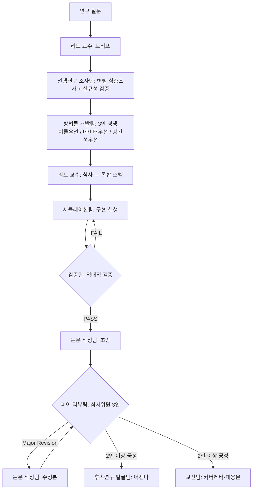

# 리스크프리미엄 퍼즐 연구실 (Risk Premium Lab)

리스크프리미엄 퍼즐(equity premium puzzle) 해결을 위한 멀티에이전트 연구 하네스.
성균관대학교 이재준 석사논문 **「개별가계소비자료를 이용한 자산가격결정」**을 국제 저널 수준의 논문으로 디벨롭하는 것을 핵심 목표로 한다.

## 구성

```
knowledge-base/          # 리스크프리미엄 문헌 지식베이스 (00-index.md부터 읽을 것)
.claude/agents/          # 9개 팀 에이전트 정의 (rp-*)
.claude/workflows/       # 연구 사이클 오케스트레이션 워크플로우
research/                # 연구 사이클 산출물 (research/README.md 참조)
```

## 에이전트팀

| 에이전트 | 팀 | 역할 |
|---|---|---|
| `rp-lead-professor` | 리드 교수 | 연구 브리프, 방법론 심사, 품질 관문 |
| `rp-literature-team` | 선행연구 조사팀 | 문헌 심층조사, 신규성 검증, 지식베이스 갱신 |
| `rp-methodology-team` | 방법론 개발팀 | 실증 설계안 개발 (3안 경쟁 방식) |
| `rp-simulation-team` | 시뮬레이션팀 | 파이프라인 구현, 몬테카를로, 보정 실험 |
| `rp-validation-team` | 검증팀 | 적대적 검증: 재현, 코드 감사, 강건성 |
| `rp-future-research-team` | 후속연구 발굴팀 | 후속 연구 아이디어 채굴·어젠다 관리 |
| `rp-paper-writing-team` | 논문 작성팀 | 논문 초안·수정본 집필 |
| `rp-peer-review-team` | 피어 리뷰팀 | 저널 심사위원 3인 패널 시뮬레이션 |
| `rp-correspondence-team` | 교신팀 | 커버레터, 심사위원 대응문, 대외 문서 |

## 연구 사이클 (`risk-premium-lab` 워크플로우)



## 사용법

Claude Code에서:

```
# 기본 실행 (이재준 논문 디벨롭 질문으로)
risk-premium-lab 워크플로우를 실행해줘

# 질문 지정 실행
risk-premium-lab 워크플로우를 실행해줘.
args: { "question": "가계 소비성장 왜도(skewness)는 한국 주식프리미엄을 설명하는가?" }

# 개별 팀 단독 호출 (Agent 도구)
rp-literature-team 에이전트로 'Constantinides-Ghosh (2017) 계열 왜도 연구' 심층조사해줘
```

워크플로우 파라미터: `question`(연구 질문), `max_validation_rounds`(기본 2), `max_review_rounds`(기본 2).

## 지식베이스

`knowledge-base/`는 리스크프리미엄 퍼즐 문헌을 11개 갈래로 정리한 것이다.
`00-index.md`(전체 지도·필독 우선순위)와 `12-thesis-development-roadmap.md`(이재준 논문 디벨롭 로드맵)부터 읽는다.

| 파일 | 갈래 |
|---|---|
| 01 | 퍼즐의 기원과 정식화 (Mehra-Prescott, HJ bounds) |
| 02 | 선호 기반 해법 (Epstein-Zin, 습관형성) |
| 03 | 장기위험 (Bansal-Yaron) |
| 04 | 희귀재해 (Rietz, Barro) |
| 05 | 이질적 주체·불완전시장 (Constantinides-Duffie) |
| 06 | **개별가계소비 실증·제한적 참가 (핵심 갈래: Mankiw-Zeldes, BCG, Vissing-Jørgensen)** |
| 07 | 소비 측정 문제 (Savov, Kroencke, Parker-Julliard) |
| 08 | 행동재무·기타 해법 (Benartzi-Thaler 등) |
| 09 | 계량 방법론 (GMM, 오일러방정식, 약식별) |
| 10 | 한국 주식프리미엄 실증연구 |
| 11 | 한국 가계 미시데이터 + 이재준 논문 서지조사 |
| 13 | **AI: 머신러닝 실증 자산가격결정 (Gu-Kelly-Xiu, IPCA, 딥러닝 SDF)** |
| 14 | **AI: 딥러닝 기반 이질적 주체·불완전시장 모형 풀이 (Deep Equilibrium Nets, DeepHAM)** |
| 15 | **AI: LLM·AI 에이전트 기반 경제·금융 연구 (Homo Silicus, 연구 자동화)** |
| 16 | **이재준 석사논문 원문 요약 (구글 드라이브 확보본 — 집계문제 기반 설계 확정)** |

## 운영 원칙

- 모든 팀은 작업 전 지식베이스를 읽고, 산출물을 `research/` 규약 경로에 남긴다.
- 검증팀·피어 리뷰팀은 산출팀과 독립적으로 (적대적으로) 운용한다.
- 검증 안 된 서지정보·수치는 어떤 산출물에도 싣지 않는다.
- git 커밋은 오케스트레이터(메인 세션)가 담당한다.
