# 원장·화면 계보와 산출 흐름도

이 문서는 **생성물이다.** 손으로 고치지 마라. 계보는
`risk_lib/datamodel/lineage.py` 가 소스에서 뽑고, 아래 도표는 그 결과로
그려진다. 코드가 바뀌면 재생성해야 문서가 사실로 남는다.

```
python -m risk_lib.datamodel.lineage
```

행수는 `run_pipeline(generate_portfolio(seed=42), seed=42, asof=…)` 한 번의
실행 결과다. 재생성 시 실행을 붙이지 않으면 행수 칸이 빈다.

계보의 근거는 네 갈래다.

| 갈래 | 뽑는 곳 |
|---|---|
| 원장 → 화면 | `ui_studio/app.py` 의 `TABS`·`DETAIL_SCREENS` 선언, `screenOf({tables:…})`, `D.data['x']`, `domain(r,'PRD-x')` 부문 전개, `_payload` 키 |
| 원장 → 서식 | `regulatory/*.py` 의 `ctx.tables["x"]` |
| 원장 → 원장 | TableSpec 의 FK 선언, 같은 함수가 A를 읽고 B를 쓰는 관계 |
| 산출 → 원장 | 테이블명을 키로 대입하는 함수, TableSpec 을 선언한 모듈 |

정형 조회·비정형 UI·데이터모델·설정 네 화면은 승인 View 전량을 대상으로 하는
범용 조회기라서 "그린다"로 세지 않는다. 이 넷을 세면 모든 원장이 화면에
연결된 것으로 나와 미배선 원장이 사라진다.

## 0. 재고

| 항목 | 수 |
|---|---|
| 카탈로그 원장 | 270장 |
| 실체화된 원장 | 270 |
| 전용 화면 | 79장 (범용 조회기 4장 별도) |
| 감독서식 모듈 | 23개 |
| 전용 화면이 그리는 원장 | 267장 |
| 감독서식이 읽는 원장 | 38장 |
| 미배선 원장 (화면·서식 둘 다 없음) | 0장 |
| 그중 하류 원장도 없는 것 | 0장 |

## 1. 전체 조감도

도메인 블록 사이의 원장 의존만 그린다. 화살표 위 숫자는 그 방향으로 이어지는 원장 쌍의 수다.

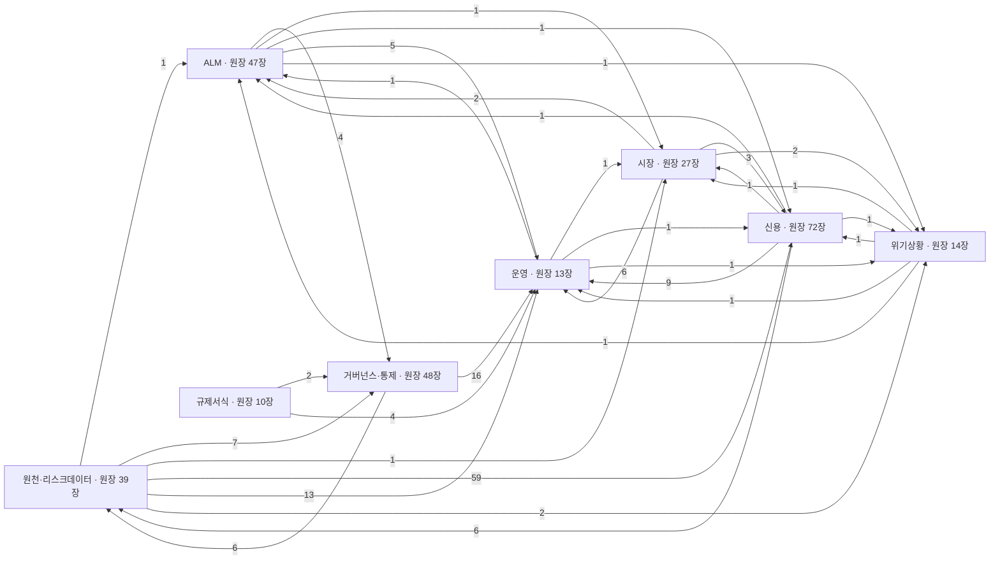

## 2. 도메인별 상세

블록마다 두 장이다. 앞장은 산출 모듈이 원장을 만드는 경로와 원장 간 의존(점선), 뒷장은 그 원장을 쓰는 화면·서식이다. 한 장에 다 넣으면 한 블록이 100노드를 넘어 읽히지 않는다.

### 2.1 원천·리스크데이터 · 원장 39장

산출 모듈 → 원장 (미배선 0장 포함)

```mermaid
flowchart LR
  subgraph S["산출 모듈"]
  direction TB
    Prisk_libx2fdatamodelx2fdecomposex2epy["risk_lib/datamodel/decompose.py"]
    Prisk_libx2fdatamodelx2fderivativesx2epy["risk_lib/datamodel/derivatives.py"]
    Prisk_libx2fdatamodelx2ffundsx2epy["risk_lib/datamodel/funds.py"]
    Prisk_libx2fdatamodelx2fmaterialize_detailx2epy["risk_lib/datamodel/materialize_detail.py"]
    Prisk_libx2fdatamodelx2fsecuritisationx2epy["risk_lib/datamodel/securitisation.py"]
    Prisk_libx2fgovernancex2fretentionx2epy["risk_lib/governance/retention.py"]
    Prisk_libx2finstitutionsx2epy["risk_lib/institutions.py"]
    Prisk_libx2fintegrationx2fconnectorx2epy["risk_lib/integration/connector.py"]
    Prisk_libx2fintegrationx2finboundx2epy["risk_lib/integration/inbound.py"]
    Prisk_libx2fintegrationx2fresiliencex2epy["risk_lib/integration/resilience.py"]
    Prisk_libx2fpipelinex2epy["risk_lib/pipeline.py"]
    Prisk_libx2fui_studiox2fstudiox2epy["risk_lib/ui_studio/studio.py"]
  end
  subgraph G["원천·리스크데이터 원장 39장"]
  direction TB
    Tdat_mart_load["dat_mart_load (259행)"]
    Tdat_retention_action["dat_retention_action (3행)"]
    Tdat_retention_policy["dat_retention_policy (6행)"]
    Tint_connector["int_connector (5행)"]
    Tint_connector_operation["int_connector_operation (6행)"]
    Tint_connector_violation["int_connector_violation (0행)"]
    Tint_delivery_attempt["int_delivery_attempt (5행)"]
    Tint_inbound_contract["int_inbound_contract (5행)"]
    Tint_inbound_delivery["int_inbound_delivery (5행)"]
    Tint_quarantine["int_quarantine (0행)"]
    Tint_retry_policy["int_retry_policy (3행)"]
    Tlim_limit_definition["lim_limit_definition (5행)"]
    Trdm_account_master["rdm_account_master (20행)"]
    Trdm_asset_quality["rdm_asset_quality (2,980행)"]
    Trdm_canonical_map["rdm_canonical_map (30행)"]
    Trdm_code_master["rdm_code_master (1,957행)"]
    Trdm_collateral["rdm_collateral (2,900행)"]
    Trdm_delinquency["rdm_delinquency (2,980행)"]
    Trdm_derivative_master["rdm_derivative_master (84행)"]
    Trdm_derivative_underlying["rdm_derivative_underlying (123행)"]
    Trdm_dq_result["rdm_dq_result (6,143행)"]
    Trdm_dq_rule["rdm_dq_rule (3,811행)"]
    Trdm_exposure["rdm_exposure (2,980행)"]
    Trdm_exposure_balance["rdm_exposure_balance (2,980행)"]
    Trdm_fund_holding["rdm_fund_holding (153행)"]
    Trdm_fund_mandate["rdm_fund_mandate (36행)"]
    Trdm_fund_master["rdm_fund_master (12행)"]
    Trdm_guarantee["rdm_guarantee (122행)"]
    Trdm_macro_indicator_master["rdm_macro_indicator_master (12행)"]
    Trdm_netting_set["rdm_netting_set (25행)"]
    Trdm_obligor["rdm_obligor (2,980행)"]
    Trdm_obligor_financial["rdm_obligor_financial (2,980행)"]
    Trdm_product_master["rdm_product_master (16행)"]
    Trdm_reconciliation["rdm_reconciliation (3행)"]
    Trdm_sec_master["rdm_sec_master (8행)"]
    Trdm_sec_pool["rdm_sec_pool (21행)"]
    Trdm_sec_tranche["rdm_sec_tranche (27행)"]
    Trdm_snapshot["rdm_snapshot (4행)"]
    Trdm_source_contract["rdm_source_contract (4행)"]
  end
  Prisk_libx2fdatamodelx2fdecomposex2epy --> Trdm_collateral
  Prisk_libx2fdatamodelx2fdecomposex2epy --> Trdm_delinquency
  Prisk_libx2fdatamodelx2fdecomposex2epy --> Trdm_exposure
  Prisk_libx2fdatamodelx2fdecomposex2epy --> Trdm_obligor
  Prisk_libx2fdatamodelx2fdecomposex2epy --> Trdm_snapshot
  Prisk_libx2fdatamodelx2fderivativesx2epy --> Trdm_derivative_master
  Prisk_libx2fdatamodelx2fderivativesx2epy --> Trdm_derivative_underlying
  Prisk_libx2fdatamodelx2fderivativesx2epy --> Trdm_netting_set
  Prisk_libx2fdatamodelx2ffundsx2epy --> Trdm_fund_holding
  Prisk_libx2fdatamodelx2ffundsx2epy --> Trdm_fund_mandate
  Prisk_libx2fdatamodelx2ffundsx2epy --> Trdm_fund_master
  Prisk_libx2fdatamodelx2fmaterialize_detailx2epy --> Trdm_asset_quality
  Prisk_libx2fdatamodelx2fmaterialize_detailx2epy --> Trdm_canonical_map
  Prisk_libx2fdatamodelx2fmaterialize_detailx2epy --> Trdm_collateral
  Prisk_libx2fdatamodelx2fmaterialize_detailx2epy --> Trdm_delinquency
  Prisk_libx2fdatamodelx2fmaterialize_detailx2epy --> Trdm_dq_rule
  Prisk_libx2fdatamodelx2fmaterialize_detailx2epy --> Trdm_exposure
  Prisk_libx2fdatamodelx2fmaterialize_detailx2epy --> Trdm_exposure_balance
  Prisk_libx2fdatamodelx2fmaterialize_detailx2epy --> Trdm_guarantee
  Prisk_libx2fdatamodelx2fmaterialize_detailx2epy --> Trdm_obligor
  Prisk_libx2fdatamodelx2fmaterialize_detailx2epy --> Trdm_obligor_financial
  Prisk_libx2fdatamodelx2fmaterialize_detailx2epy --> Trdm_reconciliation
  Prisk_libx2fdatamodelx2fmaterialize_detailx2epy --> Trdm_source_contract
  Prisk_libx2fdatamodelx2fsecuritisationx2epy --> Trdm_sec_master
  Prisk_libx2fdatamodelx2fsecuritisationx2epy --> Trdm_sec_pool
  Prisk_libx2fdatamodelx2fsecuritisationx2epy --> Trdm_sec_tranche
  Prisk_libx2fgovernancex2fretentionx2epy --> Tdat_mart_load
  Prisk_libx2fgovernancex2fretentionx2epy --> Tdat_retention_action
  Prisk_libx2fgovernancex2fretentionx2epy --> Tdat_retention_policy
  Prisk_libx2finstitutionsx2epy --> Tdat_retention_policy
  Prisk_libx2finstitutionsx2epy --> Trdm_account_master
  Prisk_libx2finstitutionsx2epy --> Trdm_code_master
  Prisk_libx2finstitutionsx2epy --> Trdm_dq_rule
  Prisk_libx2finstitutionsx2epy --> Trdm_macro_indicator_master
  Prisk_libx2finstitutionsx2epy --> Trdm_product_master
  Prisk_libx2fintegrationx2fconnectorx2epy --> Tint_connector
  Prisk_libx2fintegrationx2fconnectorx2epy --> Tint_connector_operation
  Prisk_libx2fintegrationx2fconnectorx2epy --> Tint_connector_violation
  Prisk_libx2fintegrationx2finboundx2epy --> Tint_inbound_contract
  Prisk_libx2fintegrationx2finboundx2epy --> Tint_inbound_delivery
  Prisk_libx2fintegrationx2fresiliencex2epy --> Tint_delivery_attempt
  Prisk_libx2fintegrationx2fresiliencex2epy --> Tint_quarantine
  Prisk_libx2fintegrationx2fresiliencex2epy --> Tint_retry_policy
  Prisk_libx2fpipelinex2epy --> Tlim_limit_definition
  Prisk_libx2fui_studiox2fstudiox2epy --> Trdm_account_master
  Prisk_libx2fui_studiox2fstudiox2epy --> Trdm_code_master
  Prisk_libx2fui_studiox2fstudiox2epy --> Trdm_dq_result
  Prisk_libx2fui_studiox2fstudiox2epy --> Trdm_product_master
  Trdm_snapshot -.-> Tdat_mart_load
  Trdm_snapshot -.-> Tdat_retention_action
  Trdm_snapshot -.-> Tdat_retention_policy
  Tint_connector -.-> Tint_inbound_contract
  Tint_connector -.-> Tint_inbound_delivery
  Tdat_retention_policy -.-> Tdat_mart_load
  Tdat_retention_policy -.-> Tdat_retention_action
  Tint_connector -.-> Tint_connector_operation
  Trdm_exposure -.-> Trdm_asset_quality
  Trdm_exposure -.-> Trdm_collateral
  Trdm_exposure -.-> Trdm_delinquency
  Trdm_exposure -.-> Trdm_exposure_balance
  Trdm_exposure -.-> Trdm_guarantee
  Trdm_obligor -.-> Trdm_exposure
  Trdm_obligor -.-> Trdm_obligor_financial
```

원장 → 화면·서식 (쓰이는 39장만)

```mermaid
flowchart LR
  subgraph G["원천·리스크데이터 원장"]
  direction TB
    Tdat_mart_load["dat_mart_load (259행)"]
    Tdat_retention_action["dat_retention_action (3행)"]
    Tdat_retention_policy["dat_retention_policy (6행)"]
    Tint_connector["int_connector (5행)"]
    Tint_connector_operation["int_connector_operation (6행)"]
    Tint_connector_violation["int_connector_violation (0행)"]
    Tint_delivery_attempt["int_delivery_attempt (5행)"]
    Tint_inbound_contract["int_inbound_contract (5행)"]
    Tint_inbound_delivery["int_inbound_delivery (5행)"]
    Tint_quarantine["int_quarantine (0행)"]
    Tint_retry_policy["int_retry_policy (3행)"]
    Tlim_limit_definition["lim_limit_definition (5행)"]
    Trdm_account_master["rdm_account_master (20행)"]
    Trdm_asset_quality["rdm_asset_quality (2,980행)"]
    Trdm_canonical_map["rdm_canonical_map (30행)"]
    Trdm_code_master["rdm_code_master (1,957행)"]
    Trdm_collateral["rdm_collateral (2,900행)"]
    Trdm_delinquency["rdm_delinquency (2,980행)"]
    Trdm_derivative_master["rdm_derivative_master (84행)"]
    Trdm_derivative_underlying["rdm_derivative_underlying (123행)"]
    Trdm_dq_result["rdm_dq_result (6,143행)"]
    Trdm_dq_rule["rdm_dq_rule (3,811행)"]
    Trdm_exposure["rdm_exposure (2,980행)"]
    Trdm_exposure_balance["rdm_exposure_balance (2,980행)"]
    Trdm_fund_holding["rdm_fund_holding (153행)"]
    Trdm_fund_mandate["rdm_fund_mandate (36행)"]
    Trdm_fund_master["rdm_fund_master (12행)"]
    Trdm_guarantee["rdm_guarantee (122행)"]
    Trdm_macro_indicator_master["rdm_macro_indicator_master (12행)"]
    Trdm_netting_set["rdm_netting_set (25행)"]
    Trdm_obligor["rdm_obligor (2,980행)"]
    Trdm_obligor_financial["rdm_obligor_financial (2,980행)"]
    Trdm_product_master["rdm_product_master (16행)"]
    Trdm_reconciliation["rdm_reconciliation (3행)"]
    Trdm_sec_master["rdm_sec_master (8행)"]
    Trdm_sec_pool["rdm_sec_pool (21행)"]
    Trdm_sec_tranche["rdm_sec_tranche (27행)"]
    Trdm_snapshot["rdm_snapshot (4행)"]
    Trdm_source_contract["rdm_source_contract (4행)"]
  end
  subgraph V["화면·서식"]
  direction TB
    VDQxb7xb300xc0ac["DQ·대사"]
    VRDM["RDM"]
    Vxac70xc2dcxc9c0xd45cx20xbaa8xb2c8xd130xb9c1["거시지표 모니터링"]
    Vxb2f4xbcf4xb7xbcf4xc99d["담보·보증"]
    Vxb4f1xae09x20xc804xc774["등급 전이"]
    Vxbcc0xacbd["변경"]
    Vxc2dcxb098xb9acxc624x20xc124xc815["시나리오 설정"]
    Vxc2dcxbbacxb808xc774xc158["시뮬레이션"]
    Vxc624xbc84xb808xc774["오버레이"]
    Vxc6d0xcc9cxb7xacc4xc57d["원천·계약"]
    Vxc720xb3d9xd654["유동화"]
    Vxc9d1xd569xd22cxc790xc99dxad8c["집합투자증권"]
    Vxcf54xb4dcx20xb9c8xc2a4xd130["코드 마스터"]
    Vxcf54xb4dcx20xb9e4xd551["코드 매핑"]
    Vxcf55xd54f["콕핏"]
    Vxd30cxc0ddxc0c1xd488["파생상품"]
    Vxd55cxb3c4xad00xb9ac["한도관리"]
    FORMS["감독서식 18개 모듈"]
  end
  Trdm_dq_result --> VDQxb7xb300xc0ac
  Trdm_dq_rule --> VDQxb7xb300xc0ac
  Trdm_reconciliation --> VDQxb7xb300xc0ac
  Tdat_mart_load --> VRDM
  Tdat_retention_action --> VRDM
  Tdat_retention_policy --> VRDM
  Tint_connector --> VRDM
  Tint_connector_operation --> VRDM
  Tint_connector_violation --> VRDM
  Tint_delivery_attempt --> VRDM
  Tint_inbound_contract --> VRDM
  Tint_inbound_delivery --> VRDM
  Tint_quarantine --> VRDM
  Tint_retry_policy --> VRDM
  Tlim_limit_definition --> VRDM
  Trdm_account_master --> VRDM
  Trdm_asset_quality --> VRDM
  Trdm_canonical_map --> VRDM
  Trdm_code_master --> VRDM
  Trdm_collateral --> VRDM
  Trdm_delinquency --> VRDM
  Trdm_derivative_master --> VRDM
  Trdm_derivative_underlying --> VRDM
  Trdm_dq_result --> VRDM
  Trdm_dq_rule --> VRDM
  Trdm_exposure --> VRDM
  Trdm_exposure_balance --> VRDM
  Trdm_fund_holding --> VRDM
  Trdm_fund_mandate --> VRDM
  Trdm_fund_master --> VRDM
  Trdm_guarantee --> VRDM
  Trdm_macro_indicator_master --> VRDM
  Trdm_netting_set --> VRDM
  Trdm_obligor --> VRDM
  Trdm_obligor_financial --> VRDM
  Trdm_product_master --> VRDM
  Trdm_reconciliation --> VRDM
  Trdm_sec_master --> VRDM
  Trdm_sec_pool --> VRDM
  Trdm_sec_tranche --> VRDM
  Trdm_snapshot --> VRDM
  Trdm_source_contract --> VRDM
  Trdm_macro_indicator_master --> Vxac70xc2dcxc9c0xd45cx20xbaa8xb2c8xd130xb9c1
  Trdm_collateral --> Vxb2f4xbcf4xb7xbcf4xc99d
  Trdm_guarantee --> Vxb2f4xbcf4xb7xbcf4xc99d
  Trdm_obligor_financial --> Vxb2f4xbcf4xb7xbcf4xc99d
  Trdm_code_master --> Vxb4f1xae09x20xc804xc774
  Trdm_canonical_map --> Vxbcc0xacbd
  Trdm_canonical_map --> Vxc2dcxb098xb9acxc624x20xc124xc815
  Tlim_limit_definition --> Vxc2dcxbbacxb808xc774xc158
  Trdm_asset_quality --> Vxc624xbc84xb808xc774
  Trdm_canonical_map --> Vxc6d0xcc9cxb7xacc4xc57d
  Trdm_snapshot --> Vxc6d0xcc9cxb7xacc4xc57d
  Trdm_source_contract --> Vxc6d0xcc9cxb7xacc4xc57d
  Trdm_sec_master --> Vxc720xb3d9xd654
  Trdm_sec_pool --> Vxc720xb3d9xd654
  Trdm_sec_tranche --> Vxc720xb3d9xd654
  Trdm_fund_holding --> Vxc9d1xd569xd22cxc790xc99dxad8c
  Trdm_fund_mandate --> Vxc9d1xd569xd22cxc790xc99dxad8c
  Trdm_fund_master --> Vxc9d1xd569xd22cxc790xc99dxad8c
  Trdm_code_master --> Vxcf54xb4dcx20xb9c8xc2a4xd130
  Trdm_account_master --> Vxcf54xb4dcx20xb9e4xd551
  Trdm_product_master --> Vxcf54xb4dcx20xb9e4xd551
  Trdm_asset_quality --> Vxcf55xd54f
  Trdm_reconciliation --> Vxcf55xd54f
  Trdm_source_contract --> Vxcf55xd54f
  Trdm_derivative_master --> Vxd30cxc0ddxc0c1xd488
  Trdm_derivative_underlying --> Vxd30cxc0ddxc0c1xd488
  Trdm_netting_set --> Vxd30cxc0ddxc0c1xd488
  Tlim_limit_definition --> Vxd55cxb3c4xad00xb9ac
  Trdm_exposure --> Vxd55cxb3c4xad00xb9ac
  Trdm_obligor --> Vxd55cxb3c4xad00xb9ac
  Trdm_asset_quality --> FORMS
  Trdm_collateral --> FORMS
  Trdm_delinquency --> FORMS
  Trdm_exposure --> FORMS
  Trdm_exposure_balance --> FORMS
  Trdm_guarantee --> FORMS
  Trdm_obligor --> FORMS
```

### 2.2 신용 · 원장 72장

산출 모듈 → 원장 (미배선 0장 포함)

```mermaid
flowchart LR
  subgraph S["산출 모듈"]
  direction TB
    Prisk_libx2fcredit_ratingx2fbuildx2epy["risk_lib/credit_rating/build.py"]
    Prisk_libx2fcrmx2flinkx2epy["risk_lib/crm/link.py"]
    Prisk_libx2fdatamodelx2fexposure_aggx2epy["risk_lib/datamodel/exposure_agg.py"]
    Prisk_libx2fdatamodelx2ffundsx2epy["risk_lib/datamodel/funds.py"]
    Prisk_libx2fdatamodelx2fmaterializex2epy["risk_lib/datamodel/materialize.py"]
    Prisk_libx2fdatamodelx2fmaterialize_detailx2epy["risk_lib/datamodel/materialize_detail.py"]
    Prisk_libx2fdatamodelx2fmaterialize_ledgersx2epy["risk_lib/datamodel/materialize_ledgers.py"]
    Prisk_libx2fdatamodelx2fsecuritisationx2epy["risk_lib/datamodel/securitisation.py"]
    Prisk_libx2finstitutionsx2epy["risk_lib/institutions.py"]
    Prisk_libx2fmarket_portfoliox2epy["risk_lib/market_portfolio.py"]
    Prisk_libx2fmodelsx2festimationx2fccf_estx2epy["risk_lib/models/estimation/ccf_est.py"]
    Prisk_libx2fmodelsx2festimationx2fchecksx2epy["risk_lib/models/estimation/checks.py"]
    Prisk_libx2fmodelsx2festimationx2fdiscount_capmx2epy["risk_lib/models/estimation/discount_capm.py"]
    Prisk_libx2fmodelsx2festimationx2fhistoryx2epy["risk_lib/models/estimation/history.py"]
    Prisk_libx2fmodelsx2festimationx2flgd_estx2epy["risk_lib/models/estimation/lgd_est.py"]
    Prisk_libx2fmodelsx2festimationx2fparamsx2epy["risk_lib/models/estimation/params.py"]
    Prisk_libx2fmodelsx2festimationx2fpd_estx2epy["risk_lib/models/estimation/pd_est.py"]
    Prisk_libx2fmodelsx2festimationx2frunx2epy["risk_lib/models/estimation/run.py"]
    Prisk_libx2fmodelsx2flgd_ead_backtestx2epy["risk_lib/models/lgd_ead_backtest.py"]
    Prisk_libx2fprovisioningx2fpmax2epy["risk_lib/provisioning/pma.py"]
    Prisk_libx2fui_studiox2fstudiox2epy["risk_lib/ui_studio/studio.py"]
  end
  subgraph G["신용 원장 72장"]
  direction TB
    Tagg_credit_exposure["agg_credit_exposure (11행)"]
    Tcrm_allocation["crm_allocation (4,834행)"]
    Tcrm_backtest_criteria["crm_backtest_criteria (9행)"]
    Tcrm_backtest_result["crm_backtest_result (21행)"]
    Tcrm_beel_curve["crm_beel_curve (180행)"]
    Tcrm_capm_estimate["crm_capm_estimate (1행)"]
    Tcrm_capm_observation["crm_capm_observation (144행)"]
    Tcrm_ccf_backtest["crm_ccf_backtest (16행)"]
    Tcrm_ccf_estimate["crm_ccf_estimate (10행)"]
    Tcrm_code_scope["crm_code_scope (20행)"]
    Tcrm_collateral_link["crm_collateral_link (4,834행)"]
    Tcrm_collateral_terms["crm_collateral_terms (2,900행)"]
    Tcrm_default_history["crm_default_history (60,750행)"]
    Tcrm_default_observation["crm_default_observation (484행)"]
    Tcrm_defaulted_lgd["crm_defaulted_lgd (3행)"]
    Tcrm_dev_sample["crm_dev_sample (3행)"]
    Tcrm_estimation_param["crm_estimation_param (21행)"]
    Tcrm_estimation_run["crm_estimation_run (16행)"]
    Tcrm_ews_signal["crm_ews_signal (2,194행)"]
    Tcrm_exposure_terms["crm_exposure_terms (2,580행)"]
    Tcrm_facility_drawdown_history["crm_facility_drawdown_history (1,420행)"]
    Tcrm_input_floor["crm_input_floor (31행)"]
    Tcrm_irb_scope["crm_irb_scope (15행)"]
    Tcrm_lgd_backtest["crm_lgd_backtest (16행)"]
    Tcrm_lgd_component["crm_lgd_component (25행)"]
    Tcrm_lgd_discount_rate["crm_lgd_discount_rate (6행)"]
    Tcrm_lgd_estimate["crm_lgd_estimate (3행)"]
    Tcrm_lifecycle_compliance["crm_lifecycle_compliance (90행)"]
    Tcrm_lifecycle_event["crm_lifecycle_event (9행)"]
    Tcrm_mitigation_param["crm_mitigation_param (6행)"]
    Tcrm_moc_component["crm_moc_component (63행)"]
    Tcrm_model["crm_model (13행)"]
    Tcrm_model_governance["crm_model_governance (16행)"]
    Tcrm_obligor_axis_score["crm_obligor_axis_score (2,400행)"]
    Tcrm_obligor_score["crm_obligor_score (800행)"]
    Tcrm_override["crm_override (59행)"]
    Tcrm_override_performance["crm_override_performance (5행)"]
    Tcrm_override_reason["crm_override_reason (5행)"]
    Tcrm_pd_calibration["crm_pd_calibration (26행)"]
    Tcrm_pd_estimate["crm_pd_estimate (8행)"]
    Tcrm_pd_yearly_dr["crm_pd_yearly_dr (64행)"]
    Tcrm_performance["crm_performance (3행)"]
    Tcrm_plgd["crm_plgd (3행)"]
    Tcrm_plgd_sensitivity["crm_plgd_sensitivity (12행)"]
    Tcrm_qualitative_assessment["crm_qualitative_assessment (4,800행)"]
    Tcrm_qualitative_item["crm_qualitative_item (6행)"]
    Tcrm_rating["crm_rating (2,980행)"]
    Tcrm_rating_migration["crm_rating_migration (54행)"]
    Tcrm_rating_requirement["crm_rating_requirement (38행)"]
    Tcrm_recovery_history["crm_recovery_history (6,668행)"]
    Tcrm_representativeness["crm_representativeness (3행)"]
    Tcrm_sample_representativeness["crm_sample_representativeness (10행)"]
    Tcrm_scorecard_axis["crm_scorecard_axis (3행)"]
    Tcrm_scorecard_bin["crm_scorecard_bin (42행)"]
    Tcrm_scorecard_factor["crm_scorecard_factor (10행)"]
    Tcrm_scorecard_param["crm_scorecard_param (6행)"]
    Tecl_gl_reconciliation["ecl_gl_reconciliation (5행)"]
    Tecl_macro_scenario["ecl_macro_scenario (30행)"]
    Tecl_pma["ecl_pma (5행)"]
    Tecl_provision_bridge["ecl_provision_bridge (6행)"]
    Tecl_result["ecl_result (2,980행)"]
    Tecl_sicr_trigger_stat["ecl_sicr_trigger_stat (6행)"]
    Tecl_stage_transition["ecl_stage_transition (3행)"]
    Trwa_crm_allocation["rwa_crm_allocation (2,900행)"]
    Trwa_fund_result["rwa_fund_result (12행)"]
    Trwa_irb_pool["rwa_irb_pool (12행)"]
    Trwa_market_component["rwa_market_component (3행)"]
    Trwa_operational_bi["rwa_operational_bi (3행)"]
    Trwa_output_floor["rwa_output_floor (1행)"]
    Trwa_result["rwa_result (2,980행)"]
    Trwa_sa_bucket["rwa_sa_bucket (9행)"]
    Trwa_sec_result["rwa_sec_result (27행)"]
  end
  Prisk_libx2fcredit_ratingx2fbuildx2epy --> Tcrm_dev_sample
  Prisk_libx2fcredit_ratingx2fbuildx2epy --> Tcrm_lifecycle_compliance
  Prisk_libx2fcredit_ratingx2fbuildx2epy --> Tcrm_lifecycle_event
  Prisk_libx2fcredit_ratingx2fbuildx2epy --> Tcrm_obligor_axis_score
  Prisk_libx2fcredit_ratingx2fbuildx2epy --> Tcrm_obligor_score
  Prisk_libx2fcredit_ratingx2fbuildx2epy --> Tcrm_override
  Prisk_libx2fcredit_ratingx2fbuildx2epy --> Tcrm_override_performance
  Prisk_libx2fcredit_ratingx2fbuildx2epy --> Tcrm_override_reason
  Prisk_libx2fcredit_ratingx2fbuildx2epy --> Tcrm_qualitative_assessment
  Prisk_libx2fcredit_ratingx2fbuildx2epy --> Tcrm_qualitative_item
  Prisk_libx2fcredit_ratingx2fbuildx2epy --> Tcrm_rating_requirement
  Prisk_libx2fcredit_ratingx2fbuildx2epy --> Tcrm_sample_representativeness
  Prisk_libx2fcredit_ratingx2fbuildx2epy --> Tcrm_scorecard_axis
  Prisk_libx2fcredit_ratingx2fbuildx2epy --> Tcrm_scorecard_bin
  Prisk_libx2fcredit_ratingx2fbuildx2epy --> Tcrm_scorecard_factor
  Prisk_libx2fcredit_ratingx2fbuildx2epy --> Tcrm_scorecard_param
  Prisk_libx2fcrmx2flinkx2epy --> Tcrm_collateral_link
  Prisk_libx2fcrmx2flinkx2epy --> Tcrm_collateral_terms
  Prisk_libx2fcrmx2flinkx2epy --> Tcrm_exposure_terms
  Prisk_libx2fdatamodelx2fexposure_aggx2epy --> Tagg_credit_exposure
  Prisk_libx2fdatamodelx2ffundsx2epy --> Trwa_fund_result
  Prisk_libx2fdatamodelx2fmaterializex2epy --> Tcrm_model
  Prisk_libx2fdatamodelx2fmaterializex2epy --> Tcrm_performance
  Prisk_libx2fdatamodelx2fmaterializex2epy --> Tcrm_rating
  Prisk_libx2fdatamodelx2fmaterializex2epy --> Tecl_macro_scenario
  Prisk_libx2fdatamodelx2fmaterializex2epy --> Tecl_result
  Prisk_libx2fdatamodelx2fmaterializex2epy --> Trwa_crm_allocation
  Prisk_libx2fdatamodelx2fmaterializex2epy --> Trwa_result
  Prisk_libx2fdatamodelx2fmaterialize_detailx2epy --> Tcrm_ews_signal
  Prisk_libx2fdatamodelx2fmaterialize_detailx2epy --> Tcrm_lgd_component
  Prisk_libx2fdatamodelx2fmaterialize_detailx2epy --> Tcrm_pd_calibration
  Prisk_libx2fdatamodelx2fmaterialize_detailx2epy --> Tcrm_rating_migration
  Prisk_libx2fdatamodelx2fmaterialize_detailx2epy --> Tecl_provision_bridge
  Prisk_libx2fdatamodelx2fmaterialize_detailx2epy --> Tecl_sicr_trigger_stat
  Prisk_libx2fdatamodelx2fmaterialize_detailx2epy --> Tecl_stage_transition
  Prisk_libx2fdatamodelx2fmaterialize_detailx2epy --> Trwa_irb_pool
  Prisk_libx2fdatamodelx2fmaterialize_detailx2epy --> Trwa_operational_bi
  Prisk_libx2fdatamodelx2fmaterialize_detailx2epy --> Trwa_output_floor
  Prisk_libx2fdatamodelx2fmaterialize_detailx2epy --> Trwa_sa_bucket
  Prisk_libx2fdatamodelx2fmaterialize_ledgersx2epy --> Tcrm_allocation
  Prisk_libx2fdatamodelx2fmaterialize_ledgersx2epy --> Tcrm_mitigation_param
  Prisk_libx2fdatamodelx2fsecuritisationx2epy --> Trwa_sec_result
  Prisk_libx2finstitutionsx2epy --> Tcrm_backtest_criteria
  Prisk_libx2finstitutionsx2epy --> Tcrm_input_floor
  Prisk_libx2finstitutionsx2epy --> Tcrm_irb_scope
  Prisk_libx2finstitutionsx2epy --> Tcrm_mitigation_param
  Prisk_libx2finstitutionsx2epy --> Tcrm_rating_requirement
  Prisk_libx2fmarket_portfoliox2epy --> Trwa_market_component
  Prisk_libx2fmodelsx2festimationx2fccf_estx2epy --> Tcrm_ccf_estimate
  Prisk_libx2fmodelsx2festimationx2fchecksx2epy --> Tcrm_ccf_estimate
  Prisk_libx2fmodelsx2festimationx2fchecksx2epy --> Tcrm_lgd_estimate
  Prisk_libx2fmodelsx2festimationx2fchecksx2epy --> Tcrm_pd_estimate
  Prisk_libx2fmodelsx2festimationx2fdiscount_capmx2epy --> Tcrm_capm_estimate
  Prisk_libx2fmodelsx2festimationx2fdiscount_capmx2epy --> Tcrm_capm_observation
  Prisk_libx2fmodelsx2festimationx2fdiscount_capmx2epy --> Tcrm_lgd_discount_rate
  Prisk_libx2fmodelsx2festimationx2fhistoryx2epy --> Tcrm_default_history
  Prisk_libx2fmodelsx2festimationx2fhistoryx2epy --> Tcrm_facility_drawdown_history
  Prisk_libx2fmodelsx2festimationx2fhistoryx2epy --> Tcrm_recovery_history
  Prisk_libx2fmodelsx2festimationx2flgd_estx2epy --> Tcrm_lgd_estimate
  Prisk_libx2fmodelsx2festimationx2fparamsx2epy --> Tcrm_estimation_param
  Prisk_libx2fmodelsx2festimationx2fparamsx2epy --> Tcrm_input_floor
  Prisk_libx2fmodelsx2festimationx2fparamsx2epy --> Tcrm_irb_scope
  Prisk_libx2fmodelsx2festimationx2fparamsx2epy --> Tcrm_lgd_discount_rate
  Prisk_libx2fmodelsx2festimationx2fpd_estx2epy --> Tcrm_pd_estimate
  Prisk_libx2fmodelsx2festimationx2fpd_estx2epy --> Tcrm_pd_yearly_dr
  Prisk_libx2fmodelsx2festimationx2frunx2epy --> Tcrm_backtest_result
  Prisk_libx2fmodelsx2festimationx2frunx2epy --> Tcrm_capm_estimate
  Prisk_libx2fmodelsx2festimationx2frunx2epy --> Tcrm_capm_observation
  Prisk_libx2fmodelsx2festimationx2frunx2epy --> Tcrm_ccf_estimate
  Prisk_libx2fmodelsx2festimationx2frunx2epy --> Tcrm_defaulted_lgd
  Prisk_libx2fmodelsx2festimationx2frunx2epy --> Tcrm_estimation_param
  Prisk_libx2fmodelsx2festimationx2frunx2epy --> Tcrm_estimation_run
  Prisk_libx2fmodelsx2festimationx2frunx2epy --> Tcrm_input_floor
  Prisk_libx2fmodelsx2festimationx2frunx2epy --> Tcrm_irb_scope
  Prisk_libx2fmodelsx2festimationx2frunx2epy --> Tcrm_lgd_discount_rate
  Prisk_libx2fmodelsx2festimationx2frunx2epy --> Tcrm_lgd_estimate
  Prisk_libx2fmodelsx2festimationx2frunx2epy --> Tcrm_moc_component
  Prisk_libx2fmodelsx2festimationx2frunx2epy --> Tcrm_model_governance
  Prisk_libx2fmodelsx2festimationx2frunx2epy --> Tcrm_pd_estimate
  Prisk_libx2fmodelsx2festimationx2frunx2epy --> Tcrm_pd_yearly_dr
  Prisk_libx2fmodelsx2festimationx2frunx2epy --> Tcrm_representativeness
  Prisk_libx2fmodelsx2flgd_ead_backtestx2epy --> Tcrm_backtest_criteria
  Prisk_libx2fmodelsx2flgd_ead_backtestx2epy --> Tcrm_ccf_backtest
  Prisk_libx2fmodelsx2flgd_ead_backtestx2epy --> Tcrm_default_observation
  Prisk_libx2fmodelsx2flgd_ead_backtestx2epy --> Tcrm_lgd_backtest
  Prisk_libx2fprovisioningx2fpmax2epy --> Tecl_gl_reconciliation
  Prisk_libx2fprovisioningx2fpmax2epy --> Tecl_pma
  Prisk_libx2fui_studiox2fstudiox2epy --> Tcrm_code_scope
  Tcrm_model -.-> Tcrm_override
  Tcrm_model -.-> Tcrm_override_performance
  Tcrm_model -.-> Tcrm_override_reason
  Tcrm_dev_sample -.-> Tcrm_lifecycle_compliance
  Tcrm_dev_sample -.-> Tcrm_lifecycle_event
  Tcrm_dev_sample -.-> Tcrm_rating_requirement
  Tcrm_model -.-> Tcrm_lifecycle_compliance
  Tcrm_model -.-> Tcrm_lifecycle_event
  Tcrm_model -.-> Tcrm_rating_requirement
  Tcrm_obligor_score -.-> Tcrm_lifecycle_compliance
  Tcrm_obligor_score -.-> Tcrm_lifecycle_event
  Tcrm_obligor_score -.-> Tcrm_rating_requirement
  Tcrm_override -.-> Tcrm_lifecycle_compliance
  Tcrm_override -.-> Tcrm_lifecycle_event
  Tcrm_override -.-> Tcrm_rating_requirement
  Tcrm_override_performance -.-> Tcrm_lifecycle_compliance
  Tcrm_override_performance -.-> Tcrm_lifecycle_event
  Tcrm_override_performance -.-> Tcrm_rating_requirement
  Tcrm_override_reason -.-> Tcrm_lifecycle_compliance
  Tcrm_override_reason -.-> Tcrm_lifecycle_event
  Tcrm_override_reason -.-> Tcrm_rating_requirement
  Tcrm_pd_calibration -.-> Tcrm_lifecycle_compliance
  Tcrm_pd_calibration -.-> Tcrm_lifecycle_event
  Tcrm_pd_calibration -.-> Tcrm_rating_requirement
  Tcrm_performance -.-> Tcrm_lifecycle_compliance
  Tcrm_performance -.-> Tcrm_lifecycle_event
  Tcrm_performance -.-> Tcrm_rating_requirement
  Tcrm_qualitative_item -.-> Tcrm_lifecycle_compliance
  Tcrm_qualitative_item -.-> Tcrm_lifecycle_event
  Tcrm_qualitative_item -.-> Tcrm_rating_requirement
  Tcrm_rating -.-> Tcrm_lifecycle_compliance
  Tcrm_rating -.-> Tcrm_lifecycle_event
  Tcrm_rating -.-> Tcrm_rating_requirement
  Tcrm_sample_representativeness -.-> Tcrm_lifecycle_compliance
  Tcrm_sample_representativeness -.-> Tcrm_lifecycle_event
  Tcrm_sample_representativeness -.-> Tcrm_rating_requirement
  Tcrm_scorecard_bin -.-> Tcrm_lifecycle_compliance
  Tcrm_scorecard_bin -.-> Tcrm_lifecycle_event
  Tcrm_scorecard_bin -.-> Tcrm_rating_requirement
  Tcrm_scorecard_factor -.-> Tcrm_lifecycle_compliance
  Tcrm_scorecard_factor -.-> Tcrm_lifecycle_event
  Tcrm_scorecard_factor -.-> Tcrm_rating_requirement
  Tcrm_model -.-> Tcrm_dev_sample
  Tcrm_model -.-> Tcrm_sample_representativeness
  Tcrm_model -.-> Tcrm_obligor_axis_score
  Tcrm_model -.-> Tcrm_obligor_score
  Tcrm_model -.-> Tcrm_qualitative_assessment
  Tcrm_model -.-> Tcrm_qualitative_item
  Tcrm_model -.-> Tcrm_scorecard_axis
  Tcrm_model -.-> Tcrm_scorecard_bin
  Tcrm_model -.-> Tcrm_scorecard_factor
  Tcrm_model -.-> Tcrm_scorecard_param
  Tcrm_collateral_link -.-> Tcrm_allocation
  Tecl_result -.-> Tagg_credit_exposure
  Tcrm_backtest_result -.-> Tcrm_ccf_estimate
  Tcrm_backtest_result -.-> Tcrm_lgd_estimate
  Tcrm_backtest_result -.-> Tcrm_pd_estimate
  Tcrm_defaulted_lgd -.-> Tcrm_ccf_estimate
  Tcrm_defaulted_lgd -.-> Tcrm_lgd_estimate
  Tcrm_defaulted_lgd -.-> Tcrm_pd_estimate
  Tcrm_estimation_run -.-> Tcrm_ccf_estimate
  Tcrm_estimation_run -.-> Tcrm_lgd_estimate
  Tcrm_estimation_run -.-> Tcrm_pd_estimate
  Tcrm_default_history -.-> Tcrm_backtest_result
  Tcrm_default_history -.-> Tcrm_capm_estimate
  Tcrm_default_history -.-> Tcrm_capm_observation
  Tcrm_default_history -.-> Tcrm_ccf_estimate
  Tcrm_default_history -.-> Tcrm_defaulted_lgd
  Tcrm_default_history -.-> Tcrm_estimation_param
  Tcrm_default_history -.-> Tcrm_estimation_run
  Tcrm_default_history -.-> Tcrm_input_floor
  Tcrm_default_history -.-> Tcrm_irb_scope
  Tcrm_default_history -.-> Tcrm_lgd_discount_rate
  Tcrm_default_history -.-> Tcrm_lgd_estimate
  Tcrm_default_history -.-> Tcrm_moc_component
  Tcrm_default_history -.-> Tcrm_model_governance
  Tcrm_default_history -.-> Tcrm_pd_estimate
  Tcrm_default_history -.-> Tcrm_pd_yearly_dr
  Tcrm_default_history -.-> Tcrm_representativeness
  Tcrm_facility_drawdown_history -.-> Tcrm_backtest_result
  Tcrm_facility_drawdown_history -.-> Tcrm_capm_estimate
  Tcrm_facility_drawdown_history -.-> Tcrm_capm_observation
  Tcrm_facility_drawdown_history -.-> Tcrm_ccf_estimate
  Tcrm_facility_drawdown_history -.-> Tcrm_defaulted_lgd
  Tcrm_facility_drawdown_history -.-> Tcrm_estimation_param
  Tcrm_facility_drawdown_history -.-> Tcrm_estimation_run
  Tcrm_facility_drawdown_history -.-> Tcrm_input_floor
  Tcrm_facility_drawdown_history -.-> Tcrm_irb_scope
  Tcrm_facility_drawdown_history -.-> Tcrm_lgd_discount_rate
  Tcrm_facility_drawdown_history -.-> Tcrm_lgd_estimate
  Tcrm_facility_drawdown_history -.-> Tcrm_moc_component
  Tcrm_facility_drawdown_history -.-> Tcrm_model_governance
  Tcrm_facility_drawdown_history -.-> Tcrm_pd_estimate
  Tcrm_facility_drawdown_history -.-> Tcrm_pd_yearly_dr
  Tcrm_facility_drawdown_history -.-> Tcrm_representativeness
  Tcrm_plgd -.-> Tcrm_backtest_result
  Tcrm_plgd -.-> Tcrm_capm_estimate
  Tcrm_plgd -.-> Tcrm_capm_observation
  Tcrm_plgd -.-> Tcrm_ccf_estimate
  Tcrm_plgd -.-> Tcrm_defaulted_lgd
  Tcrm_plgd -.-> Tcrm_estimation_param
  Tcrm_plgd -.-> Tcrm_estimation_run
  Tcrm_plgd -.-> Tcrm_input_floor
  Tcrm_plgd -.-> Tcrm_irb_scope
  Tcrm_plgd -.-> Tcrm_lgd_discount_rate
  Tcrm_plgd -.-> Tcrm_lgd_estimate
  Tcrm_plgd -.-> Tcrm_moc_component
  Tcrm_plgd -.-> Tcrm_model_governance
  Tcrm_plgd -.-> Tcrm_pd_estimate
  Tcrm_plgd -.-> Tcrm_pd_yearly_dr
  Tcrm_plgd -.-> Tcrm_representativeness
  Tcrm_recovery_history -.-> Tcrm_backtest_result
  Tcrm_recovery_history -.-> Tcrm_capm_estimate
  Tcrm_recovery_history -.-> Tcrm_capm_observation
  Tcrm_recovery_history -.-> Tcrm_ccf_estimate
  Tcrm_recovery_history -.-> Tcrm_defaulted_lgd
  Tcrm_recovery_history -.-> Tcrm_estimation_param
  Tcrm_recovery_history -.-> Tcrm_estimation_run
  Tcrm_recovery_history -.-> Tcrm_input_floor
  Tcrm_recovery_history -.-> Tcrm_irb_scope
  Tcrm_recovery_history -.-> Tcrm_lgd_discount_rate
  Tcrm_recovery_history -.-> Tcrm_lgd_estimate
  Tcrm_recovery_history -.-> Tcrm_moc_component
  Tcrm_recovery_history -.-> Tcrm_model_governance
  Tcrm_recovery_history -.-> Tcrm_pd_estimate
  Tcrm_recovery_history -.-> Tcrm_pd_yearly_dr
  Tcrm_recovery_history -.-> Tcrm_representativeness
  Tcrm_backtest_criteria -.-> Tcrm_ccf_backtest
  Tcrm_backtest_criteria -.-> Tcrm_lgd_backtest
  Tcrm_beel_curve -.-> Tcrm_plgd
  Tcrm_default_history -.-> Tcrm_recovery_history
  Tcrm_model -.-> Tcrm_performance
  Tcrm_model -.-> Tcrm_rating
  Tcrm_override_reason -.-> Tcrm_override
  Tcrm_override_reason -.-> Tcrm_override_performance
  Tcrm_qualitative_item -.-> Tcrm_qualitative_assessment
  Tcrm_rating_requirement -.-> Tcrm_lifecycle_compliance
  Tcrm_rating_requirement -.-> Tcrm_lifecycle_event
```

원장 → 화면·서식 (쓰이는 72장만)

```mermaid
flowchart LR
  subgraph G["신용 원장"]
  direction TB
    Tagg_credit_exposure["agg_credit_exposure (11행)"]
    Tcrm_allocation["crm_allocation (4,834행)"]
    Tcrm_backtest_criteria["crm_backtest_criteria (9행)"]
    Tcrm_backtest_result["crm_backtest_result (21행)"]
    Tcrm_beel_curve["crm_beel_curve (180행)"]
    Tcrm_capm_estimate["crm_capm_estimate (1행)"]
    Tcrm_capm_observation["crm_capm_observation (144행)"]
    Tcrm_ccf_backtest["crm_ccf_backtest (16행)"]
    Tcrm_ccf_estimate["crm_ccf_estimate (10행)"]
    Tcrm_code_scope["crm_code_scope (20행)"]
    Tcrm_collateral_link["crm_collateral_link (4,834행)"]
    Tcrm_collateral_terms["crm_collateral_terms (2,900행)"]
    Tcrm_default_history["crm_default_history (60,750행)"]
    Tcrm_default_observation["crm_default_observation (484행)"]
    Tcrm_defaulted_lgd["crm_defaulted_lgd (3행)"]
    Tcrm_dev_sample["crm_dev_sample (3행)"]
    Tcrm_estimation_param["crm_estimation_param (21행)"]
    Tcrm_estimation_run["crm_estimation_run (16행)"]
    Tcrm_ews_signal["crm_ews_signal (2,194행)"]
    Tcrm_exposure_terms["crm_exposure_terms (2,580행)"]
    Tcrm_facility_drawdown_history["crm_facility_drawdown_history (1,420행)"]
    Tcrm_input_floor["crm_input_floor (31행)"]
    Tcrm_irb_scope["crm_irb_scope (15행)"]
    Tcrm_lgd_backtest["crm_lgd_backtest (16행)"]
    Tcrm_lgd_component["crm_lgd_component (25행)"]
    Tcrm_lgd_discount_rate["crm_lgd_discount_rate (6행)"]
    Tcrm_lgd_estimate["crm_lgd_estimate (3행)"]
    Tcrm_lifecycle_compliance["crm_lifecycle_compliance (90행)"]
    Tcrm_lifecycle_event["crm_lifecycle_event (9행)"]
    Tcrm_mitigation_param["crm_mitigation_param (6행)"]
    Tcrm_moc_component["crm_moc_component (63행)"]
    Tcrm_model["crm_model (13행)"]
    Tcrm_model_governance["crm_model_governance (16행)"]
    Tcrm_obligor_axis_score["crm_obligor_axis_score (2,400행)"]
    Tcrm_obligor_score["crm_obligor_score (800행)"]
    Tcrm_override["crm_override (59행)"]
    Tcrm_override_performance["crm_override_performance (5행)"]
    Tcrm_override_reason["crm_override_reason (5행)"]
    Tcrm_pd_calibration["crm_pd_calibration (26행)"]
    Tcrm_pd_estimate["crm_pd_estimate (8행)"]
    Tcrm_pd_yearly_dr["crm_pd_yearly_dr (64행)"]
    Tcrm_performance["crm_performance (3행)"]
    Tcrm_plgd["crm_plgd (3행)"]
    Tcrm_plgd_sensitivity["crm_plgd_sensitivity (12행)"]
    Tcrm_qualitative_assessment["crm_qualitative_assessment (4,800행)"]
    Tcrm_qualitative_item["crm_qualitative_item (6행)"]
    Tcrm_rating["crm_rating (2,980행)"]
    Tcrm_rating_migration["crm_rating_migration (54행)"]
    Tcrm_rating_requirement["crm_rating_requirement (38행)"]
    Tcrm_recovery_history["crm_recovery_history (6,668행)"]
    Tcrm_representativeness["crm_representativeness (3행)"]
    Tcrm_sample_representativeness["crm_sample_representativeness (10행)"]
    Tcrm_scorecard_axis["crm_scorecard_axis (3행)"]
    Tcrm_scorecard_bin["crm_scorecard_bin (42행)"]
    Tcrm_scorecard_factor["crm_scorecard_factor (10행)"]
    Tcrm_scorecard_param["crm_scorecard_param (6행)"]
    Tecl_gl_reconciliation["ecl_gl_reconciliation (5행)"]
    Tecl_macro_scenario["ecl_macro_scenario (30행)"]
    Tecl_pma["ecl_pma (5행)"]
    Tecl_provision_bridge["ecl_provision_bridge (6행)"]
    Tecl_result["ecl_result (2,980행)"]
    Tecl_sicr_trigger_stat["ecl_sicr_trigger_stat (6행)"]
    Tecl_stage_transition["ecl_stage_transition (3행)"]
    Trwa_crm_allocation["rwa_crm_allocation (2,900행)"]
    Trwa_fund_result["rwa_fund_result (12행)"]
    Trwa_irb_pool["rwa_irb_pool (12행)"]
    Trwa_market_component["rwa_market_component (3행)"]
    Trwa_operational_bi["rwa_operational_bi (3행)"]
    Trwa_output_floor["rwa_output_floor (1행)"]
    Trwa_result["rwa_result (2,980행)"]
    Trwa_sa_bucket["rwa_sa_bucket (9행)"]
    Trwa_sec_result["rwa_sec_result (27행)"]
  end
  subgraph V["화면·서식"]
  direction TB
    VBEELxb7PLGD["BEEL·PLGD"]
    VCCFx20xcd94xc815["CCF 추정"]
    VECL["ECL"]
    VLGDx20xcd94xc815["LGD 추정"]
    VLGDxb7EADx20xc2e4xce21xac80xc99d["LGD·EAD 실측검증"]
    VPDx20xcd94xc815["PD 추정"]
    Vxac80xc99dx20xc77cxc815["검증 일정"]
    Vxb4f1xae09x20xbcf4xc815["등급 보정"]
    Vxb4f1xae09x20xc804xc774["등급 전이"]
    Vxbaa8xd615x20xac70xbc84xb10cxc2a4["모형 거버넌스"]
    Vxbaa8xd615x20xc778xbca4xd1a0xb9ac["모형 인벤토리"]
    Vxbaa8xd615xb9acxc2a4xd06c["모형리스크"]
    Vxbcc0xbcc4xb825xb7xc548xc815xc131["변별력·안정성"]
    Vxbd80xb3c4xc790xc0b0x20LGD["부도자산 LGD"]
    Vxc0b0xcd9cx20xbc29xbc95xb860["산출 방법론"]
    Vxc2e0xc6a9["신용"]
    Vxc2e0xc6a9x20RWA["신용 RWA"]
    Vxc720xb3d9xd654["유동화"]
    Vxc870xae30xacbdxbcf4["조기경보"]
    Vxc9d1xacc4x20xc6d0xc7a5["집계 원장"]
    Vxc9d1xd569xd22cxc790xc99dxad8c["집합투자증권"]
    Vxcf54xb4dcx20xb9e4xd551["코드 매핑"]
    Vxcf55xd54f["콕핏"]
    Vxd68cxc218x20xd560xc778xc728["회수 할인율"]
    FORMS["감독서식 14개 모듈"]
  end
  Tcrm_beel_curve --> VBEELxb7PLGD
  Tcrm_defaulted_lgd --> VBEELxb7PLGD
  Tcrm_lgd_discount_rate --> VBEELxb7PLGD
  Tcrm_plgd --> VBEELxb7PLGD
  Tcrm_plgd_sensitivity --> VBEELxb7PLGD
  Tcrm_ccf_backtest --> VCCFx20xcd94xc815
  Tcrm_ccf_estimate --> VCCFx20xcd94xc815
  Tcrm_dev_sample --> VCCFx20xcd94xc815
  Tcrm_estimation_param --> VCCFx20xcd94xc815
  Tcrm_estimation_run --> VCCFx20xcd94xc815
  Tcrm_facility_drawdown_history --> VCCFx20xcd94xc815
  Tcrm_input_floor --> VCCFx20xcd94xc815
  Tcrm_irb_scope --> VCCFx20xcd94xc815
  Tcrm_moc_component --> VCCFx20xcd94xc815
  Tecl_gl_reconciliation --> VECL
  Tecl_macro_scenario --> VECL
  Tecl_pma --> VECL
  Tecl_provision_bridge --> VECL
  Tecl_result --> VECL
  Tecl_sicr_trigger_stat --> VECL
  Tecl_stage_transition --> VECL
  Tcrm_default_observation --> VLGDx20xcd94xc815
  Tcrm_dev_sample --> VLGDx20xcd94xc815
  Tcrm_estimation_param --> VLGDx20xcd94xc815
  Tcrm_estimation_run --> VLGDx20xcd94xc815
  Tcrm_input_floor --> VLGDx20xcd94xc815
  Tcrm_irb_scope --> VLGDx20xcd94xc815
  Tcrm_lgd_discount_rate --> VLGDx20xcd94xc815
  Tcrm_lgd_estimate --> VLGDx20xcd94xc815
  Tcrm_moc_component --> VLGDx20xcd94xc815
  Tcrm_recovery_history --> VLGDx20xcd94xc815
  Tcrm_backtest_criteria --> VLGDxb7EADx20xc2e4xce21xac80xc99d
  Tcrm_ccf_backtest --> VLGDxb7EADx20xc2e4xce21xac80xc99d
  Tcrm_default_observation --> VLGDxb7EADx20xc2e4xce21xac80xc99d
  Tcrm_lgd_backtest --> VLGDxb7EADx20xc2e4xce21xac80xc99d
  Tcrm_dev_sample --> VPDx20xcd94xc815
  Tcrm_estimation_param --> VPDx20xcd94xc815
  Tcrm_estimation_run --> VPDx20xcd94xc815
  Tcrm_input_floor --> VPDx20xcd94xc815
  Tcrm_irb_scope --> VPDx20xcd94xc815
  Tcrm_moc_component --> VPDx20xcd94xc815
  Tcrm_pd_estimate --> VPDx20xcd94xc815
  Tcrm_pd_yearly_dr --> VPDx20xcd94xc815
  Tcrm_model --> Vxac80xc99dx20xc77cxc815
  Tcrm_pd_calibration --> Vxb4f1xae09x20xbcf4xc815
  Tcrm_lgd_component --> Vxb4f1xae09x20xc804xc774
  Tcrm_pd_calibration --> Vxb4f1xae09x20xc804xc774
  Tcrm_performance --> Vxb4f1xae09x20xc804xc774
  Tcrm_rating_migration --> Vxb4f1xae09x20xc804xc774
  Tcrm_backtest_criteria --> Vxbaa8xd615x20xac70xbc84xb10cxc2a4
  Tcrm_backtest_result --> Vxbaa8xd615x20xac70xbc84xb10cxc2a4
  Tcrm_ccf_backtest --> Vxbaa8xd615x20xac70xbc84xb10cxc2a4
  Tcrm_lgd_backtest --> Vxbaa8xd615x20xac70xbc84xb10cxc2a4
  Tcrm_model_governance --> Vxbaa8xd615x20xac70xbc84xb10cxc2a4
  Tcrm_representativeness --> Vxbaa8xd615x20xac70xbc84xb10cxc2a4
  Tcrm_sample_representativeness --> Vxbaa8xd615x20xac70xbc84xb10cxc2a4
  Tcrm_model --> Vxbaa8xd615x20xc778xbca4xd1a0xb9ac
  Tcrm_model --> Vxbaa8xd615xb9acxc2a4xd06c
  Tcrm_performance --> Vxbcc0xbcc4xb825xb7xc548xc815xc131
  Tcrm_default_observation --> Vxbd80xb3c4xc790xc0b0x20LGD
  Tcrm_defaulted_lgd --> Vxbd80xb3c4xc790xc0b0x20LGD
  Tcrm_recovery_history --> Vxbd80xb3c4xc790xc0b0x20LGD
  Trwa_fund_result --> Vxc0b0xcd9cx20xbc29xbc95xb860
  Trwa_sec_result --> Vxc0b0xcd9cx20xbc29xbc95xb860
  Tagg_credit_exposure --> Vxc2e0xc6a9
  Tcrm_backtest_criteria --> Vxc2e0xc6a9
  Tcrm_ccf_backtest --> Vxc2e0xc6a9
  Tcrm_code_scope --> Vxc2e0xc6a9
  Tcrm_default_observation --> Vxc2e0xc6a9
  Tcrm_dev_sample --> Vxc2e0xc6a9
  Tcrm_ews_signal --> Vxc2e0xc6a9
  Tcrm_lgd_backtest --> Vxc2e0xc6a9
  Tcrm_lgd_component --> Vxc2e0xc6a9
  Tcrm_lifecycle_compliance --> Vxc2e0xc6a9
  Tcrm_lifecycle_event --> Vxc2e0xc6a9
  Tcrm_model --> Vxc2e0xc6a9
  Tcrm_obligor_axis_score --> Vxc2e0xc6a9
  Tcrm_obligor_score --> Vxc2e0xc6a9
  Tcrm_override --> Vxc2e0xc6a9
  Tcrm_override_performance --> Vxc2e0xc6a9
  Tcrm_override_reason --> Vxc2e0xc6a9
  Tcrm_pd_calibration --> Vxc2e0xc6a9
  Tcrm_performance --> Vxc2e0xc6a9
  Tcrm_qualitative_assessment --> Vxc2e0xc6a9
  Tcrm_qualitative_item --> Vxc2e0xc6a9
  Tcrm_rating --> Vxc2e0xc6a9
  Tcrm_rating_migration --> Vxc2e0xc6a9
  Tcrm_rating_requirement --> Vxc2e0xc6a9
  Tcrm_sample_representativeness --> Vxc2e0xc6a9
  Tcrm_scorecard_axis --> Vxc2e0xc6a9
  Tcrm_scorecard_bin --> Vxc2e0xc6a9
  Tcrm_scorecard_factor --> Vxc2e0xc6a9
  Tcrm_scorecard_param --> Vxc2e0xc6a9
  Tcrm_allocation --> Vxc2e0xc6a9x20RWA
  Tcrm_backtest_result --> Vxc2e0xc6a9x20RWA
  Tcrm_beel_curve --> Vxc2e0xc6a9x20RWA
  Tcrm_capm_estimate --> Vxc2e0xc6a9x20RWA
  Tcrm_capm_observation --> Vxc2e0xc6a9x20RWA
  Tcrm_ccf_estimate --> Vxc2e0xc6a9x20RWA
  Tcrm_collateral_link --> Vxc2e0xc6a9x20RWA
  Tcrm_collateral_terms --> Vxc2e0xc6a9x20RWA
  Tcrm_default_history --> Vxc2e0xc6a9x20RWA
  Tcrm_defaulted_lgd --> Vxc2e0xc6a9x20RWA
  Tcrm_estimation_param --> Vxc2e0xc6a9x20RWA
  Tcrm_estimation_run --> Vxc2e0xc6a9x20RWA
  Tcrm_exposure_terms --> Vxc2e0xc6a9x20RWA
  Tcrm_facility_drawdown_history --> Vxc2e0xc6a9x20RWA
  Tcrm_input_floor --> Vxc2e0xc6a9x20RWA
  Tcrm_irb_scope --> Vxc2e0xc6a9x20RWA
  Tcrm_lgd_discount_rate --> Vxc2e0xc6a9x20RWA
  Tcrm_lgd_estimate --> Vxc2e0xc6a9x20RWA
  Tcrm_mitigation_param --> Vxc2e0xc6a9x20RWA
  Tcrm_moc_component --> Vxc2e0xc6a9x20RWA
  Tcrm_model_governance --> Vxc2e0xc6a9x20RWA
  Tcrm_pd_estimate --> Vxc2e0xc6a9x20RWA
  Tcrm_pd_yearly_dr --> Vxc2e0xc6a9x20RWA
  Tcrm_plgd --> Vxc2e0xc6a9x20RWA
  Tcrm_plgd_sensitivity --> Vxc2e0xc6a9x20RWA
  Tcrm_recovery_history --> Vxc2e0xc6a9x20RWA
  Tcrm_representativeness --> Vxc2e0xc6a9x20RWA
  Trwa_crm_allocation --> Vxc2e0xc6a9x20RWA
  Trwa_fund_result --> Vxc2e0xc6a9x20RWA
  Trwa_irb_pool --> Vxc2e0xc6a9x20RWA
  Trwa_market_component --> Vxc2e0xc6a9x20RWA
  Trwa_operational_bi --> Vxc2e0xc6a9x20RWA
  Trwa_output_floor --> Vxc2e0xc6a9x20RWA
  Trwa_result --> Vxc2e0xc6a9x20RWA
  Trwa_sa_bucket --> Vxc2e0xc6a9x20RWA
  Trwa_sec_result --> Vxc2e0xc6a9x20RWA
  Trwa_sec_result --> Vxc720xb3d9xd654
  Tcrm_ews_signal --> Vxc870xae30xacbdxbcf4
  Tagg_credit_exposure --> Vxc9d1xacc4x20xc6d0xc7a5
  Trwa_fund_result --> Vxc9d1xd569xd22cxc790xc99dxad8c
  Tcrm_code_scope --> Vxcf54xb4dcx20xb9e4xd551
  Trwa_sa_bucket --> Vxcf55xd54f
  Tcrm_capm_estimate --> Vxd68cxc218x20xd560xc778xc728
  Tcrm_capm_observation --> Vxd68cxc218x20xd560xc778xc728
  Tcrm_lgd_discount_rate --> Vxd68cxc218x20xd560xc778xc728
  Tcrm_lgd_estimate --> Vxd68cxc218x20xd560xc778xc728
  Tcrm_rating --> FORMS
  Tecl_provision_bridge --> FORMS
  Tecl_result --> FORMS
  Trwa_crm_allocation --> FORMS
  Trwa_irb_pool --> FORMS
  Trwa_market_component --> FORMS
  Trwa_operational_bi --> FORMS
  Trwa_output_floor --> FORMS
  Trwa_result --> FORMS
  Trwa_sa_bucket --> FORMS
```

### 2.3 시장 · 원장 27장

산출 모듈 → 원장 (미배선 0장 포함)

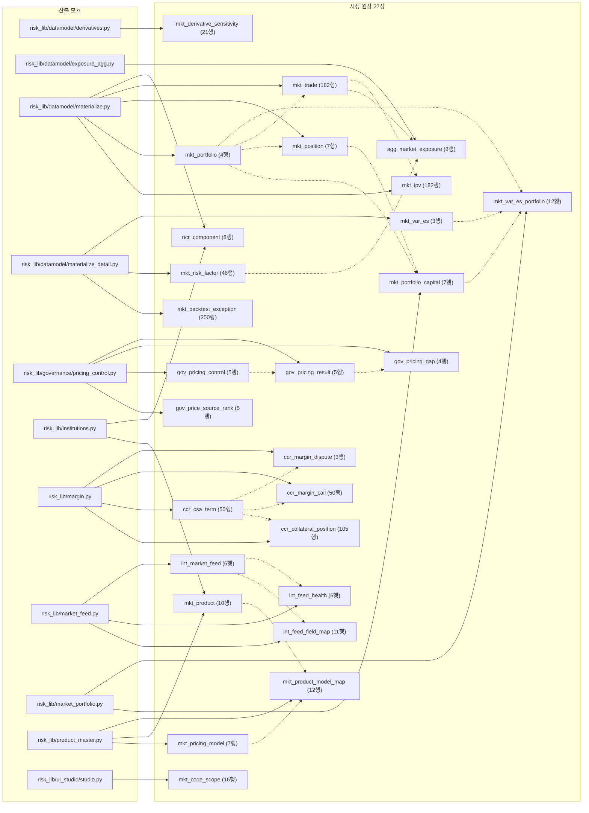

원장 → 화면·서식 (쓰이는 27장만)

```mermaid
flowchart LR
  subgraph G["시장 원장"]
  direction TB
    Tagg_market_exposure["agg_market_exposure (8행)"]
    Tccr_collateral_position["ccr_collateral_position (105행)"]
    Tccr_csa_term["ccr_csa_term (50행)"]
    Tccr_margin_call["ccr_margin_call (50행)"]
    Tccr_margin_dispute["ccr_margin_dispute (3행)"]
    Tgov_price_source_rank["gov_price_source_rank (5행)"]
    Tgov_pricing_control["gov_pricing_control (5행)"]
    Tgov_pricing_gap["gov_pricing_gap (4행)"]
    Tgov_pricing_result["gov_pricing_result (5행)"]
    Tint_feed_field_map["int_feed_field_map (11행)"]
    Tint_feed_health["int_feed_health (6행)"]
    Tint_market_feed["int_market_feed (6행)"]
    Tmkt_backtest_exception["mkt_backtest_exception (250행)"]
    Tmkt_code_scope["mkt_code_scope (16행)"]
    Tmkt_derivative_sensitivity["mkt_derivative_sensitivity (21행)"]
    Tmkt_ipv["mkt_ipv (182행)"]
    Tmkt_portfolio["mkt_portfolio (4행)"]
    Tmkt_portfolio_capital["mkt_portfolio_capital (7행)"]
    Tmkt_position["mkt_position (7행)"]
    Tmkt_pricing_model["mkt_pricing_model (7행)"]
    Tmkt_product["mkt_product (10행)"]
    Tmkt_product_model_map["mkt_product_model_map (12행)"]
    Tmkt_risk_factor["mkt_risk_factor (46행)"]
    Tmkt_trade["mkt_trade (182행)"]
    Tmkt_var_es["mkt_var_es (3행)"]
    Tmkt_var_es_portfolio["mkt_var_es_portfolio (12행)"]
    Tncr_component["ncr_component (8행)"]
  end
  subgraph V["화면·서식"]
  direction TB
    VNCRxb7xac74xc804xc131["NCR·건전성"]
    VVaRxb7ES["VaR·ES"]
    Vxac00xaca9xac80xc99dxb7IPV["가격검증·IPV"]
    Vxbc31xd14cxc2a4xd305["백테스팅"]
    Vxc2dcxc7a5["시장"]
    Vxc2dcxc7a5x20RWA["시장 RWA"]
    Vxc2dcxc7a5x20xd3ecxd2b8xd3f4xb9acxc624["시장 포트폴리오"]
    Vxc9d1xacc4x20xc6d0xc7a5["집계 원장"]
    Vxcf54xb4dcx20xb9e4xd551["코드 매핑"]
    Vxcf55xd54f["콕핏"]
    Vxd30cxc0ddxc0c1xd488["파생상품"]
    Vxd3ecxd2b8xd3f4xb9acxc624x20xc124xc815["포트폴리오 설정"]
    FORMS["감독서식 10개 모듈"]
  end
  Tncr_component --> VNCRxb7xac74xc804xc131
  Tmkt_var_es --> VVaRxb7ES
  Tmkt_ipv --> Vxac00xaca9xac80xc99dxb7IPV
  Tmkt_risk_factor --> Vxac00xaca9xac80xc99dxb7IPV
  Tmkt_trade --> Vxac00xaca9xac80xc99dxb7IPV
  Tmkt_backtest_exception --> Vxbc31xd14cxc2a4xd305
  Tagg_market_exposure --> Vxc2dcxc7a5
  Tccr_collateral_position --> Vxc2dcxc7a5
  Tccr_csa_term --> Vxc2dcxc7a5
  Tccr_margin_call --> Vxc2dcxc7a5
  Tccr_margin_dispute --> Vxc2dcxc7a5
  Tgov_price_source_rank --> Vxc2dcxc7a5
  Tgov_pricing_control --> Vxc2dcxc7a5
  Tgov_pricing_gap --> Vxc2dcxc7a5
  Tgov_pricing_result --> Vxc2dcxc7a5
  Tint_feed_field_map --> Vxc2dcxc7a5
  Tint_feed_health --> Vxc2dcxc7a5
  Tint_market_feed --> Vxc2dcxc7a5
  Tmkt_backtest_exception --> Vxc2dcxc7a5
  Tmkt_code_scope --> Vxc2dcxc7a5
  Tmkt_derivative_sensitivity --> Vxc2dcxc7a5
  Tmkt_ipv --> Vxc2dcxc7a5
  Tmkt_portfolio --> Vxc2dcxc7a5
  Tmkt_portfolio_capital --> Vxc2dcxc7a5
  Tmkt_position --> Vxc2dcxc7a5
  Tmkt_pricing_model --> Vxc2dcxc7a5
  Tmkt_product --> Vxc2dcxc7a5
  Tmkt_product_model_map --> Vxc2dcxc7a5
  Tmkt_risk_factor --> Vxc2dcxc7a5
  Tmkt_trade --> Vxc2dcxc7a5
  Tmkt_var_es --> Vxc2dcxc7a5
  Tmkt_var_es_portfolio --> Vxc2dcxc7a5
  Tmkt_var_es --> Vxc2dcxc7a5x20RWA
  Tmkt_portfolio_capital --> Vxc2dcxc7a5x20xd3ecxd2b8xd3f4xb9acxc624
  Tmkt_position --> Vxc2dcxc7a5x20xd3ecxd2b8xd3f4xb9acxc624
  Tmkt_var_es_portfolio --> Vxc2dcxc7a5x20xd3ecxd2b8xd3f4xb9acxc624
  Tagg_market_exposure --> Vxc9d1xacc4x20xc6d0xc7a5
  Tmkt_code_scope --> Vxcf54xb4dcx20xb9e4xd551
  Tmkt_ipv --> Vxcf55xd54f
  Tmkt_derivative_sensitivity --> Vxd30cxc0ddxc0c1xd488
  Tmkt_portfolio --> Vxd3ecxd2b8xd3f4xb9acxc624x20xc124xc815
  Tmkt_trade --> Vxd3ecxd2b8xd3f4xb9acxc624x20xc124xc815
  Tmkt_backtest_exception --> FORMS
  Tmkt_ipv --> FORMS
  Tmkt_risk_factor --> FORMS
  Tmkt_trade --> FORMS
  Tmkt_var_es --> FORMS
```

### 2.4 운영 · 원장 13장

산출 모듈 → 원장 (미배선 0장 포함)

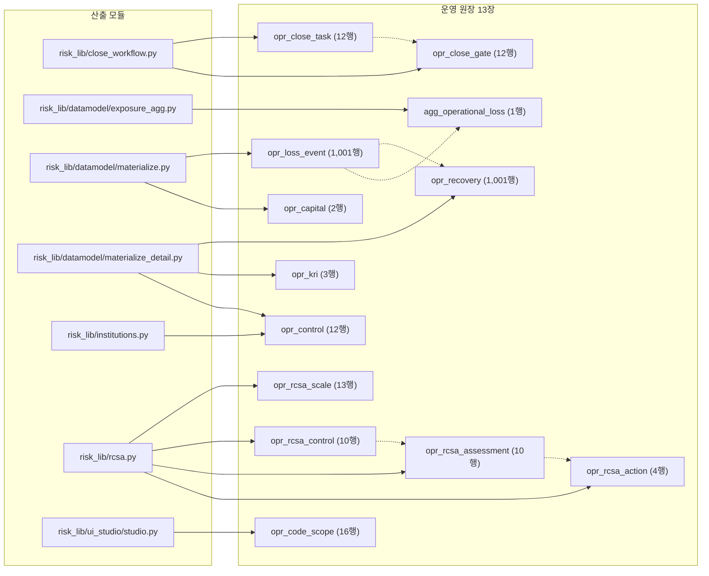

원장 → 화면·서식 (쓰이는 13장만)

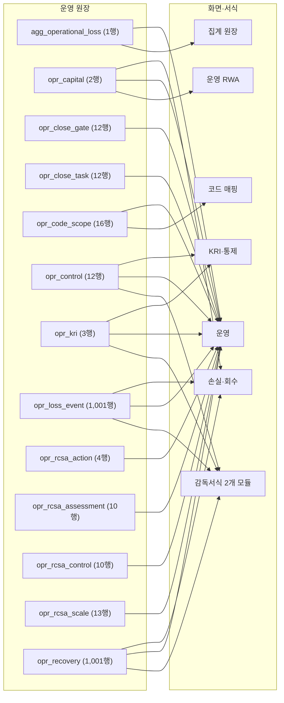

### 2.5 ALM · 원장 47장

산출 모듈 → 원장 (미배선 0장 포함)

```mermaid
flowchart LR
  subgraph S["산출 모듈"]
  direction TB
    Prisk_libx2falmx2fbehaviour_estimationx2epy["risk_lib/alm/behaviour_estimation.py"]
    Prisk_libx2falmx2fbehaviour_historyx2epy["risk_lib/alm/behaviour_history.py"]
    Prisk_libx2falmx2fcurvesx2epy["risk_lib/alm/curves.py"]
    Prisk_libx2falmx2fparamsx2epy["risk_lib/alm/params.py"]
    Prisk_libx2fdatamodelx2fexposure_aggx2epy["risk_lib/datamodel/exposure_agg.py"]
    Prisk_libx2fdatamodelx2fmaterializex2epy["risk_lib/datamodel/materialize.py"]
    Prisk_libx2fdatamodelx2fmaterialize_detailx2epy["risk_lib/datamodel/materialize_detail.py"]
    Prisk_libx2ffundingx2epy["risk_lib/funding.py"]
    Prisk_libx2finstitutionsx2epy["risk_lib/institutions.py"]
    Prisk_libx2fpipelinex2epy["risk_lib/pipeline.py"]
    Prisk_libx2fui_studiox2fstudiox2epy["risk_lib/ui_studio/studio.py"]
  end
  subgraph G["ALM 원장 47장"]
  direction TB
    Tagg_alm_exposure["agg_alm_exposure (10행)"]
    Talm_behaviour_backtest["alm_behaviour_backtest (5행)"]
    Talm_behaviour_model["alm_behaviour_model (8행)"]
    Talm_behaviour_param["alm_behaviour_param (2행)"]
    Talm_behaviour_scenario_mult["alm_behaviour_scenario_mult (12행)"]
    Talm_cashflow_behavioural["alm_cashflow_behavioural (31,381행)"]
    Talm_cashflow_bucket["alm_cashflow_bucket (441행)"]
    Talm_cashflow_contract["alm_cashflow_contract (9,397행)"]
    Talm_code_scope["alm_code_scope (20행)"]
    Talm_contract["alm_contract (3,021행)"]
    Talm_early_redemption_observation["alm_early_redemption_observation (60행)"]
    Talm_irrbb_bucket_pv["alm_irrbb_bucket_pv (378행)"]
    Talm_irrbb_result["alm_irrbb_result (12행)"]
    Talm_irrbb_shock["alm_irrbb_shock (6행)"]
    Talm_lcr_factor["alm_lcr_factor (28행)"]
    Talm_lcr_flow["alm_lcr_flow (12행)"]
    Talm_lcr_item["alm_lcr_item (12행)"]
    Talm_liquidity_stress_param["alm_liquidity_stress_param (42행)"]
    Talm_maturity_ladder["alm_maturity_ladder (266행)"]
    Talm_nii_result["alm_nii_result (2행)"]
    Talm_nmd_balance_history["alm_nmd_balance_history (216행)"]
    Talm_nmd_core_method_compare["alm_nmd_core_method_compare (9행)"]
    Talm_nmd_param["alm_nmd_param (3행)"]
    Talm_nsfr_factor["alm_nsfr_factor (20행)"]
    Talm_nsfr_item["alm_nsfr_item (17행)"]
    Talm_post_shock_floor["alm_post_shock_floor (3행)"]
    Talm_prepay_observation["alm_prepay_observation (60행)"]
    Talm_prepay_scurve_param["alm_prepay_scurve_param (1행)"]
    Talm_product_terms["alm_product_terms (19행)"]
    Talm_rate_shock_param["alm_rate_shock_param (192행)"]
    Talm_repricing_gap["alm_repricing_gap (19행)"]
    Talm_result["alm_result (4행)"]
    Talm_scenario_def["alm_scenario_def (6행)"]
    Talm_survival_path["alm_survival_path (182행)"]
    Talm_time_bucket["alm_time_bucket (19행)"]
    Tdisc_irrbb_table6["disc_irrbb_table6 (32행)"]
    Tdisc_irrbb_table7_qualitative["disc_irrbb_table7_qualitative (8행)"]
    Tdisc_irrbb_table7_quantitative["disc_irrbb_table7_quantitative (2행)"]
    Tkr_auto_option_param["kr_auto_option_param (3행)"]
    Tkr_irrbb_governance["kr_irrbb_governance (9행)"]
    Tkr_nmd_category["kr_nmd_category (4행)"]
    Tkr_retail_behavioural_scope["kr_retail_behavioural_scope (608행)"]
    Tkr_retail_criteria["kr_retail_criteria (3행)"]
    Tliq_funding_concentration["liq_funding_concentration (56행)"]
    Tliq_funding_ladder["liq_funding_ladder (7행)"]
    Tliq_funding_limit["liq_funding_limit (4행)"]
    Tliq_funding_trade["liq_funding_trade (118행)"]
  end
  Prisk_libx2falmx2fbehaviour_estimationx2epy --> Talm_behaviour_backtest
  Prisk_libx2falmx2fbehaviour_estimationx2epy --> Talm_behaviour_model
  Prisk_libx2falmx2fbehaviour_estimationx2epy --> Talm_behaviour_param
  Prisk_libx2falmx2fbehaviour_estimationx2epy --> Talm_nmd_core_method_compare
  Prisk_libx2falmx2fbehaviour_estimationx2epy --> Talm_nmd_param
  Prisk_libx2falmx2fbehaviour_estimationx2epy --> Talm_prepay_scurve_param
  Prisk_libx2falmx2fbehaviour_historyx2epy --> Talm_early_redemption_observation
  Prisk_libx2falmx2fbehaviour_historyx2epy --> Talm_nmd_balance_history
  Prisk_libx2falmx2fbehaviour_historyx2epy --> Talm_prepay_observation
  Prisk_libx2falmx2fcurvesx2epy --> Talm_post_shock_floor
  Prisk_libx2falmx2fcurvesx2epy --> Talm_rate_shock_param
  Prisk_libx2falmx2fcurvesx2epy --> Talm_scenario_def
  Prisk_libx2falmx2fparamsx2epy --> Talm_behaviour_param
  Prisk_libx2falmx2fparamsx2epy --> Talm_behaviour_scenario_mult
  Prisk_libx2falmx2fparamsx2epy --> Talm_nmd_param
  Prisk_libx2falmx2fparamsx2epy --> Talm_prepay_scurve_param
  Prisk_libx2falmx2fparamsx2epy --> Talm_product_terms
  Prisk_libx2falmx2fparamsx2epy --> Talm_time_bucket
  Prisk_libx2fdatamodelx2fexposure_aggx2epy --> Tagg_alm_exposure
  Prisk_libx2fdatamodelx2fmaterializex2epy --> Talm_irrbb_shock
  Prisk_libx2fdatamodelx2fmaterializex2epy --> Talm_result
  Prisk_libx2fdatamodelx2fmaterialize_detailx2epy --> Talm_lcr_item
  Prisk_libx2fdatamodelx2fmaterialize_detailx2epy --> Talm_repricing_gap
  Prisk_libx2ffundingx2epy --> Tliq_funding_concentration
  Prisk_libx2ffundingx2epy --> Tliq_funding_ladder
  Prisk_libx2ffundingx2epy --> Tliq_funding_limit
  Prisk_libx2ffundingx2epy --> Tliq_funding_trade
  Prisk_libx2finstitutionsx2epy --> Talm_lcr_factor
  Prisk_libx2finstitutionsx2epy --> Talm_liquidity_stress_param
  Prisk_libx2finstitutionsx2epy --> Talm_nsfr_factor
  Prisk_libx2finstitutionsx2epy --> Talm_post_shock_floor
  Prisk_libx2finstitutionsx2epy --> Talm_rate_shock_param
  Prisk_libx2finstitutionsx2epy --> Talm_scenario_def
  Prisk_libx2finstitutionsx2epy --> Talm_time_bucket
  Prisk_libx2finstitutionsx2epy --> Tkr_auto_option_param
  Prisk_libx2finstitutionsx2epy --> Tkr_retail_criteria
  Prisk_libx2fpipelinex2epy --> Talm_cashflow_behavioural
  Prisk_libx2fpipelinex2epy --> Talm_cashflow_bucket
  Prisk_libx2fpipelinex2epy --> Talm_cashflow_contract
  Prisk_libx2fpipelinex2epy --> Talm_contract
  Prisk_libx2fpipelinex2epy --> Talm_irrbb_bucket_pv
  Prisk_libx2fpipelinex2epy --> Talm_irrbb_result
  Prisk_libx2fpipelinex2epy --> Talm_lcr_factor
  Prisk_libx2fpipelinex2epy --> Talm_lcr_flow
  Prisk_libx2fpipelinex2epy --> Talm_liquidity_stress_param
  Prisk_libx2fpipelinex2epy --> Talm_maturity_ladder
  Prisk_libx2fpipelinex2epy --> Talm_nii_result
  Prisk_libx2fpipelinex2epy --> Talm_nsfr_factor
  Prisk_libx2fpipelinex2epy --> Talm_nsfr_item
  Prisk_libx2fpipelinex2epy --> Talm_survival_path
  Prisk_libx2fpipelinex2epy --> Tdisc_irrbb_table6
  Prisk_libx2fpipelinex2epy --> Tdisc_irrbb_table7_qualitative
  Prisk_libx2fpipelinex2epy --> Tdisc_irrbb_table7_quantitative
  Prisk_libx2fpipelinex2epy --> Tkr_auto_option_param
  Prisk_libx2fpipelinex2epy --> Tkr_irrbb_governance
  Prisk_libx2fpipelinex2epy --> Tkr_nmd_category
  Prisk_libx2fpipelinex2epy --> Tkr_retail_behavioural_scope
  Prisk_libx2fpipelinex2epy --> Tkr_retail_criteria
  Prisk_libx2fui_studiox2fstudiox2epy --> Talm_code_scope
  Talm_contract -.-> Talm_cashflow_behavioural
  Talm_contract -.-> Talm_cashflow_bucket
  Talm_contract -.-> Talm_cashflow_contract
  Talm_product_terms -.-> Talm_contract
  Talm_cashflow_bucket -.-> Talm_irrbb_bucket_pv
  Talm_cashflow_bucket -.-> Talm_irrbb_result
  Talm_code_scope -.-> Tagg_alm_exposure
  Talm_lcr_factor -.-> Talm_lcr_flow
  Talm_liquidity_stress_param -.-> Talm_survival_path
  Talm_nsfr_factor -.-> Talm_nsfr_item
  Tkr_retail_criteria -.-> Tkr_nmd_category
  Tkr_retail_criteria -.-> Tkr_retail_behavioural_scope
```

원장 → 화면·서식 (쓰이는 47장만)

```mermaid
flowchart LR
  subgraph G["ALM 원장"]
  direction TB
    Tagg_alm_exposure["agg_alm_exposure (10행)"]
    Talm_behaviour_backtest["alm_behaviour_backtest (5행)"]
    Talm_behaviour_model["alm_behaviour_model (8행)"]
    Talm_behaviour_param["alm_behaviour_param (2행)"]
    Talm_behaviour_scenario_mult["alm_behaviour_scenario_mult (12행)"]
    Talm_cashflow_behavioural["alm_cashflow_behavioural (31,381행)"]
    Talm_cashflow_bucket["alm_cashflow_bucket (441행)"]
    Talm_cashflow_contract["alm_cashflow_contract (9,397행)"]
    Talm_code_scope["alm_code_scope (20행)"]
    Talm_contract["alm_contract (3,021행)"]
    Talm_early_redemption_observation["alm_early_redemption_observation (60행)"]
    Talm_irrbb_bucket_pv["alm_irrbb_bucket_pv (378행)"]
    Talm_irrbb_result["alm_irrbb_result (12행)"]
    Talm_irrbb_shock["alm_irrbb_shock (6행)"]
    Talm_lcr_factor["alm_lcr_factor (28행)"]
    Talm_lcr_flow["alm_lcr_flow (12행)"]
    Talm_lcr_item["alm_lcr_item (12행)"]
    Talm_liquidity_stress_param["alm_liquidity_stress_param (42행)"]
    Talm_maturity_ladder["alm_maturity_ladder (266행)"]
    Talm_nii_result["alm_nii_result (2행)"]
    Talm_nmd_balance_history["alm_nmd_balance_history (216행)"]
    Talm_nmd_core_method_compare["alm_nmd_core_method_compare (9행)"]
    Talm_nmd_param["alm_nmd_param (3행)"]
    Talm_nsfr_factor["alm_nsfr_factor (20행)"]
    Talm_nsfr_item["alm_nsfr_item (17행)"]
    Talm_post_shock_floor["alm_post_shock_floor (3행)"]
    Talm_prepay_observation["alm_prepay_observation (60행)"]
    Talm_prepay_scurve_param["alm_prepay_scurve_param (1행)"]
    Talm_product_terms["alm_product_terms (19행)"]
    Talm_rate_shock_param["alm_rate_shock_param (192행)"]
    Talm_repricing_gap["alm_repricing_gap (19행)"]
    Talm_result["alm_result (4행)"]
    Talm_scenario_def["alm_scenario_def (6행)"]
    Talm_survival_path["alm_survival_path (182행)"]
    Talm_time_bucket["alm_time_bucket (19행)"]
    Tdisc_irrbb_table6["disc_irrbb_table6 (32행)"]
    Tdisc_irrbb_table7_qualitative["disc_irrbb_table7_qualitative (8행)"]
    Tdisc_irrbb_table7_quantitative["disc_irrbb_table7_quantitative (2행)"]
    Tkr_auto_option_param["kr_auto_option_param (3행)"]
    Tkr_irrbb_governance["kr_irrbb_governance (9행)"]
    Tkr_nmd_category["kr_nmd_category (4행)"]
    Tkr_retail_behavioural_scope["kr_retail_behavioural_scope (608행)"]
    Tkr_retail_criteria["kr_retail_criteria (3행)"]
    Tliq_funding_concentration["liq_funding_concentration (56행)"]
    Tliq_funding_ladder["liq_funding_ladder (7행)"]
    Tliq_funding_limit["liq_funding_limit (4행)"]
    Tliq_funding_trade["liq_funding_trade (118행)"]
  end
  subgraph V["화면·서식"]
  direction TB
    VALM["ALM"]
    VALMx20xacc4xc218x20xc6d0xc7a5["ALM 계수 원장"]
    Vxad6dxb0b4x20xae08xb9acxb9acxc2a4xd06c["국내 금리리스크"]
    Vxae08xb9acxb9acxc2a4xd06c["금리리스크"]
    Vxbe44xb9ccxae30xc131xc608xae08x20xcf54xc5b4["비만기성예금 코어"]
    Vxc0ddxc874xae30xac04["생존기간"]
    Vxc2dcxbbacxb808xc774xc158["시뮬레이션"]
    Vxc720xb3d9xc131x20xc0acxb2e4xb9ac["유동성 사다리"]
    Vxc720xb3d9xc131xb9acxc2a4xd06c["유동성리스크"]
    Vxc9d1xacc4x20xc6d0xc7a5["집계 원장"]
    Vxcf54xb4dcx20xb9e4xd551["코드 매핑"]
    Vxd55cxb3c4xad00xb9ac["한도관리"]
    Vxd589xb3d9xbaa8xd615x20xbc31xd14cxc2a4xd2b8["행동모형 백테스트"]
    Vxd589xb3d9xbaa8xd615x20xcd94xc815["행동모형 추정"]
    Vxd604xae08xd750xb984x20xc6d0xc7a5["현금흐름 원장"]
    FORMS["감독서식 6개 모듈"]
  end
  Tagg_alm_exposure --> VALM
  Talm_behaviour_backtest --> VALM
  Talm_behaviour_model --> VALM
  Talm_behaviour_param --> VALM
  Talm_behaviour_scenario_mult --> VALM
  Talm_cashflow_behavioural --> VALM
  Talm_cashflow_bucket --> VALM
  Talm_cashflow_contract --> VALM
  Talm_code_scope --> VALM
  Talm_contract --> VALM
  Talm_early_redemption_observation --> VALM
  Talm_irrbb_bucket_pv --> VALM
  Talm_irrbb_result --> VALM
  Talm_irrbb_shock --> VALM
  Talm_lcr_factor --> VALM
  Talm_lcr_flow --> VALM
  Talm_lcr_item --> VALM
  Talm_liquidity_stress_param --> VALM
  Talm_maturity_ladder --> VALM
  Talm_nii_result --> VALM
  Talm_nmd_balance_history --> VALM
  Talm_nmd_core_method_compare --> VALM
  Talm_nmd_param --> VALM
  Talm_nsfr_factor --> VALM
  Talm_nsfr_item --> VALM
  Talm_post_shock_floor --> VALM
  Talm_prepay_observation --> VALM
  Talm_prepay_scurve_param --> VALM
  Talm_product_terms --> VALM
  Talm_rate_shock_param --> VALM
  Talm_repricing_gap --> VALM
  Talm_result --> VALM
  Talm_scenario_def --> VALM
  Talm_survival_path --> VALM
  Talm_time_bucket --> VALM
  Tdisc_irrbb_table6 --> VALM
  Tdisc_irrbb_table7_qualitative --> VALM
  Tdisc_irrbb_table7_quantitative --> VALM
  Tkr_auto_option_param --> VALM
  Tkr_irrbb_governance --> VALM
  Tkr_nmd_category --> VALM
  Tkr_retail_behavioural_scope --> VALM
  Tkr_retail_criteria --> VALM
  Tliq_funding_concentration --> VALM
  Tliq_funding_ladder --> VALM
  Tliq_funding_limit --> VALM
  Tliq_funding_trade --> VALM
  Talm_behaviour_param --> VALMx20xacc4xc218x20xc6d0xc7a5
  Talm_behaviour_scenario_mult --> VALMx20xacc4xc218x20xc6d0xc7a5
  Talm_liquidity_stress_param --> VALMx20xacc4xc218x20xc6d0xc7a5
  Talm_nmd_param --> VALMx20xacc4xc218x20xc6d0xc7a5
  Talm_post_shock_floor --> VALMx20xacc4xc218x20xc6d0xc7a5
  Talm_prepay_scurve_param --> VALMx20xacc4xc218x20xc6d0xc7a5
  Talm_product_terms --> VALMx20xacc4xc218x20xc6d0xc7a5
  Talm_rate_shock_param --> VALMx20xacc4xc218x20xc6d0xc7a5
  Talm_scenario_def --> VALMx20xacc4xc218x20xc6d0xc7a5
  Talm_time_bucket --> VALMx20xacc4xc218x20xc6d0xc7a5
  Talm_irrbb_bucket_pv --> Vxad6dxb0b4x20xae08xb9acxb9acxc2a4xd06c
  Talm_irrbb_result --> Vxad6dxb0b4x20xae08xb9acxb9acxc2a4xd06c
  Talm_nii_result --> Vxad6dxb0b4x20xae08xb9acxb9acxc2a4xd06c
  Talm_nmd_param --> Vxad6dxb0b4x20xae08xb9acxb9acxc2a4xd06c
  Talm_post_shock_floor --> Vxad6dxb0b4x20xae08xb9acxb9acxc2a4xd06c
  Talm_rate_shock_param --> Vxad6dxb0b4x20xae08xb9acxb9acxc2a4xd06c
  Talm_repricing_gap --> Vxad6dxb0b4x20xae08xb9acxb9acxc2a4xd06c
  Talm_time_bucket --> Vxad6dxb0b4x20xae08xb9acxb9acxc2a4xd06c
  Tdisc_irrbb_table6 --> Vxad6dxb0b4x20xae08xb9acxb9acxc2a4xd06c
  Tdisc_irrbb_table7_qualitative --> Vxad6dxb0b4x20xae08xb9acxb9acxc2a4xd06c
  Tdisc_irrbb_table7_quantitative --> Vxad6dxb0b4x20xae08xb9acxb9acxc2a4xd06c
  Tkr_auto_option_param --> Vxad6dxb0b4x20xae08xb9acxb9acxc2a4xd06c
  Tkr_irrbb_governance --> Vxad6dxb0b4x20xae08xb9acxb9acxc2a4xd06c
  Tkr_nmd_category --> Vxad6dxb0b4x20xae08xb9acxb9acxc2a4xd06c
  Tkr_retail_behavioural_scope --> Vxad6dxb0b4x20xae08xb9acxb9acxc2a4xd06c
  Tkr_retail_criteria --> Vxad6dxb0b4x20xae08xb9acxb9acxc2a4xd06c
  Talm_irrbb_bucket_pv --> Vxae08xb9acxb9acxc2a4xd06c
  Talm_irrbb_result --> Vxae08xb9acxb9acxc2a4xd06c
  Talm_nii_result --> Vxae08xb9acxb9acxc2a4xd06c
  Talm_post_shock_floor --> Vxae08xb9acxb9acxc2a4xd06c
  Talm_rate_shock_param --> Vxae08xb9acxb9acxc2a4xd06c
  Talm_repricing_gap --> Vxae08xb9acxb9acxc2a4xd06c
  Talm_result --> Vxae08xb9acxb9acxc2a4xd06c
  Talm_scenario_def --> Vxae08xb9acxb9acxc2a4xd06c
  Talm_nii_result --> Vxbe44xb9ccxae30xc131xc608xae08x20xcf54xc5b4
  Talm_nmd_balance_history --> Vxbe44xb9ccxae30xc131xc608xae08x20xcf54xc5b4
  Talm_nmd_core_method_compare --> Vxbe44xb9ccxae30xc131xc608xae08x20xcf54xc5b4
  Talm_nmd_param --> Vxbe44xb9ccxae30xc131xc608xae08x20xcf54xc5b4
  Tkr_nmd_category --> Vxbe44xb9ccxae30xc131xc608xae08x20xcf54xc5b4
  Talm_liquidity_stress_param --> Vxc0ddxc874xae30xac04
  Talm_survival_path --> Vxc0ddxc874xae30xac04
  Talm_irrbb_result --> Vxc2dcxbbacxb808xc774xc158
  Talm_maturity_ladder --> Vxc720xb3d9xc131x20xc0acxb2e4xb9ac
  Talm_scenario_def --> Vxc720xb3d9xc131x20xc0acxb2e4xb9ac
  Talm_time_bucket --> Vxc720xb3d9xc131x20xc0acxb2e4xb9ac
  Talm_lcr_factor --> Vxc720xb3d9xc131xb9acxc2a4xd06c
  Talm_lcr_flow --> Vxc720xb3d9xc131xb9acxc2a4xd06c
  Talm_nsfr_factor --> Vxc720xb3d9xc131xb9acxc2a4xd06c
  Talm_nsfr_item --> Vxc720xb3d9xc131xb9acxc2a4xd06c
  Talm_result --> Vxc720xb3d9xc131xb9acxc2a4xd06c
  Tagg_alm_exposure --> Vxc9d1xacc4x20xc6d0xc7a5
  Talm_code_scope --> Vxcf54xb4dcx20xb9e4xd551
  Talm_irrbb_result --> Vxd55cxb3c4xad00xb9ac
  Tkr_irrbb_governance --> Vxd55cxb3c4xad00xb9ac
  Talm_behaviour_backtest --> Vxd589xb3d9xbaa8xd615x20xbc31xd14cxc2a4xd2b8
  Talm_behaviour_model --> Vxd589xb3d9xbaa8xd615x20xbc31xd14cxc2a4xd2b8
  Talm_behaviour_param --> Vxd589xb3d9xbaa8xd615x20xbc31xd14cxc2a4xd2b8
  Talm_behaviour_backtest --> Vxd589xb3d9xbaa8xd615x20xcd94xc815
  Talm_behaviour_model --> Vxd589xb3d9xbaa8xd615x20xcd94xc815
  Talm_behaviour_param --> Vxd589xb3d9xbaa8xd615x20xcd94xc815
  Talm_behaviour_scenario_mult --> Vxd589xb3d9xbaa8xd615x20xcd94xc815
  Talm_early_redemption_observation --> Vxd589xb3d9xbaa8xd615x20xcd94xc815
  Talm_prepay_observation --> Vxd589xb3d9xbaa8xd615x20xcd94xc815
  Talm_prepay_scurve_param --> Vxd589xb3d9xbaa8xd615x20xcd94xc815
  Talm_cashflow_behavioural --> Vxd604xae08xd750xb984x20xc6d0xc7a5
  Talm_cashflow_bucket --> Vxd604xae08xd750xb984x20xc6d0xc7a5
  Talm_cashflow_contract --> Vxd604xae08xd750xb984x20xc6d0xc7a5
  Talm_contract --> Vxd604xae08xd750xb984x20xc6d0xc7a5
  Talm_scenario_def --> Vxd604xae08xd750xb984x20xc6d0xc7a5
  Talm_time_bucket --> Vxd604xae08xd750xb984x20xc6d0xc7a5
  Talm_lcr_item --> FORMS
  Talm_nsfr_item --> FORMS
  Talm_repricing_gap --> FORMS
  Talm_time_bucket --> FORMS
```

### 2.6 위기상황 · 원장 14장

산출 모듈 → 원장 (미배선 0장 포함)

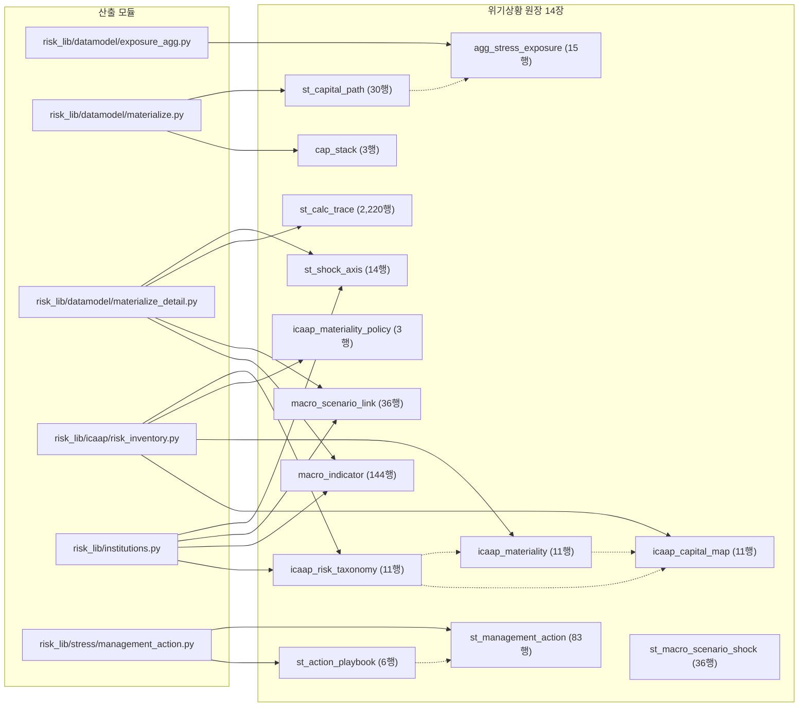

원장 → 화면·서식 (쓰이는 14장만)

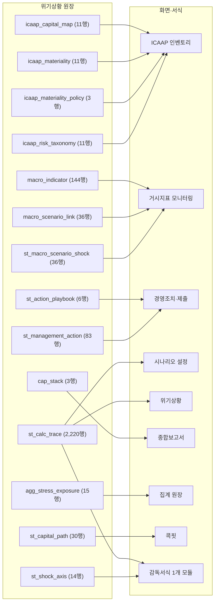

### 2.7 규제서식 · 원장 10장

산출 모듈 → 원장 (미배선 0장 포함)

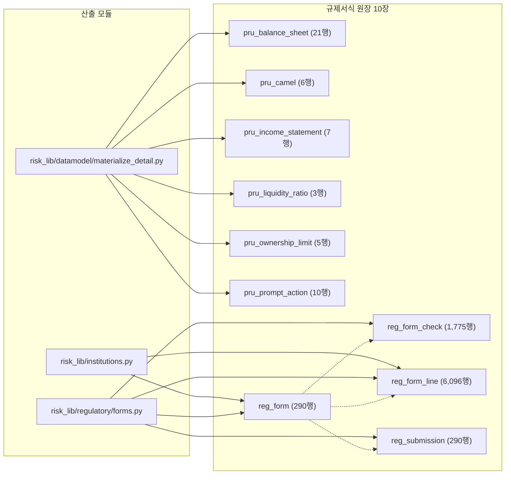

원장 → 화면·서식 (쓰이는 10장만)

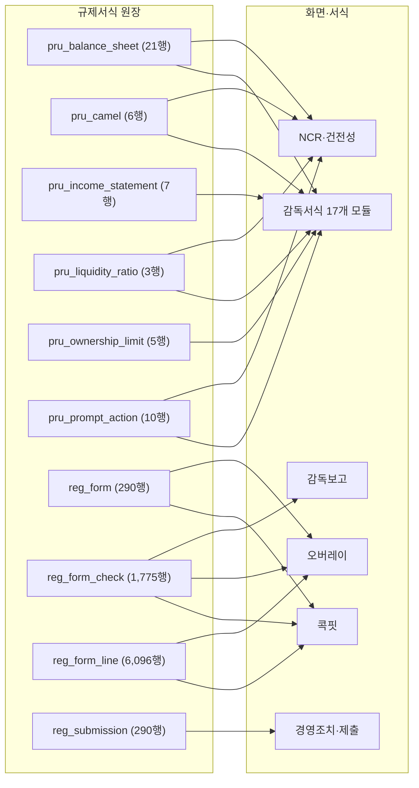

### 2.8 거버넌스·통제 · 원장 48장

산출 모듈 → 원장 (미배선 0장 포함)

```mermaid
flowchart LR
  subgraph S["산출 모듈"]
  direction TB
    Prisk_libx2fdatamodelx2fmaterializex2epy["risk_lib/datamodel/materialize.py"]
    Prisk_libx2fdatamodelx2fmaterialize_ledgersx2epy["risk_lib/datamodel/materialize_ledgers.py"]
    Prisk_libx2fgovernancex2fchange_controlx2epy["risk_lib/governance/change_control.py"]
    Prisk_libx2fgovernancex2fmodel_lifecyclex2epy["risk_lib/governance/model_lifecycle.py"]
    Prisk_libx2fgovernancex2frbacx2epy["risk_lib/governance/rbac.py"]
    Prisk_libx2fgovernancex2funified_runx2epy["risk_lib/governance/unified_run.py"]
    Prisk_libx2finstitutionsx2epy["risk_lib/institutions.py"]
    Prisk_libx2fintegrationx2fengine_adapterx2epy["risk_lib/integration/engine_adapter.py"]
    Prisk_libx2fpipelinex2epy["risk_lib/pipeline.py"]
    Prisk_libx2fui_studiox2fgovernancex2epy["risk_lib/ui_studio/governance.py"]
    Prisk_libx2fui_studiox2fstudiox2epy["risk_lib/ui_studio/studio.py"]
    Prisk_libx2fvalidationx2findependentx2epy["risk_lib/validation/independent.py"]
  end
  subgraph G["거버넌스·통제 원장 48장"]
  direction TB
    Tagent_activity["agent_activity (56행)"]
    Tagent_killswitch["agent_killswitch (2행)"]
    Tagent_registry["agent_registry (55행)"]
    Taig_adjustment["aig_adjustment (4행)"]
    Taig_agent_trace["aig_agent_trace (112행)"]
    Taig_redaction_rule["aig_redaction_rule (6행)"]
    Tchg_change_request["chg_change_request (2행)"]
    Tchg_impact_map["chg_impact_map (8행)"]
    Tchg_regression_test["chg_regression_test (6행)"]
    Tgov_access_decision["gov_access_decision (6행)"]
    Tgov_alert_policy["gov_alert_policy (5행)"]
    Tgov_approval["gov_approval (294행)"]
    Tgov_audit_chain["gov_audit_chain (413행)"]
    Tgov_change_control["gov_change_control (0행)"]
    Tgov_change_gate["gov_change_gate (0행)"]
    Tgov_change_impact["gov_change_impact (0행)"]
    Tgov_change_policy["gov_change_policy (75행)"]
    Tgov_change_request["gov_change_request (0행)"]
    Tgov_evidence_edge["gov_evidence_edge (7행)"]
    Tgov_evidence_node["gov_evidence_node (7행)"]
    Tgov_exception_action["gov_exception_action (14행)"]
    Tgov_model_stage["gov_model_stage (6행)"]
    Tgov_model_state["gov_model_state (13행)"]
    Tgov_model_transition["gov_model_transition (37행)"]
    Tgov_role["gov_role (10행)"]
    Tgov_role_permission["gov_role_permission (352행)"]
    Tgov_run_domain["gov_run_domain (9행)"]
    Tgov_sod_conflict["gov_sod_conflict (6행)"]
    Tgov_unified_run["gov_unified_run (1행)"]
    Tgov_user_role["gov_user_role (7행)"]
    Tint_engine_adapter["int_engine_adapter (5행)"]
    Tint_engine_io["int_engine_io (14행)"]
    Tlex_aggregate["lex_aggregate (3행)"]
    Tlex_connected_group["lex_connected_group (2,997행)"]
    Tlex_exemption["lex_exemption (34행)"]
    Tlex_exposure_measure["lex_exposure_measure (3,672행)"]
    Tlex_lookthrough["lex_lookthrough (67행)"]
    Tlex_position["lex_position (8,739행)"]
    Tlex_setting["lex_setting (25행)"]
    Tlex_substitution["lex_substitution (300행)"]
    Tui_field_policy["ui_field_policy (2,850행)"]
    Tui_layout_proposal["ui_layout_proposal (3행)"]
    Tui_query_plan["ui_query_plan (6행)"]
    Tui_view["ui_view (342행)"]
    Tval_audit_ledger["val_audit_ledger (23행)"]
    Tval_check["val_check (86행)"]
    Tval_independent_request["val_independent_request (1행)"]
    Tval_independent_target["val_independent_target (21행)"]
  end
  Prisk_libx2fdatamodelx2fmaterializex2epy --> Taig_adjustment
  Prisk_libx2fdatamodelx2fmaterializex2epy --> Tval_audit_ledger
  Prisk_libx2fdatamodelx2fmaterializex2epy --> Tval_check
  Prisk_libx2fdatamodelx2fmaterialize_ledgersx2epy --> Taig_agent_trace
  Prisk_libx2fdatamodelx2fmaterialize_ledgersx2epy --> Taig_redaction_rule
  Prisk_libx2fdatamodelx2fmaterialize_ledgersx2epy --> Tgov_audit_chain
  Prisk_libx2fgovernancex2fchange_controlx2epy --> Tgov_change_control
  Prisk_libx2fgovernancex2fchange_controlx2epy --> Tgov_change_gate
  Prisk_libx2fgovernancex2fchange_controlx2epy --> Tgov_change_impact
  Prisk_libx2fgovernancex2fchange_controlx2epy --> Tgov_change_policy
  Prisk_libx2fgovernancex2fchange_controlx2epy --> Tgov_change_request
  Prisk_libx2fgovernancex2fmodel_lifecyclex2epy --> Tgov_model_stage
  Prisk_libx2fgovernancex2fmodel_lifecyclex2epy --> Tgov_model_state
  Prisk_libx2fgovernancex2fmodel_lifecyclex2epy --> Tgov_model_transition
  Prisk_libx2fgovernancex2frbacx2epy --> Tgov_access_decision
  Prisk_libx2fgovernancex2frbacx2epy --> Tgov_role
  Prisk_libx2fgovernancex2frbacx2epy --> Tgov_role_permission
  Prisk_libx2fgovernancex2frbacx2epy --> Tgov_sod_conflict
  Prisk_libx2fgovernancex2frbacx2epy --> Tgov_user_role
  Prisk_libx2fgovernancex2funified_runx2epy --> Tgov_run_domain
  Prisk_libx2fgovernancex2funified_runx2epy --> Tgov_unified_run
  Prisk_libx2finstitutionsx2epy --> Tgov_model_stage
  Prisk_libx2fintegrationx2fengine_adapterx2epy --> Tint_engine_adapter
  Prisk_libx2fintegrationx2fengine_adapterx2epy --> Tint_engine_io
  Prisk_libx2fpipelinex2epy --> Tlex_aggregate
  Prisk_libx2fpipelinex2epy --> Tlex_connected_group
  Prisk_libx2fpipelinex2epy --> Tlex_exemption
  Prisk_libx2fpipelinex2epy --> Tlex_exposure_measure
  Prisk_libx2fpipelinex2epy --> Tlex_lookthrough
  Prisk_libx2fpipelinex2epy --> Tlex_position
  Prisk_libx2fpipelinex2epy --> Tlex_setting
  Prisk_libx2fpipelinex2epy --> Tlex_substitution
  Prisk_libx2fui_studiox2fgovernancex2epy --> Tchg_change_request
  Prisk_libx2fui_studiox2fgovernancex2epy --> Tchg_impact_map
  Prisk_libx2fui_studiox2fgovernancex2epy --> Tchg_regression_test
  Prisk_libx2fui_studiox2fgovernancex2epy --> Tgov_evidence_edge
  Prisk_libx2fui_studiox2fgovernancex2epy --> Tgov_evidence_node
  Prisk_libx2fui_studiox2fstudiox2epy --> Tagent_activity
  Prisk_libx2fui_studiox2fstudiox2epy --> Tagent_killswitch
  Prisk_libx2fui_studiox2fstudiox2epy --> Tagent_registry
  Prisk_libx2fui_studiox2fstudiox2epy --> Tgov_alert_policy
  Prisk_libx2fui_studiox2fstudiox2epy --> Tgov_approval
  Prisk_libx2fui_studiox2fstudiox2epy --> Tgov_exception_action
  Prisk_libx2fui_studiox2fstudiox2epy --> Tui_field_policy
  Prisk_libx2fui_studiox2fstudiox2epy --> Tui_layout_proposal
  Prisk_libx2fui_studiox2fstudiox2epy --> Tui_query_plan
  Prisk_libx2fui_studiox2fstudiox2epy --> Tui_view
  Prisk_libx2fvalidationx2findependentx2epy --> Tval_independent_request
  Prisk_libx2fvalidationx2findependentx2epy --> Tval_independent_target
  Taig_adjustment -.-> Tgov_audit_chain
  Tgov_access_decision -.-> Tgov_audit_chain
  Tgov_approval -.-> Tgov_audit_chain
  Tval_audit_ledger -.-> Tgov_audit_chain
  Tval_check -.-> Tgov_audit_chain
  Tgov_approval -.-> Tgov_evidence_edge
  Tgov_approval -.-> Tgov_evidence_node
  Tval_audit_ledger -.-> Tgov_evidence_edge
  Tval_audit_ledger -.-> Tgov_evidence_node
  Tval_check -.-> Tgov_evidence_edge
  Tval_check -.-> Tgov_evidence_node
  Tchg_change_request -.-> Tchg_impact_map
  Tchg_change_request -.-> Tchg_regression_test
  Tgov_change_request -.-> Tgov_change_control
  Tgov_change_request -.-> Tgov_change_gate
  Tgov_change_request -.-> Tgov_change_impact
  Tgov_model_stage -.-> Tgov_model_transition
  Tgov_role -.-> Tgov_role_permission
  Tgov_role -.-> Tgov_sod_conflict
  Tgov_role -.-> Tgov_user_role
  Tgov_unified_run -.-> Tgov_run_domain
  Tint_engine_adapter -.-> Tint_engine_io
  Tlex_setting -.-> Tlex_position
  Tui_view -.-> Tui_field_policy
  Tui_view -.-> Tui_layout_proposal
  Tui_view -.-> Tui_query_plan
  Tval_independent_request -.-> Tval_independent_target
```

원장 → 화면·서식 (쓰이는 48장만)

```mermaid
flowchart LR
  subgraph G["거버넌스·통제 원장"]
  direction TB
    Tagent_activity["agent_activity (56행)"]
    Tagent_killswitch["agent_killswitch (2행)"]
    Tagent_registry["agent_registry (55행)"]
    Taig_adjustment["aig_adjustment (4행)"]
    Taig_agent_trace["aig_agent_trace (112행)"]
    Taig_redaction_rule["aig_redaction_rule (6행)"]
    Tchg_change_request["chg_change_request (2행)"]
    Tchg_impact_map["chg_impact_map (8행)"]
    Tchg_regression_test["chg_regression_test (6행)"]
    Tgov_access_decision["gov_access_decision (6행)"]
    Tgov_alert_policy["gov_alert_policy (5행)"]
    Tgov_approval["gov_approval (294행)"]
    Tgov_audit_chain["gov_audit_chain (413행)"]
    Tgov_change_control["gov_change_control (0행)"]
    Tgov_change_gate["gov_change_gate (0행)"]
    Tgov_change_impact["gov_change_impact (0행)"]
    Tgov_change_policy["gov_change_policy (75행)"]
    Tgov_change_request["gov_change_request (0행)"]
    Tgov_evidence_edge["gov_evidence_edge (7행)"]
    Tgov_evidence_node["gov_evidence_node (7행)"]
    Tgov_exception_action["gov_exception_action (14행)"]
    Tgov_model_stage["gov_model_stage (6행)"]
    Tgov_model_state["gov_model_state (13행)"]
    Tgov_model_transition["gov_model_transition (37행)"]
    Tgov_role["gov_role (10행)"]
    Tgov_role_permission["gov_role_permission (352행)"]
    Tgov_run_domain["gov_run_domain (9행)"]
    Tgov_sod_conflict["gov_sod_conflict (6행)"]
    Tgov_unified_run["gov_unified_run (1행)"]
    Tgov_user_role["gov_user_role (7행)"]
    Tint_engine_adapter["int_engine_adapter (5행)"]
    Tint_engine_io["int_engine_io (14행)"]
    Tlex_aggregate["lex_aggregate (3행)"]
    Tlex_connected_group["lex_connected_group (2,997행)"]
    Tlex_exemption["lex_exemption (34행)"]
    Tlex_exposure_measure["lex_exposure_measure (3,672행)"]
    Tlex_lookthrough["lex_lookthrough (67행)"]
    Tlex_position["lex_position (8,739행)"]
    Tlex_setting["lex_setting (25행)"]
    Tlex_substitution["lex_substitution (300행)"]
    Tui_field_policy["ui_field_policy (2,850행)"]
    Tui_layout_proposal["ui_layout_proposal (3행)"]
    Tui_query_plan["ui_query_plan (6행)"]
    Tui_view["ui_view (342행)"]
    Tval_audit_ledger["val_audit_ledger (23행)"]
    Tval_check["val_check (86행)"]
    Tval_independent_request["val_independent_request (1행)"]
    Tval_independent_target["val_independent_target (21행)"]
  end
  subgraph V["화면·서식"]
  direction TB
    VAIx20xac70xbc84xb10cxc2a4["AI 거버넌스"]
    VBEELxb7PLGD["BEEL·PLGD"]
    VCCFx20xcd94xc815["CCF 추정"]
    VKRIxb7xd1b5xc81c["KRI·통제"]
    VLGDx20xcd94xc815["LGD 추정"]
    VLGDxb7EADx20xc2e4xce21xac80xc99d["LGD·EAD 실측검증"]
    VPDx20xcd94xc815["PD 추정"]
    VRDM["RDM"]
    Vxac70xc561x20xbd84xc11d["거액 분석"]
    Vxac70xc561x20xc124xc815["거액 설정"]
    Vxac80xc99d["검증"]
    Vxbaa8xd615x20xac70xbc84xb10cxc2a4["모형 거버넌스"]
    Vxbaa8xd615x20xc218xba85xc8fcxae30["모형 수명주기"]
    Vxbcc0xacbd["변경"]
    Vxbcc0xacbdxd1b5xc81c["변경통제"]
    Vxbd80xb3c4xc790xc0b0x20LGD["부도자산 LGD"]
    Vxbe44xb9ccxae30xc131xc608xae08x20xcf54xc5b4["비만기성예금 코어"]
    Vxc2dcxb098xb9acxc624x20xc124xc815["시나리오 설정"]
    Vxc2e4xd589xb7xac10xc0acxcd94xc801["실행·감사추적"]
    Vxc5d0xc774xc804xd2b8["에이전트"]
    Vxc608xc678xb7xc870xce58["예외·조치"]
    Vxc624xbc84xb808xc774["오버레이"]
    Vxc811xadfcxd1b5xc81cxb7xc9c1xbb34xbd84xb9ac["접근통제·직무분리"]
    Vxc870xd68cx20xac70xbc84xb10cxc2a4["조회 거버넌스"]
    Vxcf55xd54f["콕핏"]
    Vxd589xb3d9xbaa8xd615x20xbc31xd14cxc2a4xd2b8["행동모형 백테스트"]
    Vxd589xb3d9xbaa8xd615x20xcd94xc815["행동모형 추정"]
    Vxd68cxc218x20xd560xc778xc728["회수 할인율"]
  end
  Taig_adjustment --> VAIx20xac70xbc84xb10cxc2a4
  Taig_agent_trace --> VAIx20xac70xbc84xb10cxc2a4
  Taig_redaction_rule --> VAIx20xac70xbc84xb10cxc2a4
  Tgov_role --> VBEELxb7PLGD
  Tgov_run_domain --> VBEELxb7PLGD
  Tgov_role --> VCCFx20xcd94xc815
  Tgov_run_domain --> VCCFx20xcd94xc815
  Tgov_alert_policy --> VKRIxb7xd1b5xc81c
  Tgov_role --> VLGDx20xcd94xc815
  Tgov_run_domain --> VLGDx20xcd94xc815
  Tgov_role --> VLGDxb7EADx20xc2e4xce21xac80xc99d
  Tgov_run_domain --> VLGDxb7EADx20xc2e4xce21xac80xc99d
  Tgov_role --> VPDx20xcd94xc815
  Tgov_run_domain --> VPDx20xcd94xc815
  Tgov_role --> VRDM
  Tgov_run_domain --> VRDM
  Tgov_role --> Vxac70xc561x20xbd84xc11d
  Tgov_run_domain --> Vxac70xc561x20xbd84xc11d
  Tlex_aggregate --> Vxac70xc561x20xbd84xc11d
  Tlex_connected_group --> Vxac70xc561x20xbd84xc11d
  Tlex_exemption --> Vxac70xc561x20xbd84xc11d
  Tlex_exposure_measure --> Vxac70xc561x20xbd84xc11d
  Tlex_lookthrough --> Vxac70xc561x20xbd84xc11d
  Tlex_position --> Vxac70xc561x20xbd84xc11d
  Tlex_setting --> Vxac70xc561x20xbd84xc11d
  Tlex_substitution --> Vxac70xc561x20xbd84xc11d
  Tgov_role --> Vxac70xc561x20xc124xc815
  Tgov_run_domain --> Vxac70xc561x20xc124xc815
  Tlex_aggregate --> Vxac70xc561x20xc124xc815
  Tlex_setting --> Vxac70xc561x20xc124xc815
  Tval_check --> Vxac80xc99d
  Tval_independent_request --> Vxac80xc99d
  Tval_independent_target --> Vxac80xc99d
  Tgov_role --> Vxbaa8xd615x20xac70xbc84xb10cxc2a4
  Tgov_run_domain --> Vxbaa8xd615x20xac70xbc84xb10cxc2a4
  Tgov_model_stage --> Vxbaa8xd615x20xc218xba85xc8fcxae30
  Tgov_model_state --> Vxbaa8xd615x20xc218xba85xc8fcxae30
  Tgov_model_transition --> Vxbaa8xd615x20xc218xba85xc8fcxae30
  Tchg_change_request --> Vxbcc0xacbd
  Tchg_impact_map --> Vxbcc0xacbd
  Tchg_regression_test --> Vxbcc0xacbd
  Tgov_change_control --> Vxbcc0xacbdxd1b5xc81c
  Tgov_change_gate --> Vxbcc0xacbdxd1b5xc81c
  Tgov_change_impact --> Vxbcc0xacbdxd1b5xc81c
  Tgov_change_policy --> Vxbcc0xacbdxd1b5xc81c
  Tgov_change_request --> Vxbcc0xacbdxd1b5xc81c
  Tgov_role --> Vxbd80xb3c4xc790xc0b0x20LGD
  Tgov_run_domain --> Vxbd80xb3c4xc790xc0b0x20LGD
  Tgov_role --> Vxbe44xb9ccxae30xc131xc608xae08x20xcf54xc5b4
  Tgov_run_domain --> Vxbe44xb9ccxae30xc131xc608xae08x20xcf54xc5b4
  Tchg_change_request --> Vxc2dcxb098xb9acxc624x20xc124xc815
  Tchg_impact_map --> Vxc2dcxb098xb9acxc624x20xc124xc815
  Tchg_regression_test --> Vxc2dcxb098xb9acxc624x20xc124xc815
  Tgov_audit_chain --> Vxc2e4xd589xb7xac10xc0acxcd94xc801
  Tgov_unified_run --> Vxc2e4xd589xb7xac10xc0acxcd94xc801
  Tint_engine_adapter --> Vxc2e4xd589xb7xac10xc0acxcd94xc801
  Tint_engine_io --> Vxc2e4xd589xb7xac10xc0acxcd94xc801
  Tval_audit_ledger --> Vxc2e4xd589xb7xac10xc0acxcd94xc801
  Tagent_activity --> Vxc5d0xc774xc804xd2b8
  Tagent_killswitch --> Vxc5d0xc774xc804xd2b8
  Tagent_registry --> Vxc5d0xc774xc804xd2b8
  Tgov_alert_policy --> Vxc608xc678xb7xc870xce58
  Tgov_exception_action --> Vxc608xc678xb7xc870xce58
  Tval_check --> Vxc624xbc84xb808xc774
  Tgov_access_decision --> Vxc811xadfcxd1b5xc81cxb7xc9c1xbb34xbd84xb9ac
  Tgov_role_permission --> Vxc811xadfcxd1b5xc81cxb7xc9c1xbb34xbd84xb9ac
  Tgov_sod_conflict --> Vxc811xadfcxd1b5xc81cxb7xc9c1xbb34xbd84xb9ac
  Tgov_user_role --> Vxc811xadfcxd1b5xc81cxb7xc9c1xbb34xbd84xb9ac
  Tui_field_policy --> Vxc811xadfcxd1b5xc81cxb7xc9c1xbb34xbd84xb9ac
  Tui_layout_proposal --> Vxc870xd68cx20xac70xbc84xb10cxc2a4
  Tui_query_plan --> Vxc870xd68cx20xac70xbc84xb10cxc2a4
  Tui_view --> Vxc870xd68cx20xac70xbc84xb10cxc2a4
  Tgov_approval --> Vxcf55xd54f
  Tgov_evidence_edge --> Vxcf55xd54f
  Tgov_evidence_node --> Vxcf55xd54f
  Tgov_exception_action --> Vxcf55xd54f
  Tval_check --> Vxcf55xd54f
  Tval_independent_request --> Vxcf55xd54f
  Tval_independent_target --> Vxcf55xd54f
  Tgov_role --> Vxd589xb3d9xbaa8xd615x20xbc31xd14cxc2a4xd2b8
  Tgov_run_domain --> Vxd589xb3d9xbaa8xd615x20xbc31xd14cxc2a4xd2b8
  Tgov_role --> Vxd589xb3d9xbaa8xd615x20xcd94xc815
  Tgov_run_domain --> Vxd589xb3d9xbaa8xd615x20xcd94xc815
  Tgov_role --> Vxd68cxc218x20xd560xc778xc728
  Tgov_run_domain --> Vxd68cxc218x20xd560xc778xc728
```

## 3. 화면 기준 역방향

각 전용 화면이 어느 도메인 블록의 원장에서 오는지. 점선 위 숫자는 그 블록에서 가져오는 원장 수다.

```mermaid
flowchart RL
  B1["원천·리스크데이터"]
  B2["신용"]
  B3["시장"]
  B4["운영"]
  B5["ALM"]
  B6["위기상황"]
  B7["규제서식"]
  B8["거버넌스·통제"]
  VAIx20xac70xbc84xb10cxc2a4("AI 거버넌스")
  VALM("ALM")
  VALMx20xacc4xc218x20xc6d0xc7a5("ALM 계수 원장")
  VBEELxb7PLGD("BEEL·PLGD")
  VCCFx20xcd94xc815("CCF 추정")
  VDQxb7xb300xc0ac("DQ·대사")
  VECL("ECL")
  VICAAPx20xc778xbca4xd1a0xb9ac("ICAAP 인벤토리")
  VKRIxb7xd1b5xc81c("KRI·통제")
  VLGDx20xcd94xc815("LGD 추정")
  VLGDxb7EADx20xc2e4xce21xac80xc99d("LGD·EAD 실측검증")
  VNCRxb7xac74xc804xc131("NCR·건전성")
  VPDx20xcd94xc815("PD 추정")
  VRDM("RDM")
  VVaRxb7ES("VaR·ES")
  Vxac00xaca9xac80xc99dxb7IPV("가격검증·IPV")
  Vxac10xb3c5xbcf4xace0("감독보고")
  Vxac70xc2dcxc9c0xd45cx20xbaa8xb2c8xd130xb9c1("거시지표 모니터링")
  Vxac70xc561x20xbd84xc11d("거액 분석")
  Vxac70xc561x20xc124xc815("거액 설정")
  Vxac80xc99d("검증")
  Vxac80xc99dx20xc77cxc815("검증 일정")
  Vxacbdxc601xc870xce58xb7xc81cxcd9c("경영조치·제출")
  Vxad6dxb0b4x20xae08xb9acxb9acxc2a4xd06c("국내 금리리스크")
  Vxae08xb9acxb9acxc2a4xd06c("금리리스크")
  Vxb2f4xbcf4xb7xbcf4xc99d("담보·보증")
  Vxb4f1xae09x20xbcf4xc815("등급 보정")
  Vxb4f1xae09x20xc804xc774("등급 전이")
  Vxbaa8xd615x20xac70xbc84xb10cxc2a4("모형 거버넌스")
  Vxbaa8xd615x20xc218xba85xc8fcxae30("모형 수명주기")
  Vxbaa8xd615x20xc778xbca4xd1a0xb9ac("모형 인벤토리")
  Vxbaa8xd615xb9acxc2a4xd06c("모형리스크")
  Vxbc31xd14cxc2a4xd305("백테스팅")
  Vxbcc0xacbd("변경")
  Vxbcc0xacbdxd1b5xc81c("변경통제")
  Vxbcc0xbcc4xb825xb7xc548xc815xc131("변별력·안정성")
  Vxbd80xb3c4xc790xc0b0x20LGD("부도자산 LGD")
  Vxbe44xb9ccxae30xc131xc608xae08x20xcf54xc5b4("비만기성예금 코어")
  Vxc0b0xcd9cx20xbc29xbc95xb860("산출 방법론")
  Vxc0ddxc874xae30xac04("생존기간")
  Vxc190xc2e4xb7xd68cxc218("손실·회수")
  Vxc2dcxb098xb9acxc624x20xc124xc815("시나리오 설정")
  Vxc2dcxbbacxb808xc774xc158("시뮬레이션")
  Vxc2dcxc7a5("시장")
  Vxc2dcxc7a5x20RWA("시장 RWA")
  Vxc2dcxc7a5x20xd3ecxd2b8xd3f4xb9acxc624("시장 포트폴리오")
  Vxc2e0xc6a9("신용")
  Vxc2e0xc6a9x20RWA("신용 RWA")
  Vxc2e4xd589xb7xac10xc0acxcd94xc801("실행·감사추적")
  Vxc5d0xc774xc804xd2b8("에이전트")
  Vxc608xc678xb7xc870xce58("예외·조치")
  Vxc624xbc84xb808xc774("오버레이")
  Vxc6b4xc601("운영")
  Vxc6b4xc601x20RWA("운영 RWA")
  Vxc6d0xcc9cxb7xacc4xc57d("원천·계약")
  Vxc704xae30xc0c1xd669("위기상황")
  Vxc720xb3d9xc131x20xc0acxb2e4xb9ac("유동성 사다리")
  Vxc720xb3d9xc131xb9acxc2a4xd06c("유동성리스크")
  Vxc720xb3d9xd654("유동화")
  Vxc811xadfcxd1b5xc81cxb7xc9c1xbb34xbd84xb9ac("접근통제·직무분리")
  Vxc870xae30xacbdxbcf4("조기경보")
  Vxc870xd68cx20xac70xbc84xb10cxc2a4("조회 거버넌스")
  Vxc885xd569xbcf4xace0xc11c("종합보고서")
  Vxc9d1xacc4x20xc6d0xc7a5("집계 원장")
  Vxc9d1xd569xd22cxc790xc99dxad8c("집합투자증권")
  Vxcf54xb4dcx20xb9c8xc2a4xd130("코드 마스터")
  Vxcf54xb4dcx20xb9e4xd551("코드 매핑")
  Vxcf55xd54f("콕핏")
  Vxd30cxc0ddxc0c1xd488("파생상품")
  Vxd3ecxd2b8xd3f4xb9acxc624x20xc124xc815("포트폴리오 설정")
  Vxd55cxb3c4xad00xb9ac("한도관리")
  Vxd589xb3d9xbaa8xd615x20xbc31xd14cxc2a4xd2b8("행동모형 백테스트")
  Vxd589xb3d9xbaa8xd615x20xcd94xc815("행동모형 추정")
  Vxd604xae08xd750xb984x20xc6d0xc7a5("현금흐름 원장")
  Vxd68cxc218x20xd560xc778xc728("회수 할인율")
  VAIx20xac70xbc84xb10cxc2a4 -.->|3| B8
  VALM -.->|47| B5
  VALMx20xacc4xc218x20xc6d0xc7a5 -.->|10| B5
  VBEELxb7PLGD -.->|2| B8
  VBEELxb7PLGD -.->|5| B2
  VCCFx20xcd94xc815 -.->|2| B8
  VCCFx20xcd94xc815 -.->|9| B2
  VDQxb7xb300xc0ac -.->|3| B1
  VECL -.->|7| B2
  VICAAPx20xc778xbca4xd1a0xb9ac -.->|4| B6
  VKRIxb7xd1b5xc81c -.->|1| B8
  VKRIxb7xd1b5xc81c -.->|2| B4
  VLGDx20xcd94xc815 -.->|2| B8
  VLGDx20xcd94xc815 -.->|10| B2
  VLGDxb7EADx20xc2e4xce21xac80xc99d -.->|2| B8
  VLGDxb7EADx20xc2e4xce21xac80xc99d -.->|4| B2
  VNCRxb7xac74xc804xc131 -.->|4| B7
  VNCRxb7xac74xc804xc131 -.->|1| B3
  VPDx20xcd94xc815 -.->|2| B8
  VPDx20xcd94xc815 -.->|8| B2
  VRDM -.->|2| B8
  VRDM -.->|39| B1
  VVaRxb7ES -.->|1| B3
  Vxac00xaca9xac80xc99dxb7IPV -.->|3| B3
  Vxac10xb3c5xbcf4xace0 -.->|1| B7
  Vxac70xc2dcxc9c0xd45cx20xbaa8xb2c8xd130xb9c1 -.->|1| B1
  Vxac70xc2dcxc9c0xd45cx20xbaa8xb2c8xd130xb9c1 -.->|3| B6
  Vxac70xc561x20xbd84xc11d -.->|10| B8
  Vxac70xc561x20xc124xc815 -.->|4| B8
  Vxac80xc99d -.->|3| B8
  Vxac80xc99dx20xc77cxc815 -.->|1| B2
  Vxacbdxc601xc870xce58xb7xc81cxcd9c -.->|1| B7
  Vxacbdxc601xc870xce58xb7xc81cxcd9c -.->|2| B6
  Vxad6dxb0b4x20xae08xb9acxb9acxc2a4xd06c -.->|16| B5
  Vxae08xb9acxb9acxc2a4xd06c -.->|8| B5
  Vxb2f4xbcf4xb7xbcf4xc99d -.->|3| B1
  Vxb4f1xae09x20xbcf4xc815 -.->|1| B2
  Vxb4f1xae09x20xc804xc774 -.->|4| B2
  Vxb4f1xae09x20xc804xc774 -.->|1| B1
  Vxbaa8xd615x20xac70xbc84xb10cxc2a4 -.->|2| B8
  Vxbaa8xd615x20xac70xbc84xb10cxc2a4 -.->|7| B2
  Vxbaa8xd615x20xc218xba85xc8fcxae30 -.->|3| B8
  Vxbaa8xd615x20xc778xbca4xd1a0xb9ac -.->|1| B2
  Vxbaa8xd615xb9acxc2a4xd06c -.->|1| B2
  Vxbc31xd14cxc2a4xd305 -.->|1| B3
  Vxbcc0xacbd -.->|3| B8
  Vxbcc0xacbd -.->|1| B1
  Vxbcc0xacbdxd1b5xc81c -.->|5| B8
  Vxbcc0xbcc4xb825xb7xc548xc815xc131 -.->|1| B2
  Vxbd80xb3c4xc790xc0b0x20LGD -.->|2| B8
  Vxbd80xb3c4xc790xc0b0x20LGD -.->|3| B2
  Vxbe44xb9ccxae30xc131xc608xae08x20xcf54xc5b4 -.->|5| B5
  Vxbe44xb9ccxae30xc131xc608xae08x20xcf54xc5b4 -.->|2| B8
  Vxc0b0xcd9cx20xbc29xbc95xb860 -.->|2| B2
  Vxc0ddxc874xae30xac04 -.->|2| B5
  Vxc190xc2e4xb7xd68cxc218 -.->|3| B4
  Vxc2dcxb098xb9acxc624x20xc124xc815 -.->|3| B8
  Vxc2dcxb098xb9acxc624x20xc124xc815 -.->|1| B1
  Vxc2dcxb098xb9acxc624x20xc124xc815 -.->|1| B6
  Vxc2dcxbbacxb808xc774xc158 -.->|1| B5
  Vxc2dcxbbacxb808xc774xc158 -.->|1| B1
  Vxc2dcxc7a5 -.->|26| B3
  Vxc2dcxc7a5x20RWA -.->|1| B3
  Vxc2dcxc7a5x20xd3ecxd2b8xd3f4xb9acxc624 -.->|3| B3
  Vxc2e0xc6a9 -.->|29| B2
  Vxc2e0xc6a9x20RWA -.->|36| B2
  Vxc2e4xd589xb7xac10xc0acxcd94xc801 -.->|5| B8
  Vxc5d0xc774xc804xd2b8 -.->|3| B8
  Vxc608xc678xb7xc870xce58 -.->|2| B8
  Vxc624xbc84xb808xc774 -.->|1| B8
  Vxc624xbc84xb808xc774 -.->|3| B7
  Vxc624xbc84xb808xc774 -.->|1| B1
  Vxc6b4xc601 -.->|13| B4
  Vxc6b4xc601x20RWA -.->|1| B4
  Vxc6d0xcc9cxb7xacc4xc57d -.->|3| B1
  Vxc704xae30xc0c1xd669 -.->|1| B6
  Vxc720xb3d9xc131x20xc0acxb2e4xb9ac -.->|3| B5
  Vxc720xb3d9xc131xb9acxc2a4xd06c -.->|5| B5
  Vxc720xb3d9xd654 -.->|1| B2
  Vxc720xb3d9xd654 -.->|3| B1
  Vxc811xadfcxd1b5xc81cxb7xc9c1xbb34xbd84xb9ac -.->|5| B8
  Vxc870xae30xacbdxbcf4 -.->|1| B2
  Vxc870xd68cx20xac70xbc84xb10cxc2a4 -.->|3| B8
  Vxc885xd569xbcf4xace0xc11c -.->|1| B6
  Vxc9d1xacc4x20xc6d0xc7a5 -.->|1| B5
  Vxc9d1xacc4x20xc6d0xc7a5 -.->|1| B3
  Vxc9d1xacc4x20xc6d0xc7a5 -.->|1| B2
  Vxc9d1xacc4x20xc6d0xc7a5 -.->|1| B4
  Vxc9d1xacc4x20xc6d0xc7a5 -.->|1| B6
  Vxc9d1xd569xd22cxc790xc99dxad8c -.->|1| B2
  Vxc9d1xd569xd22cxc790xc99dxad8c -.->|3| B1
  Vxcf54xb4dcx20xb9c8xc2a4xd130 -.->|1| B1
  Vxcf54xb4dcx20xb9e4xd551 -.->|1| B5
  Vxcf54xb4dcx20xb9e4xd551 -.->|1| B3
  Vxcf54xb4dcx20xb9e4xd551 -.->|1| B2
  Vxcf54xb4dcx20xb9e4xd551 -.->|1| B4
  Vxcf54xb4dcx20xb9e4xd551 -.->|2| B1
  Vxcf55xd54f -.->|7| B8
  Vxcf55xd54f -.->|3| B7
  Vxcf55xd54f -.->|1| B3
  Vxcf55xd54f -.->|1| B2
  Vxcf55xd54f -.->|3| B1
  Vxcf55xd54f -.->|1| B6
  Vxd30cxc0ddxc0c1xd488 -.->|1| B3
  Vxd30cxc0ddxc0c1xd488 -.->|3| B1
  Vxd3ecxd2b8xd3f4xb9acxc624x20xc124xc815 -.->|2| B3
  Vxd55cxb3c4xad00xb9ac -.->|2| B5
  Vxd55cxb3c4xad00xb9ac -.->|3| B1
  Vxd589xb3d9xbaa8xd615x20xbc31xd14cxc2a4xd2b8 -.->|3| B5
  Vxd589xb3d9xbaa8xd615x20xbc31xd14cxc2a4xd2b8 -.->|2| B8
  Vxd589xb3d9xbaa8xd615x20xcd94xc815 -.->|7| B5
  Vxd589xb3d9xbaa8xd615x20xcd94xc815 -.->|2| B8
  Vxd604xae08xd750xb984x20xc6d0xc7a5 -.->|6| B5
  Vxd68cxc218x20xd560xc778xc728 -.->|2| B8
  Vxd68cxc218x20xd560xc778xc728 -.->|4| B2
```

### 3.1 화면별 원장 목록

| 화면 | 원장 수 | 원장 |
|---|---|---|
| AI 거버넌스 | 3 | aig_adjustment, aig_agent_trace, aig_redaction_rule |
| ALM | 47 | agg_alm_exposure, alm_behaviour_backtest, alm_behaviour_model, alm_behaviour_param, alm_behaviour_scenario_mult, alm_cashflow_behavioural, alm_cashflow_bucket, alm_cashflow_contract, alm_code_scope, alm_contract, alm_early_redemption_observation, alm_irrbb_bucket_pv, alm_irrbb_result, alm_irrbb_shock, alm_lcr_factor, alm_lcr_flow, alm_lcr_item, alm_liquidity_stress_param, alm_maturity_ladder, alm_nii_result, alm_nmd_balance_history, alm_nmd_core_method_compare, alm_nmd_param, alm_nsfr_factor, alm_nsfr_item, alm_post_shock_floor, alm_prepay_observation, alm_prepay_scurve_param, alm_product_terms, alm_rate_shock_param, alm_repricing_gap, alm_result, alm_scenario_def, alm_survival_path, alm_time_bucket, disc_irrbb_table6, disc_irrbb_table7_qualitative, disc_irrbb_table7_quantitative, kr_auto_option_param, kr_irrbb_governance, kr_nmd_category, kr_retail_behavioural_scope, kr_retail_criteria, liq_funding_concentration, liq_funding_ladder, liq_funding_limit, liq_funding_trade |
| ALM 계수 원장 | 10 | alm_behaviour_param, alm_behaviour_scenario_mult, alm_liquidity_stress_param, alm_nmd_param, alm_post_shock_floor, alm_prepay_scurve_param, alm_product_terms, alm_rate_shock_param, alm_scenario_def, alm_time_bucket |
| BEEL·PLGD | 7 | crm_beel_curve, crm_defaulted_lgd, crm_lgd_discount_rate, crm_plgd, crm_plgd_sensitivity, gov_role, gov_run_domain |
| CCF 추정 | 11 | crm_ccf_backtest, crm_ccf_estimate, crm_dev_sample, crm_estimation_param, crm_estimation_run, crm_facility_drawdown_history, crm_input_floor, crm_irb_scope, crm_moc_component, gov_role, gov_run_domain |
| DQ·대사 | 3 | rdm_dq_result, rdm_dq_rule, rdm_reconciliation |
| ECL | 7 | ecl_gl_reconciliation, ecl_macro_scenario, ecl_pma, ecl_provision_bridge, ecl_result, ecl_sicr_trigger_stat, ecl_stage_transition |
| ICAAP 인벤토리 | 4 | icaap_capital_map, icaap_materiality, icaap_materiality_policy, icaap_risk_taxonomy |
| KRI·통제 | 3 | gov_alert_policy, opr_control, opr_kri |
| LGD 추정 | 12 | crm_default_observation, crm_dev_sample, crm_estimation_param, crm_estimation_run, crm_input_floor, crm_irb_scope, crm_lgd_discount_rate, crm_lgd_estimate, crm_moc_component, crm_recovery_history, gov_role, gov_run_domain |
| LGD·EAD 실측검증 | 6 | crm_backtest_criteria, crm_ccf_backtest, crm_default_observation, crm_lgd_backtest, gov_role, gov_run_domain |
| NCR·건전성 | 5 | ncr_component, pru_balance_sheet, pru_camel, pru_liquidity_ratio, pru_prompt_action |
| PD 추정 | 10 | crm_dev_sample, crm_estimation_param, crm_estimation_run, crm_input_floor, crm_irb_scope, crm_moc_component, crm_pd_estimate, crm_pd_yearly_dr, gov_role, gov_run_domain |
| RDM | 41 | dat_mart_load, dat_retention_action, dat_retention_policy, gov_role, gov_run_domain, int_connector, int_connector_operation, int_connector_violation, int_delivery_attempt, int_inbound_contract, int_inbound_delivery, int_quarantine, int_retry_policy, lim_limit_definition, rdm_account_master, rdm_asset_quality, rdm_canonical_map, rdm_code_master, rdm_collateral, rdm_delinquency, rdm_derivative_master, rdm_derivative_underlying, rdm_dq_result, rdm_dq_rule, rdm_exposure, rdm_exposure_balance, rdm_fund_holding, rdm_fund_mandate, rdm_fund_master, rdm_guarantee, rdm_macro_indicator_master, rdm_netting_set, rdm_obligor, rdm_obligor_financial, rdm_product_master, rdm_reconciliation, rdm_sec_master, rdm_sec_pool, rdm_sec_tranche, rdm_snapshot, rdm_source_contract |
| VaR·ES | 1 | mkt_var_es |
| 가격검증·IPV | 3 | mkt_ipv, mkt_risk_factor, mkt_trade |
| 감독보고 | 1 | reg_form_check |
| 거시지표 모니터링 | 4 | macro_indicator, macro_scenario_link, rdm_macro_indicator_master, st_macro_scenario_shock |
| 거액 분석 | 10 | gov_role, gov_run_domain, lex_aggregate, lex_connected_group, lex_exemption, lex_exposure_measure, lex_lookthrough, lex_position, lex_setting, lex_substitution |
| 거액 설정 | 4 | gov_role, gov_run_domain, lex_aggregate, lex_setting |
| 검증 | 3 | val_check, val_independent_request, val_independent_target |
| 검증 일정 | 1 | crm_model |
| 경영조치·제출 | 3 | reg_submission, st_action_playbook, st_management_action |
| 국내 금리리스크 | 16 | alm_irrbb_bucket_pv, alm_irrbb_result, alm_nii_result, alm_nmd_param, alm_post_shock_floor, alm_rate_shock_param, alm_repricing_gap, alm_time_bucket, disc_irrbb_table6, disc_irrbb_table7_qualitative, disc_irrbb_table7_quantitative, kr_auto_option_param, kr_irrbb_governance, kr_nmd_category, kr_retail_behavioural_scope, kr_retail_criteria |
| 금리리스크 | 8 | alm_irrbb_bucket_pv, alm_irrbb_result, alm_nii_result, alm_post_shock_floor, alm_rate_shock_param, alm_repricing_gap, alm_result, alm_scenario_def |
| 기관 설정 | 0 | (없음) |
| 담보·보증 | 3 | rdm_collateral, rdm_guarantee, rdm_obligor_financial |
| 등급 보정 | 1 | crm_pd_calibration |
| 등급 전이 | 5 | crm_lgd_component, crm_pd_calibration, crm_performance, crm_rating_migration, rdm_code_master |
| 모형 거버넌스 | 9 | crm_backtest_criteria, crm_backtest_result, crm_ccf_backtest, crm_lgd_backtest, crm_model_governance, crm_representativeness, crm_sample_representativeness, gov_role, gov_run_domain |
| 모형 수명주기 | 3 | gov_model_stage, gov_model_state, gov_model_transition |
| 모형 인벤토리 | 1 | crm_model |
| 모형리스크 | 1 | crm_model |
| 백테스팅 | 1 | mkt_backtest_exception |
| 변경 | 4 | chg_change_request, chg_impact_map, chg_regression_test, rdm_canonical_map |
| 변경통제 | 5 | gov_change_control, gov_change_gate, gov_change_impact, gov_change_policy, gov_change_request |
| 변별력·안정성 | 1 | crm_performance |
| 부도자산 LGD | 5 | crm_default_observation, crm_defaulted_lgd, crm_recovery_history, gov_role, gov_run_domain |
| 비만기성예금 코어 | 7 | alm_nii_result, alm_nmd_balance_history, alm_nmd_core_method_compare, alm_nmd_param, gov_role, gov_run_domain, kr_nmd_category |
| 산출 방법론 | 2 | rwa_fund_result, rwa_sec_result |
| 상업성 | 0 | (없음) |
| 생존기간 | 2 | alm_liquidity_stress_param, alm_survival_path |
| 손실·회수 | 3 | opr_capital, opr_loss_event, opr_recovery |
| 시나리오 설정 | 5 | chg_change_request, chg_impact_map, chg_regression_test, rdm_canonical_map, st_calc_trace |
| 시뮬레이션 | 2 | alm_irrbb_result, lim_limit_definition |
| 시장 | 26 | agg_market_exposure, ccr_collateral_position, ccr_csa_term, ccr_margin_call, ccr_margin_dispute, gov_price_source_rank, gov_pricing_control, gov_pricing_gap, gov_pricing_result, int_feed_field_map, int_feed_health, int_market_feed, mkt_backtest_exception, mkt_code_scope, mkt_derivative_sensitivity, mkt_ipv, mkt_portfolio, mkt_portfolio_capital, mkt_position, mkt_pricing_model, mkt_product, mkt_product_model_map, mkt_risk_factor, mkt_trade, mkt_var_es, mkt_var_es_portfolio |
| 시장 RWA | 1 | mkt_var_es |
| 시장 포트폴리오 | 3 | mkt_portfolio_capital, mkt_position, mkt_var_es_portfolio |
| 신용 | 29 | agg_credit_exposure, crm_backtest_criteria, crm_ccf_backtest, crm_code_scope, crm_default_observation, crm_dev_sample, crm_ews_signal, crm_lgd_backtest, crm_lgd_component, crm_lifecycle_compliance, crm_lifecycle_event, crm_model, crm_obligor_axis_score, crm_obligor_score, crm_override, crm_override_performance, crm_override_reason, crm_pd_calibration, crm_performance, crm_qualitative_assessment, crm_qualitative_item, crm_rating, crm_rating_migration, crm_rating_requirement, crm_sample_representativeness, crm_scorecard_axis, crm_scorecard_bin, crm_scorecard_factor, crm_scorecard_param |
| 신용 RWA | 36 | crm_allocation, crm_backtest_result, crm_beel_curve, crm_capm_estimate, crm_capm_observation, crm_ccf_estimate, crm_collateral_link, crm_collateral_terms, crm_default_history, crm_defaulted_lgd, crm_estimation_param, crm_estimation_run, crm_exposure_terms, crm_facility_drawdown_history, crm_input_floor, crm_irb_scope, crm_lgd_discount_rate, crm_lgd_estimate, crm_mitigation_param, crm_moc_component, crm_model_governance, crm_pd_estimate, crm_pd_yearly_dr, crm_plgd, crm_plgd_sensitivity, crm_recovery_history, crm_representativeness, rwa_crm_allocation, rwa_fund_result, rwa_irb_pool, rwa_market_component, rwa_operational_bi, rwa_output_floor, rwa_result, rwa_sa_bucket, rwa_sec_result |
| 실행·감사추적 | 5 | gov_audit_chain, gov_unified_run, int_engine_adapter, int_engine_io, val_audit_ledger |
| 에이전트 | 3 | agent_activity, agent_killswitch, agent_registry |
| 역스트레스 | 0 | (없음) |
| 예외·조치 | 2 | gov_alert_policy, gov_exception_action |
| 오버레이 | 5 | rdm_asset_quality, reg_form, reg_form_check, reg_form_line, val_check |
| 요건 추적 | 0 | (없음) |
| 운영 | 13 | agg_operational_loss, opr_capital, opr_close_gate, opr_close_task, opr_code_scope, opr_control, opr_kri, opr_loss_event, opr_rcsa_action, opr_rcsa_assessment, opr_rcsa_control, opr_rcsa_scale, opr_recovery |
| 운영 RWA | 1 | opr_capital |
| 원천·계약 | 3 | rdm_canonical_map, rdm_snapshot, rdm_source_contract |
| 위기상황 | 1 | st_calc_trace |
| 유동성 사다리 | 3 | alm_maturity_ladder, alm_scenario_def, alm_time_bucket |
| 유동성리스크 | 5 | alm_lcr_factor, alm_lcr_flow, alm_nsfr_factor, alm_nsfr_item, alm_result |
| 유동화 | 4 | rdm_sec_master, rdm_sec_pool, rdm_sec_tranche, rwa_sec_result |
| 접근통제·직무분리 | 5 | gov_access_decision, gov_role_permission, gov_sod_conflict, gov_user_role, ui_field_policy |
| 조기경보 | 1 | crm_ews_signal |
| 조회 거버넌스 | 3 | ui_layout_proposal, ui_query_plan, ui_view |
| 종합보고서 | 1 | cap_stack |
| 집계 원장 | 5 | agg_alm_exposure, agg_credit_exposure, agg_market_exposure, agg_operational_loss, agg_stress_exposure |
| 집합투자증권 | 4 | rdm_fund_holding, rdm_fund_mandate, rdm_fund_master, rwa_fund_result |
| 코드 마스터 | 1 | rdm_code_master |
| 코드 매핑 | 6 | alm_code_scope, crm_code_scope, mkt_code_scope, opr_code_scope, rdm_account_master, rdm_product_master |
| 콕핏 | 16 | gov_approval, gov_evidence_edge, gov_evidence_node, gov_exception_action, mkt_ipv, rdm_asset_quality, rdm_reconciliation, rdm_source_contract, reg_form, reg_form_check, reg_form_line, rwa_sa_bucket, st_capital_path, val_check, val_independent_request, val_independent_target |
| 파생상품 | 4 | mkt_derivative_sensitivity, rdm_derivative_master, rdm_derivative_underlying, rdm_netting_set |
| 포트폴리오 설정 | 2 | mkt_portfolio, mkt_trade |
| 한도관리 | 5 | alm_irrbb_result, kr_irrbb_governance, lim_limit_definition, rdm_exposure, rdm_obligor |
| 행동모형 백테스트 | 5 | alm_behaviour_backtest, alm_behaviour_model, alm_behaviour_param, gov_role, gov_run_domain |
| 행동모형 추정 | 9 | alm_behaviour_backtest, alm_behaviour_model, alm_behaviour_param, alm_behaviour_scenario_mult, alm_early_redemption_observation, alm_prepay_observation, alm_prepay_scurve_param, gov_role, gov_run_domain |
| 현금흐름 원장 | 6 | alm_cashflow_behavioural, alm_cashflow_bucket, alm_cashflow_contract, alm_contract, alm_scenario_def, alm_time_bucket |
| 회수 할인율 | 6 | crm_capm_estimate, crm_capm_observation, crm_lgd_discount_rate, crm_lgd_estimate, gov_role, gov_run_domain |

## 4. 미배선 원장과 판정

전용 화면도 감독서식도 쓰지 않는 원장이다. 판정 대장은 `lineage.ORPHAN_REGISTRY` 이고 `tests/test_lineage.py` 가 미등재 원장이 생기면 실패시킨다.

현재 0장이다. 원장 전부가 전용 화면이나 감독서식에 닿는다.

## 5. 산출 단계별 입출력

`pipeline.py` 의 스테이지 함수가 원장명을 문자열로 다루는 부분만 나온다. 스테이지가 DataFrame 을 인자로 주고받는 구간은 여기 잡히지 않는다.

| 스테이지 | 쓰는 원장 | 읽는 원장 |
|---|---|---|
| `_stage_alm` | alm_cashflow_behavioural, alm_cashflow_bucket, alm_cashflow_contract, alm_contract, alm_irrbb_bucket_pv, alm_irrbb_result, alm_lcr_factor, alm_lcr_flow, alm_liquidity_stress_param, alm_maturity_ladder, alm_nii_result, alm_nsfr_factor, alm_nsfr_item, alm_survival_path | alm_behaviour_param, alm_behaviour_scenario_mult, alm_nmd_param, alm_post_shock_floor, alm_prepay_scurve_param, alm_product_terms, alm_rate_shock_param, alm_scenario_def, alm_time_bucket |
| `_stage_ledgers` | disc_irrbb_table6, disc_irrbb_table7_qualitative, disc_irrbb_table7_quantitative, kr_auto_option_param, kr_irrbb_governance, kr_nmd_category, kr_retail_behavioural_scope, kr_retail_criteria, lex_aggregate, lex_connected_group, lex_exemption, lex_exposure_measure, lex_lookthrough, lex_position, lex_setting, lex_substitution, lim_limit_definition | alm_contract, alm_irrbb_result, alm_nmd_param, alm_product_terms, alm_rate_shock_param, alm_time_bucket, int_inbound_contract, int_inbound_delivery, rdm_collateral, rdm_exposure, rdm_macro_indicator_master, st_macro_scenario_shock |
| `_stage_structured` | - | rwa_fund_result, rwa_sec_result |

## 6. 감독서식이 읽는 원장

| 서식 모듈 | 원장 |
|---|---|
| forms.py | alm_lcr_item, alm_nsfr_item, rdm_asset_quality, rwa_irb_pool, rwa_market_component, rwa_operational_bi, rwa_sa_bucket |
| forms_ext.py | mkt_backtest_exception, mkt_ipv, mkt_risk_factor, mkt_trade, mkt_var_es, opr_control, opr_kri, opr_loss_event, opr_recovery, pru_balance_sheet, pru_camel, pru_income_statement, pru_liquidity_ratio, pru_ownership_limit, pru_prompt_action, rdm_asset_quality, rdm_delinquency, rdm_exposure, rdm_guarantee, rwa_crm_allocation, rwa_output_floor, st_calc_trace, st_shock_axis |
| forms_fss_asset.py | ecl_provision_bridge, pru_balance_sheet, rdm_asset_quality, rdm_obligor |
| forms_fss_asset_data.py | ecl_result, rdm_asset_quality, rdm_exposure, rdm_obligor |
| forms_fss_capital.py | mkt_backtest_exception, mkt_risk_factor, mkt_trade, pru_balance_sheet, rdm_exposure, rdm_exposure_balance, rwa_result |
| forms_fss_card.py | pru_income_statement |
| forms_fss_card_data.py | ecl_result, pru_income_statement, rdm_asset_quality |
| forms_fss_compliance.py | alm_nsfr_item, pru_balance_sheet, pru_ownership_limit, rdm_asset_quality |
| forms_fss_financial.py | pru_balance_sheet, pru_income_statement, pru_liquidity_ratio |
| forms_fss_financial_data.py | ecl_result, mkt_trade, pru_balance_sheet, pru_income_statement, rdm_asset_quality, rwa_market_component |
| forms_fss_general_data.py | mkt_trade, pru_balance_sheet, rdm_asset_quality, rdm_exposure, rdm_obligor |
| forms_fss_indicator.py | alm_repricing_gap, alm_time_bucket, mkt_trade, mkt_var_es, opr_loss_event, pru_balance_sheet, pru_camel, pru_liquidity_ratio, rdm_asset_quality, rdm_delinquency, rwa_irb_pool, rwa_market_component, rwa_operational_bi, rwa_result |
| forms_fss_keyfin.py | mkt_trade, pru_income_statement, pru_liquidity_ratio, pru_ownership_limit, rdm_asset_quality, rdm_exposure |
| forms_fss_keyfin_data.py | pru_balance_sheet, pru_ownership_limit |
| forms_fss_liquidity.py | alm_lcr_item, alm_repricing_gap, pru_ownership_limit, rdm_collateral, rdm_exposure, rdm_obligor |
| forms_fss_overseas_a.py | alm_repricing_gap, pru_balance_sheet |
| forms_fss_overseas_b.py | mkt_trade, rdm_guarantee, rdm_obligor, rwa_result |
| forms_fss_overseas_b_data.py | ecl_result, pru_balance_sheet, pru_income_statement, rdm_obligor, rwa_result |
| forms_fss_overseas_data.py | ecl_result, mkt_trade, rdm_asset_quality, rdm_exposure, rdm_guarantee, rdm_obligor |
| forms_fss_profit.py | alm_repricing_gap, ecl_provision_bridge, mkt_ipv, pru_ownership_limit, rdm_asset_quality |
| forms_fss_profit_data.py | crm_rating, mkt_ipv, pru_balance_sheet, pru_income_statement |
| forms_fss_retail.py | rdm_asset_quality, rdm_collateral, rdm_obligor |
| forms_fss_retail_data.py | ecl_result, rdm_asset_quality, rdm_collateral, rdm_exposure, rdm_guarantee |

## 7. 연결 원장이 없는 화면

이 저장소의 규약은 화면마다 연결 원장을 두는 것이다. 아래 화면은 원장이 아니라 산출 객체나 코드 선언에서 값을 받는다. `tests/test_lineage.py` 가 목록이 늘면 실패시킨다.

| 화면 | 사유 |
|---|---|
| 기관 설정 | 연결 원장은 있다. inst_master·inst_profile·inst_portfolio_mix·inst_country_mix·intl_label_lexicon 이며 data_gen_intl.build_all() 이 만든다. 다만 그 다섯 장이 아직 ALL_TABLES 밖이라 이 계보 그래프의 원장 집합에 없다. 카탈로그에 등재되면 이 줄을 뺀다 |
| 상업성 | 사업성 산출. 규제 산출물이 아니고 원장 카탈로그에 넣지 않았다. 수치는 risk_lib/commercial.py 의 가정 프레임에서 온다 |
| 역스트레스 | 역스트레스 결과를 원장으로 만들지 않았다. 화면은 PipelineResult.reverse_stress 객체를 payload 로 받아 그린다. 원장이 없어 정형 조회·감독서식에서 이 결과를 쓸 수 없다 |
| 요건 추적 | 요건 추적표는 원장이 아니라 코드 선언(req_trace.TRACE)이다. 증빙 실재는 tests/test_req_trace.py 가 검증한다 |

### 7.1 보고서 페이지 세트

`page_registry.PAGES` 의 보고서 페이지 72장은 원장이 아니라
`PipelineResult` 객체를 직접 읽어 그린다. 페이지 모듈이 이름으로 부르는 원장은
1장(rdm_snapshot)뿐이라 위 계보에
거의 잡히지 않는다. 같은 수치를 정형 조회나 감독서식에서 원장으로 다시 집을 수
없다는 뜻이다.
