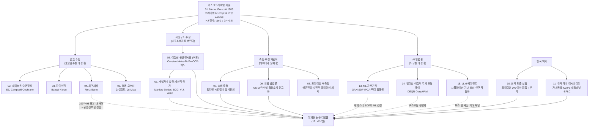

# 00. 지식베이스 인덱스 — 리스크프리미엄 퍼즐 해결 에이전트 연구팀

> 최종 목표: 성균관대 이재준 석사논문 「개별가계소비자료를 이용한 자산가격결정」의 저널 논문 디벨롭
> 갱신일: 2026-08-08 | 관리: 선행연구 조사팀
> 동반 문서: [12-thesis-development-roadmap.md](./12-thesis-development-roadmap.md) (논문 디벨롭 로드맵)

---

## 1. 리스크프리미엄 퍼즐: 정의와 정량적 크기

**정의**: 표준 대표소비자·시간분리 CRRA 기대효용의 소비기반 자산가격결정모형(CCAPM)이, 관측된 주식의 무위험자산 대비 초과수익률(주식프리미엄)을 "합리적" 위험회피계수로는 재현하지 못하는 정량적 간극 (Mehra & Prescott 1985, *JME*). 갈래 01·10에서 인용.

### 미국 벤치마크 (갈래 01)

| 항목 | 수치 | 출처 |
|---|---|---|
| 역사적 주식프리미엄 (1889–1978) | 주식 실질수익률 약 6.98% − 무위험 약 0.80% = **약 6.18%p** | Mehra & Prescott (1985) |
| 모형이 낼 수 있는 최대 프리미엄 (γ∈(0,10), β∈(0,1)) | **약 0.35%p** — 관측치의 1/18 | Mehra & Prescott (1985) |
| 프리미엄을 맞추는 데 필요한 상대위험회피계수(RRA) | **γ ≈ 30~40 이상 (후속 문헌 기준 최대 50)** | Mehra & Prescott (1985); Cochrane (2005) |
| 표본 연장 시 (1889–2000) | 프리미엄 **약 6.9%p로 오히려 확대** | Mehra & Prescott (2003) |
| 쌍둥이 퍼즐: 무위험이자율 퍼즐 | 프리미엄을 맞출 만큼 γ를 높이면 무위험이자율(실질 약 1% 미만 관측)이 비현실적으로 상승 | Weil (1989) |

### Hansen-Jagannathan(HJ) 경계 (갈래 01)

- 무차익 조건에서 SDF는 **σ(m)/E(m) ≥ |E(R^e)|/σ(R^e)** 를 만족해야 함 (Hansen & Jagannathan 1991, *JPE*).
- 미국 주식 연간 샤프비율 약 0.4~0.5 → **σ(m) ≥ 약 0.4~0.5** 필요. 반면 CRRA-총소비 SDF의 변동성은 σ(m) ≈ γ·σ(Δlnc) ≈ γ × 0.01~0.036에 불과 → 낮은 γ로는 경계를 크게 미달. Cochrane (2005) 표준 계산으로 **γ ≥ 25~50** 필요.

### 한국 수치 (갈래 10·01)

| 항목 | 수치 | 출처 |
|---|---|---|
| 한국 연간 주식프리미엄 | **약 3% 이하** (미국 약 6%보다 현저히 낮음) | Park & Kim (2009), *JKE* 10(2); 김인수·홍정훈 (2008), 재무연구 |
| 실제 vs CCAPM 이론 프리미엄 | 실제 **1.77%** vs 이론 **0.16%** — "약형 퍼즐" 존재 | 남윤명 외 (2014), 금융공학연구 (서지 확인 필요) |
| CCAPM 추정 위험회피계수 | 이론적 적정범위보다 **오히려 작게** 추정 (예: 1991~2013년 RRA 1.39) → 선진국형 퍼즐 미관찰 | 응용경제 10(3) 2008; 학위논문(ScienceON) |
| 퍼즐의 형태 | 퍼즐 I(프리미엄)보다 **퍼즐 II(높은 무위험이자율)가 부각**; Epstein-Zin류로 퍼즐 II는 상당 부분 해소 가능하나 퍼즐 I 잔존 | 독고윤·박종원·조재호 (2001); 김민직·조재호 (2020) |
| 소비 채널의 미시적 약함 | 주식 자본이득 1만원당 소비 전환 약 **130원(1.3%)** — 미국·유럽(3~4%)의 1/3 | 가계금융복지조사 기반 한국은행 분석 (2026 보도) |

### ⚠️ 갈래 간 수치 상충·주의 사항

- **미국 프리미엄의 크기**: 6.18%p(M-P 1985, 1889–1978) / 6.33%(Bansal-Yaron 2004의 데이터 기준, 갈래 03) / 6.9%p(M-P 2003, 1889–2000) / 실현 7.43% vs 사전적 2.55~4.32%(Fama-French 2002, 1951–2000, 갈래 08) — 표본기간·실현/사전 구분에 따라 **3~7%p까지 흔들림**(갈래 01 쟁점 1). "설명해야 할 프리미엄"의 확정 자체가 쟁점.
- **한국 프리미엄의 크기**: "약 3% 이하"(갈래 10, Park-Kim 2009) vs "2.64% (미국 5.94%)"(갈래 11이 인용한 동일 논문의 검색 요약) — 같은 논문에 대한 인용 수치가 갈래 간 다르게 기재되어 있으므로 원문 대조 필요.
- **서지 상충**: Mankiw (1986)의 게재지는 지시문 표기(JME)와 달리 웹 검증 결과 **JFE**임(갈래 05 명시).
- **통상 인용 수치 주의**: Mankiw-Zeldes 내재 RRA(약 100 → 주주 기준 약 35), MMV(2009) RRA(주주 ≈15, 부유 주주 ≈10), BCG(2002) RRA 2~4(갈래 09에서는 "3 내외")는 원문 표와의 직접 대조가 권고됨(갈래 06 수치 신뢰도 주의).

---

## 2. 갈래별 지도 (14개 파일)

| # | 갈래 (링크) | 한 줄 요약 | 퍼즐 설명력 평가 |
|---|---|---|---|
| 01 | [주식프리미엄 퍼즐의 기원과 정식화](./01-equity-premium-puzzle-foundations.md) | Lucas(1978)→CCAPM→Mehra-Prescott(1985)→Weil(1989)→HJ(1991)로 이어지는 퍼즐의 출생 증명서와 채점 기준(프리미엄·이자율·HJ 경계) 정리 | 해법이 아니라 **관문** — 모든 해법이 통과해야 할 정량 기준(γ 30~50, σ(m)≥0.4~0.5)을 규정 |
| 02 | [선호 기반 해법: 재귀효용·습관형성](./02-preference-based-solutions.md) | Epstein-Zin으로 RRA·EIS 분리, Constantinides(1990)·Campbell-Cochrane(1999) 습관으로 SDF 변동성 증폭 | 부분 성공 — 습관은 프리미엄 수준·시변성 재현하나 유효 RRA≈35 재포장·고빈도 변동 회피(Otrok 외 2002) 비판; 재귀효용 단독으로는 해결 실패(Weil) |
| 03 | [장기위험(LRR) 모형](./03-long-run-risk.md) | 작고 지속적인 성장 성분+확률변동성+EZ 선호(γ=10, ψ=1.5)로 프리미엄·이자율·변동성 동시 설명 (Bansal-Yaron 2004) | 유력 표준모형이나 **식별 논쟁 미결** — 잠재 성분의 실재성(Beeler-Campbell vs BKY), 타이밍 프리미엄 30~40%(EFS 2014) 비판 |
| 04 | [희귀재해(Rare Disasters) 모형](./04-rare-disasters.md) | 소비분포 좌측 꼬리(재해 확률 연 1.5~3.5%, 낙폭 15~64%)로 γ=3~4에서 프리미엄 재현 (Barro 2006) | 부활한 유력 후보이나 Julliard-Ghosh(2012)의 "관측 재해로는 불충분" 비판 잔존; **한국은 1997~98 재해가 표본 안에 있어 검증 우위** |
| 05 | [이질적 주체·불완전시장](./05-heterogeneity-incomplete-markets.md) | 영구적·경기역행적 고유충격 하에서 SDF가 가계 소비의 횡단면 분산·왜도·꼬리에 의존 (Constantinides-Duffie 1996; Constantinides-Ghosh 2017) | **이재준 논문의 이론적 기초** — CCV 조건 하에서 낮은 γ로 프리미엄 설명 가능; 단 일시적 충격이면 자기보험으로 무력화(Telmer, Krueger-Lustig) |
| 06 | [개별가계소비 실증·제한적 참가](./06-household-consumption-limited-participation.md) | Mankiw-Zeldes(1991)~BCG(2002)~Vissing-Jørgensen(2002)~MMV(2009): 주주 소비로 재면 내재 RRA가 수백→2~35로 하락 | **가장 직접적인 선행 실증 갈래** — 자산보유자 MRS 평균 SDF는 RRA 2~4에서 프리미엄과 정합적(BCG); 측정오차·짧은 표본이 약점 |
| 07 | [소비 측정 문제·대안 지표](./07-consumption-measurement.md) | 집계·필터링·시간집계가 소비위험을 지워 γ를 과대추정(NIPA 81 vs 쓰레기 17, Savov 2011; Kroencke 2017) | 퍼즐의 상당 부분이 **측정의 산물**일 가능성 입증 — 미시자료 사용의 정당화이자, 미시 측정오차(감쇠)라는 반대 방향 편의 경고 |
| 08 | [행동재무·기타 해법](./08-behavioral-and-other-solutions.md) | 근시안적 손실회피(BT 1995), 모호성(Ju-Miao 2012), 생존편의·사전적 프리미엄(FF 2002)·세제(McGrattan-Prescott) 등 비표준 설명 | 각각 부분 성공 — 특히 "설명해야 할 프리미엄이 과장되었다"(사전적 2.55~4.32%)는 측정 반론은 목표 모멘트 설정에 직결 |
| 09 | [계량 방법론: GMM·오일러방정식·패널](./09-econometric-methods.md) | GMM(Hansen 1982)부터 약식별(Stock-Wright), 측정오차 견고 추정(AAB 2009), 집계편의(Attanasio-Weber)까지 추정 병리의 진단·교정 도구 | 해법이 아니라 **판별 도구** — "퍼즐이 경제구조의 산물인가 추정 병리의 산물인가"를 구분; 가계자료 GMM 함정 체크리스트 10항 제공 |
| 10 | [한국 주식프리미엄 실증](./10-korea-equity-premium-evidence.md) | 한국은 프리미엄 3% 이하·RRA 저추정으로 "미국식 퍼즐 미관찰", 대신 무위험이자율 퍼즐(퍼즐 II)과 약형 퍼즐(1.77% vs 0.16%) 존재 | 국내 문헌은 전부 총량소비 기반 — **개별가계자료로 결론이 뒤집히는지가 공백** = 이재준 논문의 기여 공간 |
| 11 | [한국 가계 미시데이터·국내 문헌](./11-korea-household-data.md) | 가계동향조사(소비◎/주주식별△)·KLIPS(패널◎)·재정패널·가계금융복지조사(주주식별◎/소비×)의 상충구조와 이재준 논문 서지 추적(→ 이후 원문 확보, 갈래 16) | 데이터 인프라 갈래 — "한국판 CEX=가계동향조사" 주 전략 + 3중 자료 전략 제시; **주주/비주주 구분 오일러방정식 국내 연구는 전무 확인** |
| 13 | [머신러닝 자산가격결정](./13-machine-learning-asset-pricing.md) | GKX(2020)·IPCA·KNS·GAN-SDF(CPZ 2024)로 고차원 조건부 정보·비선형 SDF를 데이터 주도 추정 | 퍼즐의 재측정 도구 — ML-SDF의 변동성과 가계 소비 이질성이 만들 수 있는 SDF 변동성의 정량 비교는 **공백** = 차별화 지점 |
| 14 | [딥러닝 이질적 주체 모형 풀이](./14-deep-learning-heterogeneous-agent-models.md) | Deep BSDE·DEQN·DeepHAM 등으로 분포가 상태변수인 불완전시장 모형의 전역해 계산 가능 | 이론 정량화 도구 — C-D류 "특이위험→프리미엄" 가설을 완결 균형에서 검증할 수단; 위기 영역 학습·해법 정확도가 미해결 |
| 15 | [LLM·AI 에이전트 경제·금융 연구](./15-llm-ai-agents-economics.md) | LLM 가계 에이전트 시뮬레이션(Horton, EconAgent), 텍스트 기반 기대 추정(Bybee), 연구 자동화(Korinek, Agent Laboratory) | 보조 방법론 — 반사실 실험·주관적 기대 채널 제공하나 γ·β 편의, 이질성 압축, 오염 문제로 **증거 지위는 미확립** (활용 시 주의) |
| 16 | [이재준 석사논문 원문 요약](./16-thesis-original-summary.md) | **원문 확보 완료** (2015, 지도 황수성): 집계문제(정리 1) → 도시가계조사 1993~2002로 M&P·GMM·스플라이싱 모의실험. 미시 RRA 0.2~2.41 vs 거시 약 542 | 디벨롭의 출발점 — 갈래 11의 "추정 설계"를 대체하는 확정 사실; Tier 1 최우선 필독 |

---

## 3. 갈래 간 관계: 퍼즐 → 해법 계보



**계보 읽기**: 선호 수정 갈래(02·03·04·08)는 "소비자료는 그대로 두고 한계효용의 변동성을 키우는" 전략, 시장구조 갈래(05·06)는 "총소비라는 집계 자체가 잘못됐다"는 전략, 측정 갈래(07·09, 08 일부)는 "소비·프리미엄 측정과 추정 병리가 퍼즐을 만들었다"는 전략이다. 이재준 논문은 **시장구조 갈래(05→06)의 한국판 실증**에 위치하며, 측정 갈래(07·09)를 방법론적 방패로, 재해 갈래(04)와 AI 갈래(13·14·15)를 확장·차별화 축으로 쓴다.

---

## 4. 이재준 논문 디벨롭 관점 필독 우선순위

### Tier 1 — 직접 선행 (논문의 뼈대: 반드시 정독)

| 갈래 | 이유 |
|---|---|
| **06** 개별가계소비 실증·제한적 참가 | 이재준 논문과 문제 설정이 동일한 실증 전통(Mankiw-Zeldes → BCG → Vissing-Jørgensen → MMV). SDF 구성 방식(그룹 평균 vs MRS 평균 vs γ차 모멘트)·주주 식별·측정오차 대응의 실무 교본 |
| **11** 한국 가계 미시데이터 | 사용할 데이터의 전부(자료별 상충구조, 3중 자료 전략)와 이재준 논문 서지 추적 결과·신규성 근거("주주/비주주 오일러방정식 국내 연구 전무")가 여기에 있음 |
| **09** 계량 방법론 | 저널 심사에서 반드시 공격받을 지점(측정오차·약식별·집계충격·짧은 패널)의 방어 도구 일체. 가계자료 GMM 함정 체크리스트 10항은 실증 설계의 필수 점검표 |
| **07** 소비 측정 | "왜 개별가계자료인가"의 정당화 논리(필터링→γ 과대추정)와, 미시자료가 떠안는 반대 방향 편의(감쇠)의 상쇄 구조 — 서론과 강건성 절의 근거 |

### Tier 2 — 이론 기반 (기여의 좌표를 정하는 축)

| 갈래 | 이유 |
|---|---|
| **05** 이질성·불완전시장 | 실증 사양(횡단면 분산·왜도 SDF)을 도출하는 이론적 모태(C-D 1996, C-G 2017)와 넘어야 할 귀무가설(자기보험 반론, Krueger-Lustig 무관련성 정리). 사실상 Tier 1에 준함 — 갈래 05 스스로 "전체 지식베이스에서 가장 직접적인 중요성"을 자임 |
| **01** 퍼즐 기초 | 기각 대상 귀무모형과 평가 모멘트(프리미엄·무위험이자율·HJ 경계)의 정의. "M-P 대비 개선 폭"이라는 표준 보고 형식 제공 |
| **10** 한국 퍼즐 실증 | 넘어야 할 국내 현황선("한국은 퍼즐이 없다" vs 약형 퍼즐 1.77% vs 0.16%)과 결과 프레이밍(총량자료 결론의 역전 여부 검증)의 기준 |

### Tier 3 — 확장·차별화 (2차 기여·후속 논문 축)

| 갈래 | 이유 |
|---|---|
| **02** 선호 기반 해법 | EZ 확장(가계 수준 RRA·EIS 분리 식별), 내부 vs 외부 습관의 미시 검정 등 가계자료만이 가능한 확장 메뉴 |
| **03** 장기위험 | 장기 누적 소비증가율(MMV형) 강건성 분석과 혼합주기·측정오차 명시 베이지언 추정(SSY 2018)의 업그레이드 경로 |
| **04** 희귀재해 | 한국 1997~98 "표본 안의 재해"를 활용한 Julliard-Ghosh 재심사, 재해 × 불완전보험 결합 — 한국 데이터 고유의 비교우위 |
| **08** 행동·기타 해법 | 한국판 "설명해야 할 프리미엄" 재측정(사전적·세후), 추정 γ의 모호성/강건성 분해 등 방어 논리 |
| **13** ML 자산가격 | 가계 소비 모멘트를 조건부 정보로 쓰는 GAN-SDF, 가계-IPCA, 소비 팩터의 동물원 검정 — AI 차별화의 1순위 |
| **14** 딥러닝 구조모형 | 실증 결과를 한국 보정 불완전시장 모형의 전역해로 정합성 검증, 구조 추정 논문으로의 승격 경로 |
| **15** LLM 에이전트 | 반사실 실험·주관적 기대 채널·연구팀 자동화의 보조 수단 (증거 지위 한계에 주의) |

---

## 5. 지식베이스 갱신 규약

**담당**: 선행연구 조사팀 (다른 팀은 수정 제안을 이슈/메모로 전달하고 직접 수정하지 않는다).

1. **새 논문 추가 형식** — 해당 갈래 파일의 「핵심 논문」 절에 아래 템플릿으로 추가한다.
   ```markdown
   ### 저자 (연도), "제목", 학술지 권(호), 페이지
   - **핵심 질문**:
   - **방법론·데이터**:
   - **주요 결과(수치)**:
   - **한계**:
   - **이재준 논문 디벨롭과의 연관성**:
   ```
2. **서지 검증**: 서지정보는 반드시 웹 검색(출판사·RePEc·NBER·KCI 등)으로 검증하고 파일 말미 참고 링크 절에 출처를 남긴다. 원문 미확인 항목은 **(서지 확인 필요)** 를 명시한다(갈래 10·11 관행 준수).
3. **수치 규율**: 수치는 원문 또는 표준 인용 수치임을 구분 표기한다. 갈래 간 수치가 상충하면 은폐하지 말고 본 인덱스 1절의 상충 목록에 추가한다.
4. **갈래 배정**: 새 논문이 여러 갈래에 걸치면 방법론적 무게중심이 있는 갈래에 본문을 두고, 다른 갈래에는 한 줄 교차참조만 둔다. 새 갈래 신설은 인덱스(본 문서)의 지도·다이어그램 갱신을 동반해야 한다.
5. **인덱스·로드맵 동기화**: 갈래 파일의 핵심 결론(퍼즐 설명력 평가)이 바뀌면 본 문서 2절 표와 4절 Tier, 그리고 [12-thesis-development-roadmap.md](./12-thesis-development-roadmap.md)의 해당 항목을 같은 커밋에서 갱신한다.
6. **파일 번호**: 01~11, 13~15는 갈래, 00은 인덱스, 12는 로드맵으로 고정한다. 신규 갈래는 16번부터 부여한다.
